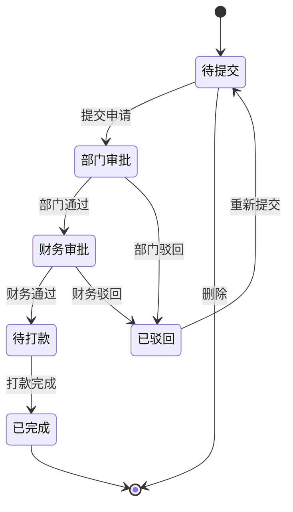

# 费用报销模块 - 功能需求规范

> **文档类型**: 功能需求规范 (Functional Requirements)
> **模块类型**: 审批流程
> **复杂度**: ⭐⭐⭐⭐ (4星)
> **预计工期**: 1.5-2天 (AI辅助)
> **依赖模块**: employee, department
> **创建日期**: 2026-01-09
> **版本**: v1.0.0

---

## 1. 功能概述

实现员工费用报销的全流程管理,包括发票上传、多级审批、财务审核、打款追踪等功能。

### 1.1 业务目标
- 规范费用报销流程,提高审批效率
- 确保发票合规性,防止重复报销
- 实现财务数据统计与分析
- 提供打款追踪机制

### 1.2 用户角色
- **报销申请人**: 普通员工
- **部门审批人**: 部门主管/经理
- **财务审批人**: 财务人员
- **系统管理员**: 维护基础数据和配置

---

## 2. 核心功能需求

### 2.1 报销单填写

#### 2.1.1 基本信息录入
- **报销类型选择**
  - 差旅费 (交通、住宿、餐补等)
  - 招待费 (客户招待、商务宴请等)
  - 办公用品 (办公设备、耗材等)
  - 交通费 (市内交通、打车等)
  - 其他费用

- **费用明细管理**
  - 支持添加多条费用明细
  - 每条明细包含: 费用说明、金额、发生日期、费用分类
  - 自动计算总金额

- **报销事由**
  - 必填项,简要说明报销原因
  - 支持多行文本输入

#### 2.1.2 发票管理
- **发票上传**
  - 支持多张发票图片上传
  - 支持格式: JPG, PNG, PDF
  - 单张图片大小限制: 5MB

- **发票类型**
  - 增值税专用发票
  - 增值税普通发票
  - 电子发票

- **发票信息录入**
  - 发票号码 (必填,8位或20位)
  - 发票金额 (必填,自动识别或手动输入)
  - 开票日期 (必填)
  - OCR识别功能 (自动提取发票信息)

- **发票验证**
  - 发票号码唯一性检查 (防止重复报销)
  - 发票金额与申请金额一致性校验
  - 发票日期有效性检查

#### 2.1.3 日期管理
- **费用发生日期**: 报销费用实际发生的日期
- **申请日期**: 提交报销申请的日期 (自动生成,不可修改)

---

### 2.2 审批流程

#### 2.2.1 审批状态流转



#### 2.2.2 部门审批
- **审批权限**: 部门主管/经理
- **审批内容**:
  - 费用合理性审核
  - 报销事由真实性
  - 费用明细完整性
- **审批操作**:
  - 通过: 进入财务审批
  - 驳回: 退回申请人修改,需填写驳回原因

#### 2.2.3 财务审批
- **审批权限**: 财务部门人员
- **审批内容**:
  - 发票合规性检查
  - 发票金额准确性
  - 财务制度符合性
  - 预算控制检查
- **审批操作**:
  - 通过: 创建打款记录,进入待打款状态
  - 驳回: 退回申请人,需详细说明驳回原因

#### 2.2.4 大额加签规则

**单笔金额加签**:
- 单笔 > 5000元: 需总经理审批
- 单笔 > 10000元: 需总经理+特别审批人

**月度累计加签**:
- 月度累计 > 20000元: 需总经理+特别审批人
- 月度累计 > 50000元: 需总经理+特别审批人+董事长审批

---

### 2.3 发票管理功能

#### 2.3.1 发票验真
- 发票号码格式验证
- 发票号码唯一性验证 (系统内查重)
- 发票金额与申请金额匹配验证

#### 2.3.2 发票OCR识别
- 自动识别发票类型、号码、金额、日期
- 支持手动修正识别结果
- 识别结果预览

#### 2.3.3 发票存储
- 发票图片云端存储
- 支持发票图片预览
- 支持发票图片下载

---

### 2.4 打款管理

#### 2.4.1 打款流程
1. 财务审批通过后,自动创建打款记录
2. 获取报销人银行账户信息
3. 财务人员执行银行转账
4. 上传打款凭证 (银行回单)
5. 系统确认打款完成,通知报销人

#### 2.4.2 打款方式
- 银行转账 (默认)
- 现金
- 支票

#### 2.4.3 打款追踪
- 打款状态: 待打款 | 打款中 | 已完成 | 打款失败
- 打款日期记录
- 打款凭证上传
- 打款失败原因记录

---

### 2.5 报表统计

#### 2.5.1 统计维度

**按部门统计**:
- 各部门报销总金额
- 各部门报销笔数
- 各部门平均报销金额
- 部门报销金额排名

**按类型统计**:
- 各报销类型金额占比
- 各报销类型笔数统计
- 报销类型分布饼图

**按月份统计**:
- 月度报销总金额趋势
- 月度报销笔数趋势
- 同比/环比分析

**按员工统计**:
- 员工个人报销记录
- 员工报销总金额排行
- 员工报销频率分析

#### 2.5.2 图表展示
- 柱状图: 部门报销对比
- 饼图: 报销类型分布
- 折线图: 月度趋势分析
- 数据表格: 明细数据导出

#### 2.5.3 数据导出
- 支持Excel格式导出
- 支持自定义时间范围
- 支持按部门/类型筛选

---

## 3. 功能约束

### 3.1 业务规则约束
- 发票号码不能重复使用
- 报销金额必须与发票金额一致
- 费用发生日期不能晚于申请日期
- 驳回的报销单必须修改后才能重新提交
- 已打款的报销单不能撤销

### 3.2 数据约束
- 报销单号格式: EXP + YYYYMMDD + 4位序号 (如 EXP202601090001)
- 发票号码: 8位或20位数字
- 金额精度: 保留两位小数
- 日期格式: YYYY-MM-DD

### 3.3 性能约束
- 发票上传响应时间 < 3秒
- 报销单提交响应时间 < 2秒
- 审批操作响应时间 < 2秒
- 统计报表查询时间 < 5秒

---

### 3.4 字段级权限控制

| 字段 | 普通员工 | 部门审批人 | 财务审批人 | 系统管理员 |
|------|---------|-----------|-----------|-----------|
| 基本信息(类型/事由/日期) | ✅ 查看/编辑(自己) | ✅ 查看 | ✅ 查看 | ✅ 查看/编辑 |
| 报销金额 | ✅ 查看(自己) | ✅ 查看 | ✅ 查看 | ✅ 查看/编辑 |
| 费用明细 | ✅ 查看/编辑(自己) | ✅ 查看 | ✅ 查看 | ✅ 查看/编辑 |
| 发票信息 | ✅ 查看/编辑(自己) | ✅ 查看 | ✅ 查看/验证 | ✅ 查看/编辑 |
| 银行账户信息 | ✅ 查看(自己) | ❌ | ✅ 查看 | ✅ 查看/编辑 |
| 打款凭证 | ✅ 查看(自己) | ❌ | ✅ 查看/上传 | ✅ 查看/编辑 |
| 审批意见 | ✅ 查看 | ✅ 查看/填写 | ✅ 查看/填写 | ✅ 查看/填写 |

---

### 3.5 数据字典集成

#### 3.5.1 依赖的数据字典类型

费用报销模块依赖以下数据字典类型:

| 字典类型 | 字典编码 | 用途 | 是否必填 |
|---------|---------|------|---------|
| 报销类型 | `expense_type` | 报销类型分类(差旅费/招待费/办公用品/交通费/其他) | ✅ |
| 报销状态 | `expense_status` | 报销单状态(草稿/待审批/已驳回/待打款/已完成) | ✅ |
| 发票类型 | `invoice_type` | 发票类型(增值税专用发票/增值税普通发票/电子发票) | ✅ |
| 打款方式 | `payment_method` | 打款方式(银行转账/现金/支票) | ❌ |
| 打款状态 | `payment_status` | 打款状态(待打款/打款中/已完成/打款失败) | ✅ |
| 费用分类 | `expense_category` | 费用明细分类(交通/住宿/餐饮/办公等) | ❌ |

#### 3.5.2 数据字典使用场景

**1. 报销类型选择**
```typescript
// 从数据字典加载报销类型选项
const expenseTypeOptions = [
  { label: '差旅费', value: 'travel', dictCode: 'expense_type' },
  { label: '招待费', value: 'hospitality', dictCode: 'expense_type' },
  { label: '办公用品', value: 'office', dictCode: 'expense_type' },
  { label: '交通费', value: 'transport', dictCode: 'expense_type' },
  { label: '其他费用', value: 'other', dictCode: 'expense_type' }
]
```

**2. 报销状态筛选**
```typescript
// 从数据字典加载报销状态选项
const statusOptions = [
  { label: '草稿', value: 'draft', dictCode: 'expense_status' },
  { label: '待部门审批', value: 'dept_pending', dictCode: 'expense_status' },
  { label: '待财务审批', value: 'finance_pending', dictCode: 'expense_status' },
  { label: '已驳回', value: 'rejected', dictCode: 'expense_status' },
  { label: '待打款', value: 'pending', dictCode: 'expense_status' },
  { label: '已完成', value: 'paid', dictCode: 'expense_status' }
]
```

**3. 发票类型选择**
```typescript
// 从数据字典加载发票类型选项
const invoiceTypeOptions = await getDictList('invoice_type')
// 返回: [{ label: '增值税专用发票', value: 'vat_special' }, { label: '增值税普通发票', value: 'vat_common' }, ...]
```

**4. 状态标签显示**
```typescript
// 从数据字典获取显示文本
const statusText = getDictLabel('expense_status', 'paid') // "已完成"
const invoiceTypeText = getDictLabel('invoice_type', 'vat_special') // "增值税专用发票"
```

**5. 费用分类选择**
```typescript
// 费用明细分类
const categoryOptions = await getDictList('expense_category')
// 返回: [{ label: '交通费', value: 'transport' }, { label: '住宿费', value: 'accommodation' }, ...]
```

#### 3.5.3 数据字典初始化要求

- **模块加载时**: 预加载报销类型、报销状态、发票类型字典
- **表单编辑时**: 动态加载费用分类字典
- **筛选面板**: 使用缓存的字典数据
- **字典刷新**: 监听字典变更事件,自动更新界面显示

#### 3.5.4 数据字典缓存策略

```typescript
// 字典数据缓存管理
const dictCache = {
  // 常用字典: 启动时预加载
  preload: ['expense_type', 'expense_status', 'invoice_type'],

  // 低频字典: 按需加载
  onDemand: ['payment_method', 'expense_category'],

  // 缓存过期时间: 30分钟
  expireTime: 30 * 60 * 1000
}
```

---

### 3.6 权限管理集成

#### 3.6.1 费用报销权限定义

| 权限编码 | 权限名称 | 权限描述 | 依赖角色 |
|---------|---------|---------|---------|
| `expense:create` | 创建报销单 | 创建新的报销申请 | 所有员工 |
| `expense:view_own` | 查看自己的报销单 | 查看自己提交的报销单 | 所有员工 |
| `expense:view_department` | 查看部门报销单 | 查看本部门员工的报销单 | 部门审批人/管理员 |
| `expense:view_all` | 查看所有报销单 | 查看公司所有报销单 | 财务审批人/管理员 |
| `expense:edit_own` | 编辑自己的报销单 | 编辑草稿状态的报销单 | 所有员工 |
| `expense:delete_own` | 删除自己的报销单 | 删除草稿状态的报销单 | 所有员工 |
| `expense:dept_approve` | 部门审批 | 审批部门报销单 | 部门审批人/管理员 |
| `expense:finance_approve` | 财务审批 | 财务审批并打款 | 财务审批人/管理员 |
| `expense:payment` | 打款操作 | 执行打款并上传凭证 | 财务审批人/管理员 |
| `expense:view_statistics` | 查看统计报表 | 查看报销统计数据 | 部门审批人/财务审批人/管理员 |
| `expense:export` | 导出数据 | 导出报销数据 | 财务审批人/管理员 |
| `expense:manage_invoice` | 验证发票 | 验证发票合规性和唯一性 | 财务审批人/管理员 |

#### 3.6.2 功能权限矩阵

| 功能 | 普通员工 | 部门审批人 | 财务审批人 | 系统管理员 |
|------|---------|-----------|-----------|-----------|
| 创建报销单 | ✅ expense:create | ✅ expense:create | ✅ expense:create | ✅ expense:create |
| 查看自己报销单 | ✅ expense:view_own | ✅ expense:view_own | ✅ expense:view_own | ✅ expense:view_own |
| 编辑草稿报销单 | ✅ expense:edit_own | ✅ expense:edit_own | ✅ expense:edit_own | ✅ expense:edit_own |
| 删除草稿报销单 | ✅ expense:delete_own | ✅ expense:delete_own | ✅ expense:delete_own | ✅ expense:delete_own |
| 查看部门报销单 | ❌ | ✅ expense:view_department | ❌ | ✅ expense:view_department |
| 查看所有报销单 | ❌ | ❌ | ✅ expense:view_all | ✅ expense:view_all |
| 部门审批 | ❌ | ✅ expense:dept_approve | ❌ | ✅ expense:dept_approve |
| 财务审批 | ❌ | ❌ | ✅ expense:finance_approve | ✅ expense:finance_approve |
| 打款操作 | ❌ | ❌ | ✅ expense:payment | ✅ expense:payment |
| 查看统计报表 | ❌ | ✅ expense:view_statistics | ✅ expense:view_statistics | ✅ expense:view_statistics |
| 导出数据 | ❌ | ❌ | ✅ expense:export | ✅ expense:export |
| 验证发票 | ❌ | ❌ | ✅ expense:manage_invoice | ✅ expense:manage_invoice |

#### 3.6.3 权限检查实现

```typescript
// 权限检查函数
function checkPermission(permission: string): boolean {
  const authStore = useAuthStore()
  return authStore.hasPermission(permission)
}

// 使用示例
const canCreate = computed(() => checkPermission('expense:create'))
const canDeptApprove = computed(() => checkPermission('expense:dept_approve'))
const canFinanceApprove = computed(() => checkPermission('expense:finance_approve'))

// 数据权限过滤
const filteredExpenses = computed(() => {
  if (checkPermission('expense:view_all')) {
    return expenseList.value // 返回所有报销单
  } else if (checkPermission('expense:view_department')) {
    // 只返回本部门的报销单
    return expenseList.value.filter(e => e.departmentId === currentUser.departmentId)
  } else {
    // 只返回自己的报销单
    return expenseList.value.filter(e => e.applicantId === currentUser.id)
  }
})
```

#### 3.6.4 按钮级权限控制

```vue
<!-- 根据权限显示/隐藏按钮 -->
<el-button
  v-if="hasPermission('expense:create')"
  @click="handleCreate"
>
  新增报销单
</el-button>

<el-button
  v-if="hasPermission('expense:dept_approve') && row.status === 'dept_pending'"
  type="primary"
  @click="handleDeptApprove(row)"
>
  部门审批
</el-button>

<el-button
  v-if="hasPermission('expense:finance_approve') && row.status === 'finance_pending'"
  type="success"
  @click="handleFinanceApprove(row)"
>
  财务审批
</el-button>

<el-button
  v-if="hasPermission('expense:payment') && row.status === 'pending'"
  type="warning"
  @click="handlePayment(row)"
>
  执行打款
</el-button>

<el-button
  v-if="hasPermission('expense:export')"
  @click="handleExport"
>
  导出数据
</el-button>
```

#### 3.6.5 字段级权限控制

```typescript
// 敏感字段权限判断
const fieldPermissions = {
  bankAccount: {
    visible: computed(() => {
      return checkPermission('expense:view_all') ||
             (checkPermission('expense:view_own') && isOwnExpense())
    })
  },
  paymentProof: {
    editable: computed(() => checkPermission('expense:payment'))
  }
}

// 表单中使用
const showBankAccount = computed(() => {
  return checkPermission('expense:view_all') ||
         (checkPermission('expense:view_own') && expense.value.applicantId === currentUser.id)
})

const canUploadProof = computed(() => checkPermission('expense:payment'))
```

---

## 4. 用户故事

### 4.1 作为员工,我希望
- 能够方便地提交报销申请
- 能够上传多张发票图片
- 能够自动识别发票信息,减少手工录入
- 能够随时查看报销审批进度
- 能够收到打款到账通知

### 4.2 作为部门主管,我希望
- 能够查看部门成员的所有报销申请
- 能够快速审批报销,提高效率
- 能够驳回不合理的报销申请
- 能够查看部门报销统计情况

### 4.3 作为财务人员,我希望
- 能够审核发票的合规性
- 能够检查发票是否重复报销
- 能够执行打款操作
- 能够查看所有报销记录
- 能够导出财务报表

### 4.4 作为系统管理员,我希望
- 能够配置大额加签规则
- 能够维护报销类型分类
- 能够查看系统运行日志

---

## 5. 功能优先级

### 5.1 P0 - 核心功能 (MVP)
- 报销单填写与提交
- 发票上传与管理
- 部门审批流程
- 财务审批流程
- 发票唯一性验证
- 基础报表统计

### 5.2 P1 - 重要功能
- 大额加签规则
- OCR识别功能
- 打款管理
- 多维度统计报表
- 数据导出功能

### 5.3 P2 - 增强功能
- 移动端审批
- 报销模板
- 预算控制
- 消息通知
- 电子签名

---

## 6. 验收标准

### 6.1 功能验收
- 所有P0功能正常运行
- 审批流程流转正确
- 发票验证机制有效
- 统计数据准确
- 无数据丢失风险

### 6.2 用户体验验收
- 界面简洁易用
- 操作流程清晰
- 错误提示友好
- 响应速度满足要求

### 6.3 业务验收
- 符合财务制度要求
- 满足内控合规要求
- 数据准确可追溯

---

## 7. Mock数据支持

费用报销模块提供了完整的Mock数据实现,便于前端独立开发和测试:

**Mock数据结构** (`src/modules/expense/mock/data.ts`):
- **6个预置报销单**,涵盖所有状态:
  - 1个已打款(差旅费)
  - 1个财务审批中(招待费)
  - 1个部门审批中(办公用品)
  - 1个已驳回(交通费)
  - 1个草稿状态(其他费用)
  - 1个大额部门审批中(差旅费>5000,需要总经理加签)
- **4个打款记录**,展示不同打款方式:
  - 银行转账(已完成/待打款)
  - 现金(已完成)
  - 支票(打款失败)
- **完整的费用明细数据**,包含多种分类(交通费/住宿费/餐补/招待费/办公设备等)
- **完整的发票数据**,包含三种类型:
  - 增值税专用发票(20位)
  - 增值税普通发票
  - 电子发票

**Mock API实现** (`src/modules/expense/api/index.ts`):
- `getMyExpenses()`: 获取我的报销列表,支持筛选和分页
- `getExpense()`: 获取报销详情
- `createExpense()`: 创建报销单(自动生成EXP编号)
- `updateExpense()`: 更新报销单(仅草稿状态)
- `deleteExpense()`: 删除报销单(仅草稿状态)
- `submitExpense()`: 提交审批,验证发票和金额一致性
- `cancelExpense()`: 撤销报销单(待审批状态)
- `getPendingApprovals()`: 获取待审批列表
- `departmentApprove()`: 部门审批(通过/驳回)
- `financeApprove()`: 财务审批(通过/驳回,自动创建打款记录)
- `validateInvoice()`: 验证发票唯一性和格式
- `ocrInvoice()`: OCR识别发票(模拟)
- `createPayment()`: 创建打款记录
- `uploadPaymentProof()`: 上传打款凭证
- `getPayments()`: 获取打款列表
- `getDepartmentStats()`: 按部门统计
- `getTypeStats()`: 按类型统计
- `getMonthlyStats()`: 按月份统计

---

## 8. 工具函数实现

费用报销模块提供了丰富的工具函数 (`src/modules/expense/utils/index.ts`):

**格式化函数**:
- `formatDate(date)`: 格式化日期为 YYYY-MM-DD
- `formatDateTime(date)`: 格式化日期时间为 YYYY-MM-DD HH:mm
- `formatAmount(amount)`: 格式化金额为 ¥XX.XX

**类型转换函数**:
- `getExpenseTypeName(type)`: 获取报销类型中文名称
  - travel → 差旅费
  - hospitality → 招待费
  - office → 办公用品
  - transport → 交通费
  - other → 其他费用
- `getExpenseStatusName(status)`: 获取报销状态中文名称
- `getExpenseStatusType(status)`: 获取Element Plus Tag类型
- `getInvoiceTypeName(type)`: 获取发票类型中文名称
- `getPaymentMethodName(method)`: 获取打款方式中文名称
- `getPaymentStatusName(status)`: 获取打款状态中文名称

**状态判断函数**:
- `canEdit(status)`: 判断是否可编辑(仅草稿状态)
- `canDelete(status)`: 判断是否可删除(仅草稿状态)
- `canSubmit(status)`: 判断是否可提交(草稿或已驳回)
- `canCancel(status)`: 判断是否可撤回(待审批状态)
- `canDeptApprove(status)`: 判断是否可部门审批
- `canFinanceApprove(status)`: 判断是否可财务审批
- `canPayment(status)`: 判断是否可打款
- `canResubmit(status)`: 判断是否可重新提交(已驳回)

**发票验证函数**:
- `validateInvoiceNumberFormat(invoiceNumber)`: 验证发票号码格式(8位或20位数字)
- `validateInvoiceAmount(invoices, totalAmount)`: 验证发票金额一致性

**大额加签规则**:
- `checkSingleAmountApproval(amount)`: 检查单笔金额加签
  - >10000: 总经理+特别审批人
  - >5000: 总经理
  - 其他: 默认审批层级
- `getApprovalLevelName(level)`: 获取审批层级名称

**报销单号生成**:
- `generateExpenseId()`: 生成报销单号 EXP+YYYYMMDD+4位随机数

**计算函数**:
- `calculateItemsTotal(items)`: 计算费用明细总金额
- `calculateInvoicesTotal(invoices)`: 计算发票总金额

**筛选函数**:
- `filterByDepartment(expenses, departmentId)`: 按部门筛选
- `filterByType(expenses, type)`: 按类型筛选
- `filterByStatus(expenses, status)`: 按状态筛选
- `filterByDateRange(expenses, startDate, endDate)`: 按日期范围筛选

**排序函数**:
- `sortByAmount(expenses, order)`: 按金额排序
- `sortByDate(expenses, order)`: 按日期排序

**工具提示函数**:
- `getStatusTip(status)`: 获取状态提示信息
- `getTypeTip(type)`: 获取类型提示信息

---

**文档版本**: v1.0.0
**最后更新**: 2026-01-11
