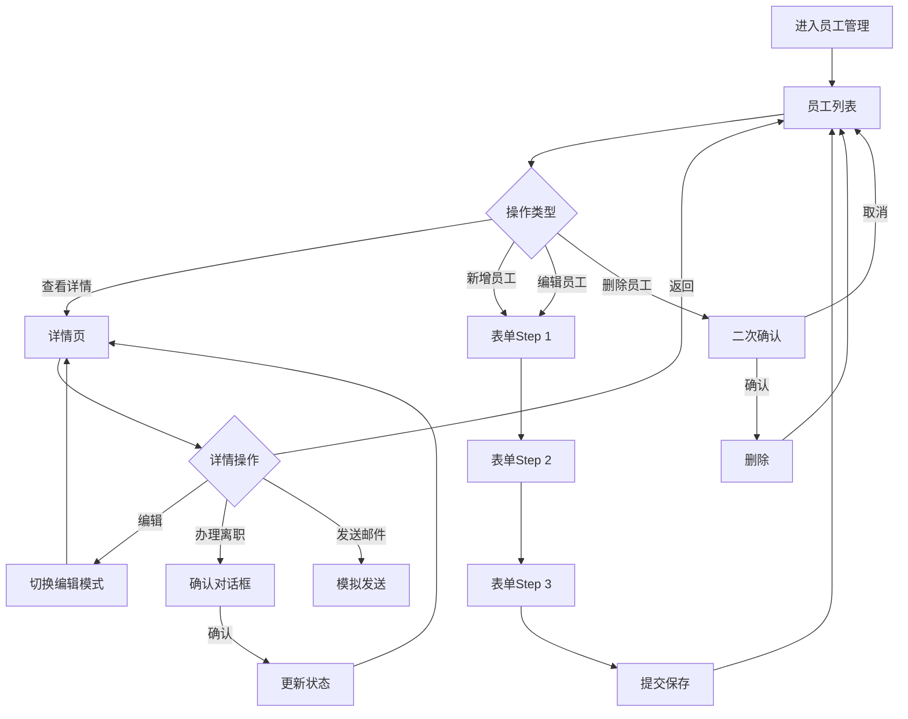

# 员工管理功能需求规范

> **规范类型**: 第一层 - 功能需求规范
> **模块**: 员工管理
> **版本**: v1.0.0
> **创建日期**: 2026-01-09

---

## 📋 目录

- [1. 功能概述](#1-功能概述)
- [2. 功能需求](#2-功能需求)
- [3. 业务规则](#3-业务规则)

---

## 1. 功能概述

### 1.1 模块简介

员工管理模块是OA系统最核心的基础模块,用于管理公司全体员工的信息档案,包括基本信息、工作信息、联系方式等,提供完整的CRUD功能、筛选搜索、统计分析等功能。

### 1.2 功能目标

- 集中管理员工信息档案
- 支持员工入职、转正、离职全生命周期管理
- 提供灵活的筛选和搜索功能
- 实时统计员工数据(在职人数、试用期等)
- 自动化提醒(生日、转正评估等)

### 1.3 用户角色

- **系统管理员**: 全部权限(查看、新增、编辑、删除所有员工)
- **部门管理员**: 查看本部门员工,编辑基本信息
- **普通员工**: 仅查看自己和公开信息

---

## 2. 功能需求

### 2.1 用户故事

```
作为HR管理员,
我想要集中管理所有员工的信息,
以便快速查询和维护员工档案。

作为部门负责人,
我想要查看本部门员工信息,
以便了解部门人员构成。

作为员工,
我想要查看和编辑自己的基本信息,
以便保持信息准确性。
```

### 2.2 功能清单

#### 2.2.1 员工列表页面

- [x] 表格视图展示所有员工
- [x] 卡片视图展示(可选)
- [x] 视图切换(表格/卡片)
- [x] 关键词搜索(姓名/工号/手机号)
- [x] 多条件筛选
  - 员工状态(在职/离职/停薪留职)
  - 部门筛选(多选)
  - 职位筛选
  - 试用期状态(试用期内/已转正)
  - 性别筛选
  - 入职时间范围
- [x] 分页功能(20/50/100条/页)
- [x] 新增员工
- [x] 编辑员工
- [x] 删除员工(二次确认)
- [x] 查看员工详情
- [x] 批量导入
- [x] 导出列表

#### 2.2.2 统计面板

- [x] 总员工数
- [x] 在职人数(带趋势图标)
- [x] 试用期人数(黄色提醒)
- [x] 本月新入职
- [x] 部门分布统计 ⭐ NEW

#### 2.2.3 员工详情页面

- [x] 左侧: 员工信息卡片
  - 大尺寸圆形头像(150px)
  - 员工编号(大字体)
  - 姓名(大字体加粗)
  - 职位标签
  - 部门链接(可点击跳转)
  - 员工状态标签
- [x] 右侧: 详细信息标签页
  - **基本信息tab**: 英文名、性别、出生日期、联系电话、邮箱、办公位置、紧急联系人
  - **工作信息tab**: 入职日期、试用期状态、转正日期、直属上级、工龄(自动计算)
  - **操作记录tab**: 时间轴形式,显示所有变更记录
- [x] 操作按钮
  - 编辑/保存(切换编辑模式)
  - 发送邮件(模拟)
  - 重置密码(模拟)
  - 办理离职(二次确认)
  - 删除员工(二次确认)

#### 2.2.4 员工表单

- [ ] 步骤式表单(el-steps)
  - **Step 1**: 基本信息(必填)
    - 员工编号(自动生成)
    - 姓名
    - 性别
    - 英文名
    - 联系电话(手机号验证)
    - 邮箱(格式验证)
    - 部门(下拉选择)
    - 职位
    - 入职日期
  - **Step 2**: 详细信息(可选)
    - 出生日期
    - 办公位置
    - 紧急联系人
    - 紧急联系电话
    - 直属上级(员工下拉搜索)
    - 头像上传
  - **Step 3**: 确认提交
    - 汇总显示所有填写信息
    - 最终确认
- [ ] 表单验证
  - 必填项验证
  - 手机号格式验证
  - 邮箱格式验证
  - 实时验证反馈

### 2.3 交互流程



---

## 3. 业务规则

### 3.1 工龄计算规则

工龄根据入职日期自动计算,精确到年份:
- 计算当前日期与入职日期的年份差
- 如果当前月份小于入职月份,则减1年
- 如果月份相同但当前日期小于入职日期,则减1年
- 最小值为0年

### 3.2 员工编号生成规则

格式: `EMP + YYYYMMDD + 序号(3位)`
- 前缀: EMP
- 日期: 入职日期(YYYYMMDD)
- 序号: 当天入职序号,从001开始
- 示例: `EMP20260109001`

### 3.3 试用期计算规则

- 默认试用期: 3个月
- 试用期结束日期 = 入职日期 + 3个月
- 试用期状态: 试用期内(probation) / 已转正(regular)

### 3.4 离职处理流程

1. 更新员工状态为"离职"
2. 记录操作日志
3. 停用系统账号
4. 归还所有资产
5. 发送离职通知

### 3.5 Mock数据支持 ⭐ NEW

#### 3.5.1 Mock数据结构
- **Mock员工数据**: 预置4名员工样本
- **Mock部门数据**: 技术部、产品部等
- **Mock职位数据**: 前端工程师、产品经理等
- **Mock操作日志**: 员工变更记录

#### 3.5.2 头像生成
- 使用 DiceBear API 生成头像
- URL格式: `https://api.dicebear.com/7.x/avataaars/svg?seed={name}`
- 自动根据姓名生成唯一头像

#### 3.5.3 数据持久化
- 开发环境使用内存Mock数据
- 数据在页面刷新后重置
- 支持实时增删改查操作

### 3.6 工具函数实现 ⭐ NEW

#### 3.6.1 员工编号生成
```typescript
generateEmployeeId(joinDate: string, count: number): string
// 格式: EMP + YYYYMMDD + 3位序号
// 示例: EMP20260111001
```

#### 3.6.2 工龄计算
```typescript
calculateWorkYears(joinDate: string): number
// 返回完整工作年数
// 最小值为0
```

#### 3.6.3 模拟延迟
```typescript
delay(ms: number = 300): Promise<void>
// 模拟API请求延迟
// 默认300ms
```

### 3.7 自动提醒功能

#### 3.5.1 生日提醒

- 检查时间: 每天早上9点
- 提醒对象: 当天生日的员工
- 提醒方式: 系统通知 + 邮件

#### 3.5.2 转正提醒

- 检查时间: 每天早上9点
- 提醒对象: 试用期到期前7天的员工
- 提醒方式:
  - 通知员工本人
  - 通知HR和部门负责人

### 3.6 权限控制规则

#### 3.6.1 数据权限

| 角色 | 查看权限 | 编辑权限 | 删除权限 |
|------|---------|---------|---------|
| 系统管理员 | 所有员工 | 所有信息 | ✅ |
| 部门管理员 | 本部门员工 | 基本信息 | ❌ |
| 普通员工 | 仅自己 | 基本信息 | ❌ |

#### 3.6.2 操作权限

- 新增员工: 仅系统管理员
- 删除员工: 仅系统管理员(需二次确认)
- 办理离职: 系统管理员和部门管理员
- 导入导出: 仅系统管理员

#### 3.6.3 字段级权限控制

| 字段 | 系统管理员 | 部门管理员 | 普通员工 |
|------|-----------|-----------|---------|
| 基本信息(姓名/性别/出生日期) | ✅ 查看/编辑 | ✅ 查看/编辑 | ✅ 查看自己/编辑自己 |
| 联系方式(手机/邮箱) | ✅ 查看/编辑 | ✅ 查看 | ✅ 查看自己/编辑自己 |
| 工作信息(部门/职位/入职日期) | ✅ 查看/编辑 | ✅ 查看 | ✅ 查看 |
| 敏感信息(薪资/职级) | ✅ 查看/编辑 | ❌ | ❌ |
| 操作记录 | ✅ 查看 | ✅ 查看本部门 | ✅ 查看自己 |

---

### 3.7 数据字典集成

#### 3.7.1 依赖的数据字典类型

员工管理模块依赖以下数据字典类型:

| 字典类型 | 字典编码 | 用途 | 是否必填 |
|---------|---------|------|---------|
| 员工状态 | `employee_status` | 员工当前状态(在职/离职/停薪留职) | ✅ |
| 性别 | `gender` | 员工性别 | ✅ |
| 试用期状态 | `probation_status` | 试用期状态(试用期内/已转正) | ✅ |
| 职位等级 | `position_level` | 员工职级(P1/P2/P3等) | ❌ |
| 部门类型 | `department_type` | 部门分类 | ❌ |
| 员工标签 | `employee_tag` | 员工标签(核心/骨干/新员工等) | ❌ |

#### 3.7.2 数据字典使用场景

**1. 员工状态筛选**
```typescript
// 从数据字典加载员工状态选项
const statusOptions = [
  { label: '在职', value: 'active', dictCode: 'employee_status' },
  { label: '离职', value: 'resigned', dictCode: 'employee_status' },
  { label: '停薪留职', value: 'suspended', dictCode: 'employee_status' }
]
```

**2. 性别选择器**
```typescript
// 从数据字典加载性别选项
const genderOptions = [
  { label: '男', value: 'male', dictCode: 'gender' },
  { label: '女', value: 'female', dictCode: 'gender' }
]
```

**3. 试用期状态显示**
```typescript
// 从数据字典获取显示文本
const statusText = getDictLabel('probation_status', 'probation') // "试用期内"
```

**4. 职级选择**
```typescript
// 从数据字典加载职级选项
const levelOptions = await getDictList('position_level')
// 返回: [{ label: 'P1', value: 'P1' }, { label: 'P2', value: 'P2' }, ...]
```

#### 3.7.3 数据字典初始化要求

- **模块加载时**: 预加载员工状态、性别、试用期状态字典
- **表单编辑时**: 动态加载职位等级字典
- **筛选面板**: 使用缓存的字典数据
- **字典刷新**: 监听字典变更事件,自动更新界面显示

#### 3.7.4 数据字典缓存策略

```typescript
// 字典数据缓存管理
const dictCache = {
  // 常用字典: 启动时预加载
  preload: ['employee_status', 'gender', 'probation_status'],

  // 低频字典: 按需加载
  onDemand: ['position_level', 'department_type', 'employee_tag'],

  // 缓存过期时间: 30分钟
  expireTime: 30 * 60 * 1000
}
```

---

### 3.8 权限管理集成

#### 3.8.1 员工管理权限定义

| 权限编码 | 权限名称 | 权限描述 | 依赖角色 |
|---------|---------|---------|---------|
| `employee:view` | 查看员工 | 查看员工列表和详情 | 所有用户 |
| `employee:view_all` | 查看所有员工 | 查看公司所有员工信息 | 管理员 |
| `employee:view_department` | 查看本部门员工 | 仅查看本部门员工 | 部门管理员 |
| `employee:create` | 新增员工 | 创建新员工档案 | 系统管理员 |
| `employee:edit` | 编辑员工 | 编辑员工基本信息 | 管理员/本人 |
| `employee:edit_all` | 编辑所有信息 | 编辑员工所有信息(含敏感字段) | 系统管理员 |
| `employee:delete` | 删除员工 | 删除员工档案 | 系统管理员 |
| `employee:resign` | 办理离职 | 处理员工离职流程 | 管理员 |
| `employee:import` | 批量导入 | 导入员工Excel数据 | 系统管理员 |
| `employee:export` | 导出列表 | 导出员工列表数据 | 系统管理员 |
| `employee:view_sensitive` | 查看敏感信息 | 查看薪资等敏感信息 | 系统管理员 |
| `employee:reset_password` | 重置密码 | 重置员工登录密码 | 系统管理员 |

#### 3.8.2 功能权限矩阵

| 功能 | 系统管理员 | 部门管理员 | 普通员工 |
|------|-----------|-----------|---------|
| 查看员工列表 | ✅ employee:view_all | ✅ employee:view_department | ✅ employee:view(仅自己) |
| 查看员工详情 | ✅ employee:view_all | ✅ employee:view_department | ✅ employee:view(仅自己) |
| 新增员工 | ✅ employee:create | ❌ | ❌ |
| 编辑基本信息 | ✅ employee:edit_all | ✅ employee:edit | ✅ employee:edit(仅自己) |
| 编辑敏感信息 | ✅ employee:edit_all | ❌ | ❌ |
| 删除员工 | ✅ employee:delete | ❌ | ❌ |
| 办理离职 | ✅ employee:resign | ✅ employee:resign | ❌ |
| 批量导入 | ✅ employee:import | ❌ | ❌ |
| 导出列表 | ✅ employee:export | ❌ | ❌ |
| 重置密码 | ✅ employee:reset_password | ❌ | ❌ |

#### 3.8.3 权限检查实现

```typescript
// 权限检查函数
function checkPermission(permission: string): boolean {
  const authStore = useAuthStore()
  return authStore.hasPermission(permission)
}

// 使用示例
const canEdit = computed(() => checkPermission('employee:edit'))
const canDelete = computed(() => checkPermission('employee:delete'))
const canViewSensitive = computed(() => checkPermission('employee:view_sensitive'))

// 数据权限过滤
const filteredEmployees = computed(() => {
  if (checkPermission('employee:view_all')) {
    return employeeList.value // 返回所有员工
  } else if (checkPermission('employee:view_department')) {
    return employeeList.value.filter(e => e.departmentId === currentUser.departmentId)
  } else {
    return employeeList.value.filter(e => e.id === currentUser.id) // 仅自己
  }
})
```

#### 3.8.4 按钮级权限控制

```vue
<!-- 根据权限显示/隐藏按钮 -->
<el-button
  v-if="hasPermission('employee:create')"
  @click="handleCreate"
>
  新增员工
</el-button>

<el-button
  v-if="hasPermission('employee:edit')"
  @click="handleEdit(row)"
>
  编辑
</el-button>

<el-button
  v-if="hasPermission('employee:delete')"
  type="danger"
  @click="handleDelete(row)"
>
  删除
</el-button>
```

#### 3.8.5 字段级权限控制

```typescript
// 敏感字段权限判断
const fieldPermissions = {
  salary: {
    visible: computed(() => hasPermission('employee:view_sensitive')),
    editable: computed(() => hasPermission('employee:edit_all'))
  },
  level: {
    visible: computed(() => hasPermission('employee:view_sensitive')),
    editable: computed(() => hasPermission('employee:edit_all'))
  }
}

// 表单中使用
const showSensitiveFields = computed(() => hasPermission('employee:view_sensitive'))
```

---

## 附录

### A. 功能优先级

**P0 (核心功能)**:
- 员工列表展示
- 员工CRUD操作
- 基本筛选搜索
- 统计数据展示

**P1 (重要功能)**:
- 步骤式表单
- 员工详情页
- 批量导入导出
- 工龄自动计算

**P2 (增强功能)**:
- 生日提醒
- 转正提醒
- 卡片视图
- 操作记录

### B. 功能测试要点

**功能测试**:
- 员工CRUD完整性
- 筛选搜索准确性
- 表单验证规则
- 权限控制有效性

**业务规则测试**:
- 工龄计算准确性
- 员工编号唯一性
- 试用期计算正确性
- 离职流程完整性

**用户体验测试**:
- 交互流程流畅性
- 错误提示友好性
- 响应速度合理性

---

**文档版本**: v1.0.0
**创建人**: AI开发助手
**最后更新**: 2026-01-09
