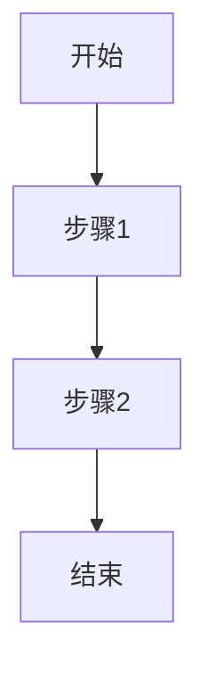
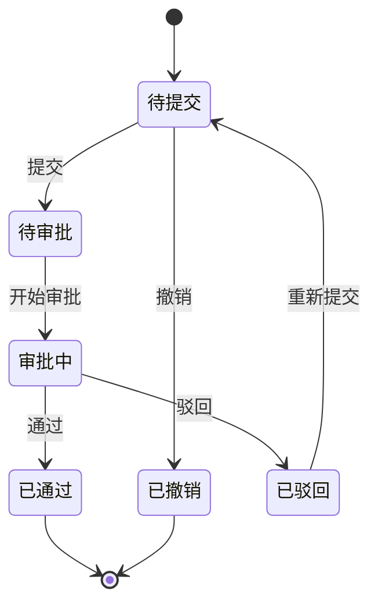

# [模块名称] 开发规范

> **模块类型**: [核心基础 / 审批流程 / 行政协同 / 知识文档]
> **复杂度**: ⭐⭐⭐ (1-5星)
> **预计工期**: X天
> **参考模块**: `src/modules/employee/`
> **创建日期**: YYYY-MM-DD
> **最后更新**: YYYY-MM-DD

---

## 📋 目录

- [1. 功能概述](#1-功能概述)
- [2. 功能需求](#2-功能需求)
- [3. 数据结构](#3-数据结构)
- [4. API接口](#4-api接口)
- [5. 验证规则](#5-验证规则)
- [6. UI规范](#6-ui规范)
- [7. 业务规则](#7-业务规则)
- [8. 自动化功能](#8-自动化功能)
- [9. 参考实现](#9-参考实现)
- [10. 特殊说明](#10-特殊说明)

---

## 1. 功能概述

### 1.1 模块简介
[简要描述模块的核心功能、业务价值和目标用户]

### 1.2 功能目标
- 目标1: [描述]
- 目标2: [描述]

### 1.3 用户角色
- 角色1: [职责]
- 角色2: [职责]

---

## 2. 功能需求

### 2.1 用户故事
```
作为 [角色],
我想要 [功能],
以便 [价值/目标]
```

### 2.2 功能清单

#### 列表页面
- [ ] 功能1: [描述]
- [ ] 功能2: [描述]
- [ ] 功能3: [描述]

#### 详情页面
- [ ] 功能1: [描述]
- [ ] 功能2: [描述]

#### 表单功能
- [ ] 新增功能: [描述]
- [ ] 编辑功能: [描述]
- [ ] 删除功能: [描述]

### 2.3 交互流程



---

## 3. 数据结构

### 3.1 TypeScript类型定义

```typescript
/**
 * [模块名称]数据结构
 */
interface [ModuleName] {
  /** 唯一标识 */
  id: string

  /** 字段1说明 */
  field1: string

  /** 字段2说明 */
  field2: number

  /** 创建时间 */
  createdAt: string

  /** 更新时间 */
  updatedAt: string
}

/**
 * 筛选条件
 */
interface [ModuleName]Filter {
  /** 关键词搜索 */
  keyword?: string

  /** 状态筛选 */
  status?: string

  /** 其他筛选条件 */
  [key: string]: any
}

/**
 * 表单数据
 */
interface [ModuleName]Form {
  /** 字段1 */
  field1: string

  /** 字段2 */
  field2: number
}

/**
 * 统计数据
 */
interface [ModuleName]Statistics {
  /** 总数 */
  total: number

  /** 其他统计指标 */
  [key: string]: number | string
}
```

### 3.2 字段说明

| 字段名 | 类型 | 必填 | 默认值 | 说明 | 示例 |
|-------|------|------|--------|------|------|
| id | string | ✅ | - | 唯一标识 | DEPT001 |
| field1 | string | ✅ | - | 说明 | 示例值 |
| field2 | number | ❌ | 0 | 说明 | 100 |
| createdAt | string | ✅ | - | 创建时间 | 2026-01-09 |
| updatedAt | string | ✅ | - | 更新时间 | 2026-01-09 |

### 3.3 枚举类型

```typescript
/**
 * 状态枚举
 */
enum [ModuleName]Status {
  ACTIVE = 'active',
  INACTIVE = 'inactive',
  DELETED = 'deleted'
}

/**
 * 类型枚举
 */
enum [ModuleName]Type {
  TYPE1 = 'type1',
  TYPE2 = 'type2'
}
```

---

## 4. API接口

### 4.1 接口列表

| 方法 | 路径 | 说明 | 权限 |
|------|------|------|------|
| GET | /api/[module] | 获取列表 | 所有用户 |
| GET | /api/[module]/:id | 获取详情 | 所有用户 |
| POST | /api/[module] | 创建 | 管理员 |
| PUT | /api/[module]/:id | 更新 | 管理员 |
| DELETE | /api/[module]/:id | 删除 | 管理员 |

### 4.2 请求/响应示例

#### 4.2.1 获取列表

**请求**:
```typescript
GET /api/[module]?page=1&pageSize=20&keyword=xxx
```

**响应**:
```typescript
interface ListResponse {
  code: number
  message: string
  data: {
    list: [ModuleName][]
    total: number
    page: number
    pageSize: number
  }
}
```

#### 4.2.2 获取详情

**请求**:
```typescript
GET /api/[module]/:id
```

**响应**:
```typescript
interface DetailResponse {
  code: number
  message: string
  data: [ModuleName]
}
```

#### 4.2.3 创建

**请求**:
```typescript
POST /api/[module]
{
  "field1": "value1",
  "field2": 100
}
```

**响应**:
```typescript
interface CreateResponse {
  code: number
  message: string
  data: {
    id: string
  }
}
```

#### 4.2.4 更新

**请求**:
```typescript
PUT /api/[module]/:id
{
  "field1": "newValue1",
  "field2": 200
}
```

**响应**:
```typescript
interface UpdateResponse {
  code: number
  message: string
  data: [ModuleName]
}
```

#### 4.2.5 删除

**请求**:
```typescript
DELETE /api/[module]/:id
```

**响应**:
```typescript
interface DeleteResponse {
  code: number
  message: string
}
```

### 4.3 API实现要求

```typescript
// src/modules/[module]/api/index.ts
import request from '@/utils/request'

/**
 * 获取列表
 */
export function getList(params: [ModuleName]Filter & { page: number; pageSize: number }) {
  return request.get<ListResponse>('/api/[module]', { params })
}

/**
 * 获取详情
 */
export function getDetail(id: string) {
  return request.get<DetailResponse>(`/api/[module]/${id}`)
}

/**
 * 创建
 */
export function create(data: [ModuleName]Form) {
  return request.post<CreateResponse>('/api/[module]', data)
}

/**
 * 更新
 */
export function update(id: string, data: Partial<[ModuleName]Form>) {
  return request.put<UpdateResponse>(`/api/[module]/${id}`, data)
}

/**
 * 删除
 */
export function remove(id: string) {
  return request.delete<DeleteResponse>(`/api/[module]/${id}`)
}
```

---

## 5. 验证规则

### 5.1 前端验证

#### 5.1.1 表单验证规则

```typescript
// src/modules/[module]/components/[Module]Form.vue
const rules = {
  field1: [
    { required: true, message: '请输入字段1', trigger: 'blur' },
    { min: 2, max: 50, message: '长度在 2 到 50 个字符', trigger: 'blur' }
  ],
  field2: [
    { required: true, message: '请输入字段2', trigger: 'blur' },
    { type: 'number', min: 0, message: '必须大于等于0', trigger: 'blur' }
  ],
  email: [
    { required: true, message: '请输入邮箱', trigger: 'blur' },
    { type: 'email', message: '请输入正确的邮箱格式', trigger: 'blur' }
  ],
  phone: [
    { required: true, message: '请输入手机号', trigger: 'blur' },
    { pattern: /^1[3-9]\d{9}$/, message: '请输入正确的手机号', trigger: 'blur' }
  ]
}
```

#### 5.1.2 正则表达式

```typescript
// src/utils/validate.ts
export const patterns = {
  /** 手机号 */
  phone: /^1[3-9]\d{9}$/,

  /** 邮箱 */
  email: /^[^\s@]+@[^\s@]+\.[^\s@]+$/,

  /** 数字 */
  number: /^\d+$/,

  /** 自定义规则 */
  custom: /pattern/
}
```

### 5.2 后端验证

- [ ] 必填字段验证
- [ ] 字段类型验证
- [ ] 字段长度验证
- [ ] 格式验证
- [ ] 业务逻辑验证

### 5.3 数据完整性

- [ ] 唯一性约束
- [ ] 外键约束
- [ ] 级联删除/更新
- [ ] 事务处理

---

## 6. UI规范

### 6.1 组件选择

| 功能 | 组件 | 说明 |
|------|------|------|
| 数据展示 | el-table | 表格组件 |
| 数据录入 | el-form | 表单组件 |
| 弹窗 | el-dialog | 对话框 |
| 确认操作 | el-popconfirm | 气泡确认框 |
| 状态标签 | StatusTag | 自定义组件 |
| 页面头部 | PageHeader | 自定义组件 |

### 6.2 页面布局

#### 6.2.1 列表页布局

```
┌─────────────────────────────────────────────────┐
│  PageHeader: 标题 + 操作按钮                      │
├───────────┬───────────────────────────┬─────────┤
│           │                           │         │
│ Filter    │    Data Table             │  Stats  │
│ Panel     │    - Table View           │  Panel  │
│           │    - Card View            │         │
│           │    - Kanban View          │         │
│           │                           │         │
├───────────┴───────────────────────────┴─────────┤
│  Pagination: 上一页 页码 下一页                 │
└─────────────────────────────────────────────────┘
```

**要求**:
- 筛选面板可折叠
- 支持表格/卡片视图切换
- 统计面板固定在右侧
- 分页器在底部居中

#### 6.2.2 详情页布局

```
┌─────────────────────────────────────────────────┐
│  PageHeader: 返回 + 标题 + 操作按钮              │
├─────────────────┬───────────────────────────────┤
│                 │  Tabs:                        │
│  Info Card      │  - 基本信息                   │
│  - 头像         │  - 详细信息                   │
│  - 标题         │  - 相关记录                   │
│  - 状态         │                               │
│  - 关键数据     │  Tab Content                  │
│                 │  - 表单展示                   │
│                 │  - 表格展示                   │
│                 │  - 时间轴展示                 │
├─────────────────┴───────────────────────────────┤
│  操作按钮: 编辑 | 删除 | 其他操作                │
└─────────────────────────────────────────────────┘
```

**要求**:
- 左侧信息卡片固定(300px)
- 右侧标签页可滚动
- 支持编辑模式切换
- 操作按钮固定在底部

#### 6.2.3 表单布局

```
┌─────────────────────────────────────────────────┐
│  Dialog/Form: 标题                               │
├─────────────────────────────────────────────────┤
│  Step 1: 基本信息 ▶ Step 2: 详细信息 ▶ Step 3  │
├─────────────────────────────────────────────────┤
│                                                  │
│  Form Item 1                                     │
│  Label: [必填标识] Input                         │
│  Error: 验证错误提示                              │
│                                                  │
│  Form Item 2                                     │
│  Label: [必填标识] Select                        │
│                                                  │
│  Form Item 3                                     │
│  Label: DatePicker                               │
│                                                  │
├─────────────────────────────────────────────────┤
│  Buttons: 上一步 | 下一步 | 取消 | 确定          │
└─────────────────────────────────────────────────┘
```

**要求**:
- 步骤式表单(3步)
- 实时验证反馈
- 必填项红色星号标识
- 错误提示清晰明确

### 6.3 样式规范

#### 6.3.1 颜色系统

```scss
// src/assets/styles/variables.scss

// 主题色
$primary-color: #1890FF;
$success-color: #52C41A;
$warning-color: #FAAD14;
$error-color: #F5222D;
$info-color: #13C2C2;

// 文字颜色
$text-primary: #333333;
$text-regular: #666666;
$text-secondary: #999999;
$text-placeholder: #CCCCCC;

// 边框颜色
$border-base: #DCDFE6;
$border-light: #E4E7ED;
$border-lighter: #EBEEF5;
$border-extra-light: #F2F6FC;

// 背景颜色
$bg-color: #F5F7FA;
```

#### 6.3.2 字体系统

```scss
// 字号
$font-size-extra-large: 24px;
$font-size-large: 18px;
$font-size-medium: 16px;
$font-size-base: 14px;
$font-size-small: 12px;
$font-size-extra-small: 10px;

// 字重
$font-weight-normal: 400;
$font-weight-medium: 500;
$font-weight-bold: 700;
```

#### 6.3.3 间距系统

```scss
// 间距
$spacing-extra-small: 4px;
$spacing-small: 8px;
$spacing-base: 16px;
$spacing-large: 24px;
$spacing-extra-large: 32px;
```

### 6.4 交互要求

#### 6.4.1 加载状态
- 数据加载时显示骨架屏或loading动画
- 按钮提交时显示loading状态并禁用
- 图片加载时显示占位图

#### 6.4.2 错误处理
- 统一的错误提示组件
- 网络错误时提供重试按钮
- 表单验证错误实时显示

#### 6.4.3 操作反馈
- 操作成功后显示Toast提示
- 危险操作需要二次确认(删除、清空等)
- 长时间操作显示进度条

#### 6.4.4 响应式
- 支持桌面端(≥1200px)
- 支持平板端(768px-1199px)
- 支持移动端(<768px)

---

## 7. 业务规则

### 7.1 数据规则

```typescript
// 示例: 部门层级规则
if (department.level >= 3) {
  throw new Error('部门层级不能超过3级')
}

// 示例: 资产编号规则
const assetCode = `ASSET${Date.now()}${Math.random().toString(36).substr(2, 4).toUpperCase()}`
```

### 7.2 权限规则

| 角色 | 查看新增 | 编辑 | 删除 | 审核 |
|------|---------|------|------|------|
| 普通员工 | ✅自己 | ✅自己 | ❌ | ❌ |
| 部门管理员 | ✅部门 | ✅部门 | ❌ | ❌ |
| 系统管理员 | ✅全部 | ✅全部 | ✅全部 | ✅ |

### 7.3 工作流规则



### 7.4 计算规则

```typescript
// 示例: 资产折旧计算
function calculateDepreciation(
  originalPrice: number,
  purchaseDate: string,
  depreciationRate: number
): number {
  const months = getMonthsDiff(purchaseDate, new Date())
  const currentPrice = originalPrice * (1 - (depreciationRate / 100) * months / 12)
  return Math.max(0, Math.round(currentPrice * 100) / 100)
}

// 示例: 请假时长计算
function calculateLeaveDuration(
  startDate: string,
  endDate: string
): number {
  // 排除周末和节假日
  const workDays = getWorkDaysBetween(startDate, endDate)
  return workDays
}
```

---

## 8. 自动化功能

### 8.1 自动计算

- [ ] 字段1: 根据其他字段自动计算
- [ ] 字段2: 使用公式计算

### 8.2 自动提醒

```typescript
// 示例: 到期提醒
if (daysUntilDue <= 3) {
  sendNotification({
    type: 'warning',
    message: '即将到期',
    recipients: ['user1', 'user2']
  })
}

// 示例: 生日提醒
if (isBirthday(employee.birthday)) {
  sendNotification({
    type: 'info',
    message: '生日祝福',
    recipients: [employee.id]
  })
}
```

### 8.3 自动更新

```typescript
// 示例: 状态自动流转
if (meeting.endTime < now && meeting.status === '进行中') {
  updateStatus(meeting.id, '已结束')
}
```

### 8.4 自动发送

```typescript
// 示例: 邮件发送
async function sendEmailNotification(params: {
  to: string[]
  subject: string
  body: string
  attachments?: File[]
}) {
  // 集成邮件服务
}

// 示例: 即时消息推送
async function sendIMMessage(params: {
  users: string[]
  message: string
  type: 'text' | 'card'
}) {
  // 集成企业微信/钉钉
}
```

---

## 9. 参考实现

### 9.1 参考模块

**路径**: `src/modules/employee/`

**参考文件**:
- `types/index.ts` - 类型定义
- `mock/data.ts` - Mock数据
- `api/index.ts` - API封装
- `store/index.ts` - Pinia Store
- `views/EmployeeList.vue` - 列表页
- `views/EmployeeDetail.vue` - 详情页
- `components/EmployeeForm.vue` - 表单组件
- `components/FilterPanel.vue` - 筛选面板

### 9.2 复用组件

- `@/components/common/PageHeader.vue` - 页面头部
- `@/components/common/StatusTag.vue` - 状态标签
- `@/components/common/EmptyState.vue` - 空状态(待开发)

### 9.3 工具函数

```typescript
// src/utils/format.ts
import {
  formatDate,
  formatMoney,
  maskPhone,
  maskEmail,
  debounce,
  throttle
} from '@/utils/format'
```

---

## 10. 特殊说明

### 10.1 性能要求

- [ ] 列表页支持虚拟滚动(>1000条数据)
- [ ] 图片懒加载
- [ ] 防抖节流处理
- [ ] 计算属性优化

### 10.2 安全要求

- [ ] XSS防护
- [ ] CSRF防护
- [ ] SQL注入防护
- [ ] 敏感数据加密

### 10.3 兼容性要求

- [ ] Chrome >= 90
- [ ] Firefox >= 88
- [ ] Safari >= 14
- [ ] Edge >= 90

### 10.4 其他注意事项

- [ ] 注意事项1
- [ ] 注意事项2

---

## 附录

### A. 开发检查清单

**编码阶段**:
- [ ] 完成类型定义
- [ ] 完成API封装
- [ ] 完成Store实现
- [ ] 完成视图组件
- [ ] 完成表单验证

**测试阶段**:
- [ ] 单元测试通过
- [ ] 功能测试通过
- [ ] 边界条件测试
- [ ] 性能测试
- [ ] 兼容性测试

**文档阶段**:
- [ ] 代码注释完整
- [ ] API文档更新
- [ ] 用户文档更新

### B. 验收标准

- [ ] 所有功能需求实现
- [ ] 所有测试用例通过
- [ ] 代码审查通过
- [ ] 性能指标达标
- [ ] 无已知Bug

---

**文档版本**: v1.0.0
**创建人**: [开发者姓名]
**审核人**: [审核人姓名]
**最后更新**: YYYY-MM-DD
