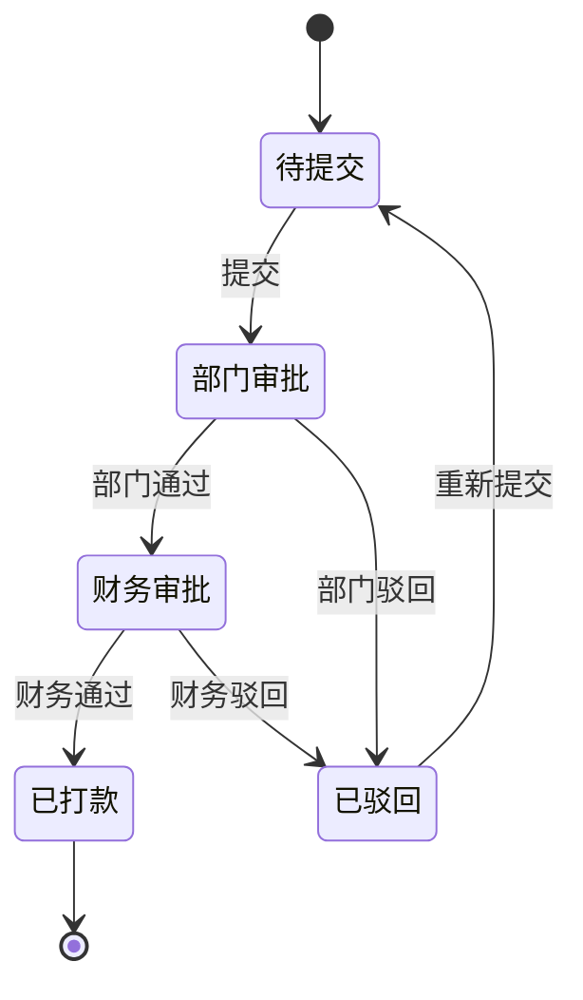

# 费用报销模块开发规范

> **模块类型**: 审批流程
> **复杂度**: ⭐⭐⭐⭐ (4星)
> **预计工期**: 1.5-2天 (AI辅助)
> **依赖模块**: employee, department
> **创建日期**: 2026-01-09

---

## 1. 功能概述

实现员工费用报销的全流程管理,包括发票上传、多级审批、财务审核、打款追踪等功能。

## 2. 核心功能

### 2.1 报销单填写
- 报销类型选择(差旅费/招待费/办公用品/交通费/其他)
- 费用明细(支持多条)
- 发票上传(支持多图,OCR识别模拟)
- 发票类型选择(增值税专用/普通/电子发票)
- 发票号码输入
- 报销事由

### 2.2 审批流程


### 2.3 大额加签规则
```typescript
interface LargeAmountRule {
  amount: number           // 金额阈值
  additionalApprover: string  // 加签审批人
}

const largeAmountRules: LargeAmountRule[] = [
  { amount: 5000, additionalApprover: 'general_manager' },     // 单笔>5000: 总经理
]

function checkLargeAmount(amount: number): string[] {
  const approvers = ['department_leader', 'finance']
  for (const rule of largeAmountRules) {
    if (amount > rule.amount) {
      approvers.push(rule.additionalApprover)
    }
  }
  return approvers
}

// 月度累计检查
async function checkMonthlyAccumulation(employeeId: string, currentAmount: number): Promise<string[]> {
  const monthStart = getMonthStart(new Date())
  const monthlyExpenses = await getExpensesByEmployee(employeeId, monthStart, new Date())
  const totalAmount = monthlyExpenses.reduce((sum, e) => sum + e.amount, 0) + currentAmount

  if (totalAmount > 20000) {
    return ['department_leader', 'finance', 'general_manager', 'special_approver']
  }

  return checkLargeAmount(currentAmount)
}
```

### 2.4 发票管理

```typescript
interface Invoice {
  id: string
  type: 'vat_special' | 'vat_common' | 'electronic'  // 增值税专用/普通/电子
  number: string                                        // 发票号码
  amount: number                                        // 发票金额
  date: string                                          // 开票日期
  imageUrl: string                                      // 发票图片
  verified: boolean                                     // 是否已验真
}

// 发票唯一性验证
async function validateInvoiceUnique(invoiceNumber: string): Promise<boolean> {
  const existing = await getExpenseByInvoiceNumber(invoiceNumber)
  if (existing) {
    throw new Error('该发票已报销,不能重复使用')
  }
  return true
}

// OCR识别(模拟)
async function recognizeInvoice(imageUrl: string): Promise<Partial<Invoice>> {
  // 调用OCR服务识别发票信息
  return {
    number: '12345678',
    amount: 1000,
    date: '2026-01-09',
    type: 'vat_common'
  }
}
```

## 3. 数据结构

```typescript
interface Expense {
  id: string                        // 报销单号: EXP+YYYYMMDD+序号
  applicantId: string               // 报销人ID
  departmentId: string              // 部门ID
  type: string                      // 报销类型
  amount: number                    // 总金额
  items: ExpenseItem[]              // 费用明细
  invoices: Invoice[]               // 发票列表
  reason: string                    // 报销事由
  applyDate: string                 // 申请日期
  expenseDate: string               // 费用发生日期

  // 审批相关
  status: 'draft' | 'dept_pending' | 'finance_pending' | 'paid' | 'rejected'
  departmentApproval?: {
    approverId: string
    approverName: string
    status: 'pending' | 'approved' | 'rejected'
    opinion?: string
    timestamp?: string
  }
  financeApproval?: {
    approverId: string
    approverName: string
    status: 'pending' | 'approved' | 'rejected'
    opinion?: string
    timestamp?: string
  }

  // 打款相关
  paymentDate?: string              // 打款时间
  paymentProof?: string             // 打款凭证

  createdAt: string
  updatedAt: string
}

interface ExpenseItem {
  description: string               // 费用说明
  amount: number                    // 金额
  date: string                      // 发生日期
  category: string                  // 费用分类
}
```

## 4. 报表统计

```typescript
// 按部门统计
interface DepartmentExpenseStats {
  departmentId: string
  departmentName: string
  totalAmount: number
  count: number
  avgAmount: number
}

// 按类型统计
interface TypeExpenseStats {
  type: string
  totalAmount: number
  count: number
  percentage: number
}

// 按月份统计
interface MonthlyExpenseStats {
  month: string  // YYYY-MM
  totalAmount: number
  count: number
}

// ECharts图表配置
const chartOptions = {
  // 柱状图: 部门报销对比
  departmentBar: {
    xAxis: { type: 'category', data: departmentNames },
    yAxis: { type: 'value', name: '金额(元)' },
    series: [{
      type: 'bar',
      data: departmentAmounts,
      itemStyle: { color: '#1890FF' }
    }]
  },

  // 饼图: 报销类型分布
  typePie: {
    tooltip: { trigger: 'item', formatter: '{b}: {c}元 ({d}%)' },
    series: [{
      type: 'pie',
      radius: '60%',
      data: typeStats.map(s => ({ value: s.totalAmount, name: s.type }))
    }]
  },

  // 折线图: 月度趋势
  monthlyLine: {
    xAxis: { type: 'category', data: months },
    yAxis: { type: 'value', name: '金额(元)' },
    series: [{
      type: 'line',
      data: monthlyAmounts,
      smooth: true,
      areaStyle: {}
    }]
  }
}
```

## 5. 打款管理

```typescript
interface PaymentRecord {
  expenseId: string
  amount: number
  paymentMethod: 'bank_transfer' | 'cash' | 'check'
  paymentDate: string
  bankAccount?: string           // 收款账号
  proof?: string                 // 打款凭证图片
  status: 'pending' | 'completed' | 'failed'
}

// 创建打款记录
async function createPayment(expenseId: string): Promise<PaymentRecord> {
  const expense = await getExpense(expenseId)

  if (expense.status !== 'finance_pending' || !expense.financeApproval?.status === 'approved') {
    throw new Error('报销单未通过财务审批')
  }

  // 获取员工银行账户
  const employee = await getEmployee(expense.applicantId)
  const bankAccount = employee.bankAccount

  const payment: PaymentRecord = {
    expenseId,
    amount: expense.amount,
    paymentMethod: 'bank_transfer',
    paymentDate: new Date().toISOString(),
    bankAccount,
    status: 'pending'
  }

  await savePayment(payment)

  // 实际项目中这里会调用银行接口
  // await bankTransfer(payment)

  return payment
}

// 上传打款凭证
async function uploadPaymentProof(paymentId: string, proofImage: string): Promise<void> {
  await updatePayment(paymentId, {
    proof: proofImage,
    status: 'completed'
  })

  // 更新报销单状态
  const payment = await getPayment(paymentId)
  await updateExpense(payment.expenseId, {
    status: 'paid',
    paymentDate: payment.paymentDate,
    paymentProof: proofImage
  })

  // 通知报销人
  await notifyEmployee(payment.applicantId, '您的报销已打款')
}
```

## 6. 财务审核重点

```typescript
interface FinanceChecklist {
  // 发票合规性
  invoiceValid: boolean        // 发票是否有效
  invoiceUnique: boolean       // 发票是否重复
  invoiceAmountMatch: boolean  // 发票金额与申请金额是否一致

  // 业务真实性
  reasonValid: boolean         // 报销事由是否合理
  withinBudget: boolean        // 是否在预算内
  dateReasonable: boolean      // 报销时间是否合理

  // 其他
  documentsComplete: boolean   // 附件是否齐全
  compliance: boolean          // 是否符合财务制度
}

// 财务审核
async function financeReview(expenseId: string, checklist: FinanceChecklist, opinion: string): Promise<void> {
  const expense = await getExpense(expenseId)

  // 验证发票
  for (const invoice of expense.invoices) {
    if (!checklist.invoiceValid) {
      throw new Error(`发票${invoice.number}无效`)
    }
    await validateInvoiceUnique(invoice.number)
  }

  // 更新审批状态
  await updateExpense(expenseId, {
    status: checklist.invoiceValid && checklist.compliance ? 'paid' : 'rejected',
    financeApproval: {
      approverId: getCurrentUserId(),
      approverName: getCurrentUserName(),
      status: checklist.invoiceValid && checklist.compliance ? 'approved' : 'rejected',
      opinion,
      timestamp: new Date().toISOString()
    }
  })

  // 如果通过,创建打款记录
  if (checklist.invoiceValid && checklist.compliance) {
    await createPayment(expenseId)
  }
}
```

---

**文档版本**: v1.0.0
