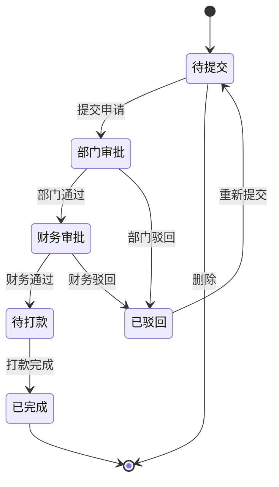

# 费用报销模块 - 功能需求规范

> **文档类型**: 功能需求规范 (Functional Requirements)
> **模块类型**: 审批流程
> **复杂度**: ⭐⭐⭐⭐ (4星)
> **预计工期**: 1.5-2天 (AI辅助)
> **依赖模块**: employee, department
> **创建日期**: 2026-01-09
> **版本**: v1.0.0

---

## 1. 功能概述

实现员工费用报销的全流程管理,包括发票上传、多级审批、财务审核、打款追踪等功能。

### 1.1 业务目标
- 规范费用报销流程,提高审批效率
- 确保发票合规性,防止重复报销
- 实现财务数据统计与分析
- 提供打款追踪机制

### 1.2 用户角色
- **报销申请人**: 普通员工
- **部门审批人**: 部门主管/经理
- **财务审批人**: 财务人员
- **系统管理员**: 维护基础数据和配置

---

## 2. 核心功能需求

### 2.1 报销单填写

#### 2.1.1 基本信息录入
- **报销类型选择**
  - 差旅费 (交通、住宿、餐补等)
  - 招待费 (客户招待、商务宴请等)
  - 办公用品 (办公设备、耗材等)
  - 交通费 (市内交通、打车等)
  - 其他费用

- **费用明细管理**
  - 支持添加多条费用明细
  - 每条明细包含: 费用说明、金额、发生日期、费用分类
  - 自动计算总金额

- **报销事由**
  - 必填项,简要说明报销原因
  - 支持多行文本输入

#### 2.1.2 发票管理
- **发票上传**
  - 支持多张发票图片上传
  - 支持格式: JPG, PNG, PDF
  - 单张图片大小限制: 5MB

- **发票类型**
  - 增值税专用发票
  - 增值税普通发票
  - 电子发票

- **发票信息录入**
  - 发票号码 (必填,8位或20位)
  - 发票金额 (必填,自动识别或手动输入)
  - 开票日期 (必填)
  - OCR识别功能 (自动提取发票信息)

- **发票验证**
  - 发票号码唯一性检查 (防止重复报销)
  - 发票金额与申请金额一致性校验
  - 发票日期有效性检查

#### 2.1.3 日期管理
- **费用发生日期**: 报销费用实际发生的日期
- **申请日期**: 提交报销申请的日期 (自动生成,不可修改)

---

### 2.2 审批流程

#### 2.2.1 审批状态流转

#### 2.2.2 部门审批
- **审批权限**: 部门主管/经理
- **审批内容**:
  - 费用合理性审核
  - 报销事由真实性
  - 费用明细完整性
- **审批操作**:
  - 通过: 进入财务审批
  - 驳回: 退回申请人修改,需填写驳回原因

#### 2.2.3 财务审批
- **审批权限**: 财务部门人员
- **审批内容**:
  - 发票合规性检查
  - 发票金额准确性
  - 财务制度符合性
  - 预算控制检查
- **审批操作**:
  - 通过: 创建打款记录,进入待打款状态
  - 驳回: 退回申请人,需详细说明驳回原因

#### 2.2.4 大额加签规则

**单笔金额加签**:
- 单笔 > 5000元: 需总经理审批
- 单笔 > 10000元: 需总经理+特别审批人

**月度累计加签**:
- 月度累计 > 20000元: 需总经理+特别审批人
- 月度累计 > 50000元: 需总经理+特别审批人+董事长审批

---

### 2.3 发票管理功能

#### 2.3.1 发票验真
- 发票号码格式验证
- 发票号码唯一性验证 (系统内查重)
- 发票金额与申请金额匹配验证

#### 2.3.2 发票OCR识别
- 自动识别发票类型、号码、金额、日期
- 支持手动修正识别结果
- 识别结果预览

#### 2.3.3 发票存储
- 发票图片云端存储
- 支持发票图片预览
- 支持发票图片下载

---

### 2.4 打款管理

#### 2.4.1 打款流程
1. 财务审批通过后,自动创建打款记录
2. 获取报销人银行账户信息
3. 财务人员执行银行转账
4. 上传打款凭证 (银行回单)
5. 系统确认打款完成,通知报销人

#### 2.4.2 打款方式
- 银行转账 (默认)
- 现金
- 支票

#### 2.4.3 打款追踪
- 打款状态: 待打款 | 打款中 | 已完成 | 打款失败
- 打款日期记录
- 打款凭证上传
- 打款失败原因记录

---

### 2.5 报表统计

#### 2.5.1 统计维度

**按部门统计**:
- 各部门报销总金额
- 各部门报销笔数
- 各部门平均报销金额
- 部门报销金额排名

**按类型统计**:
- 各报销类型金额占比
- 各报销类型笔数统计
- 报销类型分布饼图

**按月份统计**:
- 月度报销总金额趋势
- 月度报销笔数趋势
- 同比/环比分析

**按员工统计**:
- 员工个人报销记录
- 员工报销总金额排行
- 员工报销频率分析

#### 2.5.2 图表展示
- 柱状图: 部门报销对比
- 饼图: 报销类型分布
- 折线图: 月度趋势分析
- 数据表格: 明细数据导出

#### 2.5.3 数据导出
- 支持Excel格式导出
- 支持自定义时间范围
- 支持按部门/类型筛选

---

## 3. 功能约束

### 3.1 业务规则约束
- 发票号码不能重复使用
- 报销金额必须与发票金额一致
- 费用发生日期不能晚于申请日期
- 驳回的报销单必须修改后才能重新提交
- 已打款的报销单不能撤销

### 3.2 数据约束
- 报销单号格式: EXP + YYYYMMDD + 4位序号 (如 EXP202601090001)
- 发票号码: 8位或20位数字
- 金额精度: 保留两位小数
- 日期格式: YYYY-MM-DD

### 3.3 性能约束
- 发票上传响应时间 < 3秒
- 报销单提交响应时间 < 2秒
- 审批操作响应时间 < 2秒
- 统计报表查询时间 < 5秒

---

## 4. 用户故事

### 4.1 作为员工,我希望
- 能够方便地提交报销申请
- 能够上传多张发票图片
- 能够自动识别发票信息,减少手工录入
- 能够随时查看报销审批进度
- 能够收到打款到账通知

### 4.2 作为部门主管,我希望
- 能够查看部门成员的所有报销申请
- 能够快速审批报销,提高效率
- 能够驳回不合理的报销申请
- 能够查看部门报销统计情况

### 4.3 作为财务人员,我希望
- 能够审核发票的合规性
- 能够检查发票是否重复报销
- 能够执行打款操作
- 能够查看所有报销记录
- 能够导出财务报表

### 4.4 作为系统管理员,我希望
- 能够配置大额加签规则
- 能够维护报销类型分类
- 能够查看系统运行日志

---

## 5. 功能优先级

### 5.1 P0 - 核心功能 (MVP)
- 报销单填写与提交
- 发票上传与管理
- 部门审批流程
- 财务审批流程
- 发票唯一性验证
- 基础报表统计

### 5.2 P1 - 重要功能
- 大额加签规则
- OCR识别功能
- 打款管理
- 多维度统计报表
- 数据导出功能

### 5.3 P2 - 增强功能
- 移动端审批
- 报销模板
- 预算控制
- 消息通知
- 电子签名

---

## 6. 验收标准

### 6.1 功能验收
- 所有P0功能正常运行
- 审批流程流转正确
- 发票验证机制有效
- 统计数据准确
- 无数据丢失风险

### 6.2 用户体验验收
- 界面简洁易用
- 操作流程清晰
- 错误提示友好
- 响应速度满足要求

### 6.3 业务验收
- 符合财务制度要求
- 满足内控合规要求
- 数据准确可追溯

---

**文档版本**: v1.0.0
**最后更新**: 2026-01-09
