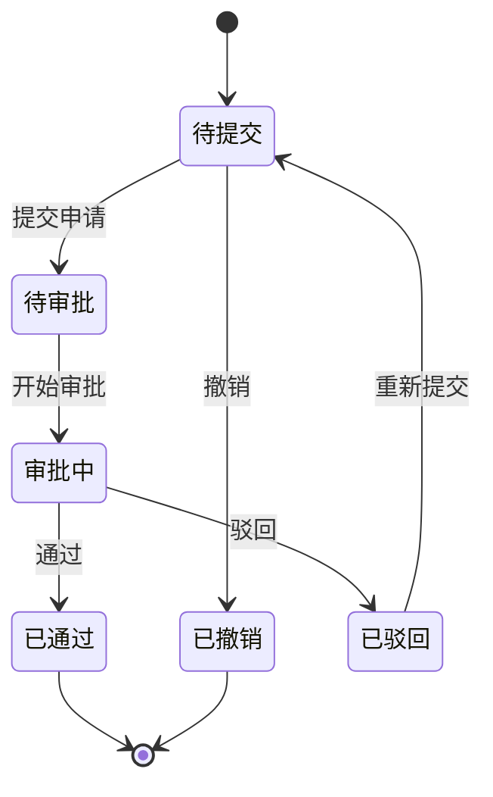

# 请假管理模块开发规范

> **模块类型**: 审批流程
> **复杂度**: ⭐⭐⭐⭐ (4星)
> **预计工期**: 1.5-2天 (AI辅助)
> **依赖模块**: employee, department
> **创建日期**: 2026-01-09

---

## 1. 功能概述

实现员工请假申请、审批、统计的全流程管理,支持多级审批、自动计算时长、余额提醒等功能。

## 2. 核心功能

### 2.1 请假申请
- 选择请假类型(年假/病假/事假/调休/婚假/产假)
- 选择开始/结束时间
- 自动计算请假时长(工作日)
- 上传附件(病假证明等)
- 填写请假事由

### 2.2 审批流程


### 2.3 多级审批规则
```typescript
interface ApprovalRule {
  duration: number        // 请假天数
  approvers: string[]     // 审批人角色
}

const approvalRules: ApprovalRule[] = [
  { duration: 3, approvers: ['department_leader'] },           // 3天内: 部门负责人
  { duration: 7, approvers: ['department_leader', 'hr'] },     // 3-7天: +人事
  { duration: Infinity, approvers: ['department_leader', 'hr', 'general_manager'] }  // 7天+: +总经理
]

function getApprovalFlow(duration: number): string[] {
  for (const rule of approvalRules) {
    if (duration <= rule.duration) {
      return rule.approvers
    }
  }
  return approvalRules[approvalRules.length - 1].approvers
}
```

### 2.4 自动提醒
- 提交时通知审批人
- 审批结果通知申请人
- 年假余额不足警告
- 连续请假>3天需二级审批警告

## 3. 数据结构

```typescript
interface LeaveRequest {
  id: string                        // 编号: LEAVE+YYYYMMDD+序号
  applicantId: string               // 申请人ID
  departmentId: string              // 部门ID
  type: 'annual' | 'sick' | 'personal' | 'comp_time' | 'marriage' | 'maternity'
  startTime: string                 // 开始时间
  endTime: string                   // 结束时间
  duration: number                  // 请假时长(天)
  reason: string                    // 请假事由
  attachments?: string[]            // 附件
  status: 'draft' | 'pending' | 'approving' | 'approved' | 'rejected' | 'cancelled'
  currentApprovalLevel: number      // 当前审批层级
  approvers: ApprovalRecord[]       // 审批记录
  createdAt: string
  updatedAt: string
}

interface ApprovalRecord {
  approverId: string                // 审批人ID
  approverName: string              // 审批人姓名
  status: 'pending' | 'approved' | 'rejected'
  opinion?: string                  // 审批意见
  timestamp?: string                // 审批时间
}
```

## 4. 请假时长计算

```typescript
/**
 * 计算请假时长(工作日)
 */
function calculateLeaveDuration(
  startTime: string,
  endTime: string
): number {
  const start = new Date(startTime)
  const end = new Date(endTime)
  let workDays = 0

  const current = new Date(start)
  while (current <= end) {
    const dayOfWeek = current.getDay()
    // 排除周末(周六=6, 周日=0)
    if (dayOfWeek !== 0 && dayOfWeek !== 6) {
      // 还要排除节假日(从节假日表查询)
      if (!isHoliday(current)) {
        workDays++
      }
    }
    current.setDate(current.getDate() + 1)
  }

  return workDays
}

/**
 * 判断是否为节假日
 */
async function isHoliday(date: Date): Promise<boolean> {
  // 查询节假日表
  const holiday = await getHoliday(date)
  return !!holiday
}
```

## 5. 年假管理

```typescript
interface LeaveBalance {
  employeeId: string
  annualTotal: number        // 年假总额(天)
  annualUsed: number         // 已使用(天)
  annualRemaining: number    // 剩余(天)
}

// 计算年假天数
function calculateAnnualLeaveYears(joinDate: string): number {
  const years = getWorkYears(joinDate)
  if (years < 1) return 0
  if (years < 10) return 5
  if (years < 20) return 10
  return 15
}
```

## 6. 日历视图

使用FullCalendar或el-calendar展示请假记录:

```vue
<template>
  <el-calendar v-model="currentDate">
    <template #date-cell="{ data }">
      <div class="calendar-cell">
        <div class="date">{{ data.day.split('-').slice(2).join('-') }}</div>
        <div
          v-for="leave in getLeavesByDate(data.day)"
          :key="leave.id"
          class="leave-item"
          :class="`leave-${leave.type}`"
        >
          {{ leave.applicantName }}
        </div>
      </div>
    </template>
  </el-calendar>
</template>
```

## 7. 审批操作

```typescript
// 提交申请
async function submitLeaveRequest(data: LeaveRequestForm) {
  // 1. 验证年假余额
  if (data.type === 'annual') {
    const balance = await getLeaveBalance(data.applicantId)
    if (balance.annualRemaining < data.duration) {
      throw new Error('年假余额不足')
    }
  }

  // 2. 计算审批流程
  const duration = calculateLeaveDuration(data.startTime, data.endTime)
  const approvers = getApprovalFlow(duration)

  // 3. 创建申请
  const request = await create({
    ...data,
    duration,
    status: 'pending',
    approvers: approvers.map(id => ({
      approverId: id,
      status: 'pending'
    }))
  })

  // 4. 通知第一个审批人
  await notifyApprover(request.approvers[0].approverId, request.id)

  return request
}

// 审批操作
async function approveLeave(requestId: string, approverId: string, action: 'approve' | 'reject', opinion?: string) {
  const request = await getLeaveRequest(requestId)

  // 找到当前审批人记录
  const record = request.approvers.find(r => r.approverId === approverId && r.status === 'pending')
  if (!record) {
    throw new Error('无权审批或已审批')
  }

  // 更新审批记录
  record.status = action === 'approve' ? 'approved' : 'rejected'
  record.opinion = opinion
  record.timestamp = new Date().toISOString()

  // 检查是否还有待审批的
  const pendingApprovers = request.approvers.filter(r => r.status === 'pending')

  if (action === 'reject') {
    // 驳回: 整个申请驳回
    request.status = 'rejected'
  } else if (pendingApprovers.length === 0) {
    // 通过且无待审批: 全部通过
    request.status = 'approved'

    // 扣减年假余额
    if (request.type === 'annual') {
      await deductLeaveBalance(request.applicantId, request.duration)
    }
  } else {
    // 通过但还有待审批: 继续流转
    request.status = 'approving'
    request.currentApprovalLevel++

    // 通知下一个审批人
    await notifyApprover(pendingApprovers[0].approverId, requestId)
  }

  // 通知申请人
  await notifyApplicant(request.applicantId, request.status, opinion)

  await updateLeaveRequest(requestId, request)
}
```

---

**文档版本**: v1.0.0
