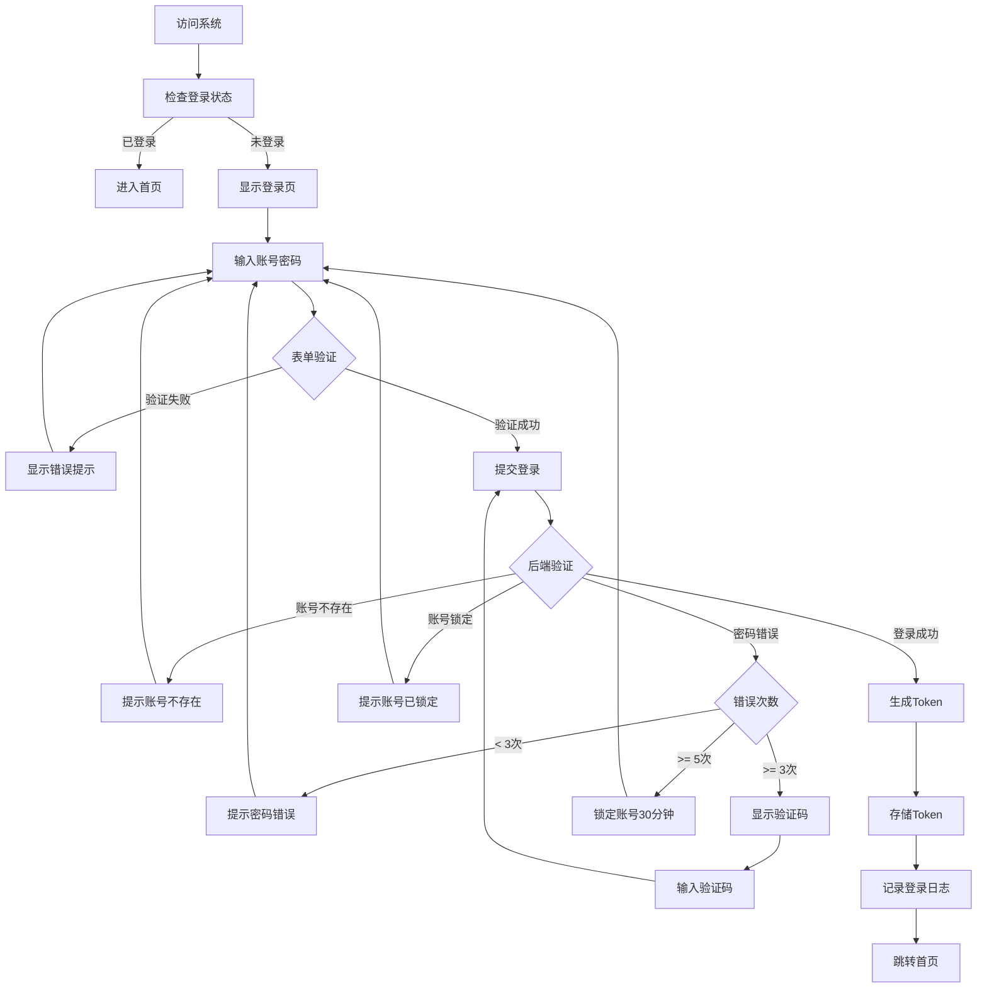
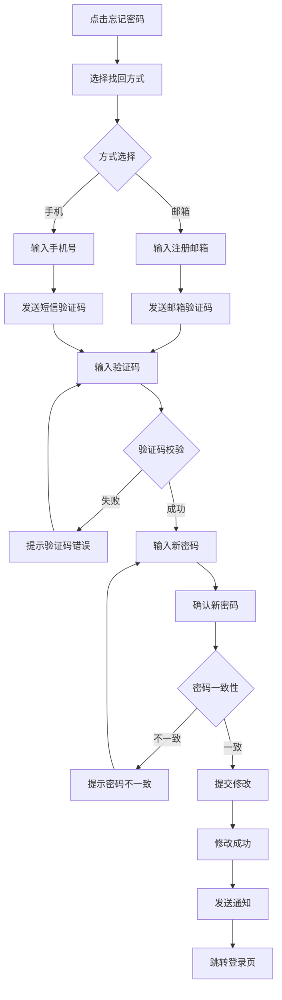
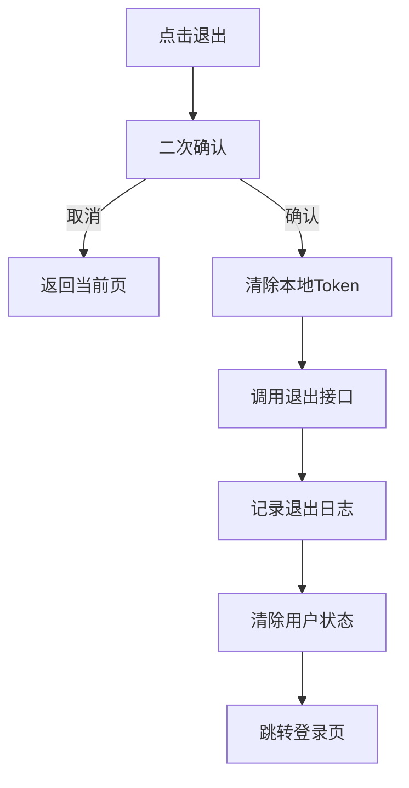
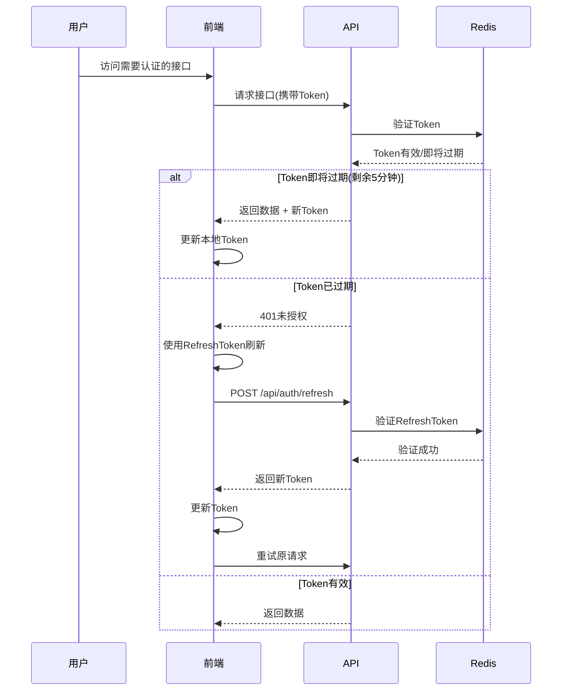

# 登录功能需求规范

> **规范类型**: 第一层 - 功能需求规范
> **模块**: 登录认证
> **版本**: v1.0.0
> **创建日期**: 2026-01-10

---

## 📋 目录

- [1. 功能概述](#1-功能概述)
- [2. 用户故事](#2-用户故事)
- [3. 功能清单](#3-功能清单)
- [4. 交互流程](#4-交互流程)
- [5. 业务规则](#5-业务规则)

---

## 1. 功能概述

### 1.1 模块简介

登录认证模块是OA系统的核心基础模块,提供用户身份认证、会话管理、权限验证等安全功能。支持多种登录方式、记住密码、找回密码、自动登录等功能,确保系统安全性和用户体验的平衡。

### 1.2 业务价值

- **安全保障**: 通过身份认证保护系统数据安全,防止未授权访问
- **用户管理**: 支持多用户并发访问,实现个性化的用户会话管理
- **审计追溯**: 记录登录日志,便于安全审计和问题追踪
- **体验优化**: 提供多种便捷登录方式,减少登录摩擦

### 1.3 目标用户

| 用户角色 | 使用场景 | 核心需求 |
|---------|---------|---------|
| 全体员工 | 每日系统登录 | 快速、安全、稳定 |
| 系统管理员 | 管理登录安全 | 监控、审计、异常处理 |
| 忘记密码用户 | 账号恢复 | 便捷找回密码 |

### 1.4 功能目标

- 提供安全可靠的用户身份认证机制
- 支持多种登录方式(账号密码、手机验证码、企业微信等)
- 实现会话管理和自动续期
- 记录完整的登录日志用于审计
- 提供友好的找回密码流程
- 防止暴力破解等安全攻击

---

## 2. 用户故事

### 2.1 核心用户故事

**故事1: 账号密码登录**

```
作为系统用户,
我想要使用账号和密码登录系统,
以便访问我的工作空间。

验收标准:
- [ ] 支持输入员工编号/邮箱/手机号作为账号
- [ ] 支持输入密码(带显示/隐藏切换)
- [ ] 登录成功后跳转到首页
- [ ] 登录失败显示明确错误提示
- [ ] 登录响应时间 < 2秒
```

**故事2: 记住登录状态**

```
作为系统用户,
我想要选择"记住我"功能,
以便下次访问时无需重新登录。

验收标准:
- [ ] 提供"记住我"复选框
- [ ] 勾选后7天内免登录
- [ ] 未勾选关闭浏览器后需重新登录
- [ ] Token存储安全,不会被XSS攻击窃取
```

**故事3: 找回密码**

```
作为忘记密码的用户,
我想要通过注册邮箱或手机号找回密码,
以便重新获得系统访问权限。

验收标准:
- [ ] 支持邮箱找回密码
- [ ] 支持手机号找回密码
- [ ] 验证码有效期10分钟
- [ ] 新密码不能与旧密码相同
- [ ] 修改成功后通知用户
```

**故事4: 退出登录**

```
作为系统用户,
我想要安全退出登录,
以便保护我的账号安全。

验收标准:
- [ ] 点击退出按钮后清除本地会话
- [ ] 跳转到登录页
- [ ] 记录退出登录日志
- [ ] 后端Token失效
```

**故事5: 登录安全防护**

```
作为系统管理员,
我想要系统具备安全防护机制,
以便防止恶意攻击和未授权访问。

验收标准:
- [ ] 密码连续输错5次锁定账号30分钟
- [ ] 同一IP地址1小时内登录失败超过10次,临时封禁
- [ ] 验证码防机器人(连续失败3次后出现)
- [ ] 检测异地登录并发送安全提醒
```

---

## 3. 功能清单

### 3.1 功能优先级

| 优先级 | 功能模块 | 功能点 | 说明 |
|-------|---------|--------|------|
| P0 | 身份认证 | 账号密码登录 | 必须实现 |
| P0 | 会话管理 | Token存储和验证 | 必须实现 |
| P0 | 会话管理 | 自动续期 | 必须实现 |
| P0 | 安全防护 | 密码错误次数限制 | 必须实现 |
| P1 | 便捷功能 | 记住我功能 | 重要 |
| P1 | 账号管理 | 退出登录 | 重要 |
| P1 | 账号恢复 | 找回密码 | 重要 |
| P1 | 安全防护 | 验证码 | 重要 |
| P2 | 安全防护 | 异地登录检测 | 可选 |
| P2 | 安全防护 | 二次验证(2FA) | 可选 |
| P2 | 便捷功能 | 第三方登录 | 可选 |

### 3.2 详细功能列表

#### 3.2.1 登录页面

- [ ] 登录表单
  - 账号输入框(支持员工编号/邮箱/手机号)
  - 密码输入框(带显示/隐藏切换)
  - 记住我复选框
  - 登录按钮
  - 忘记密码链接
- [ ] 表单验证
  - 账号非空验证
  - 密码非空验证
  - 实时格式验证
- [ ] 验证码(连续失败3次后显示)
  - 图形验证码
  - 点击刷新
- [ ] 第三方登录按钮
  - 企业微信登录(P2)
  - 钉钉登录(P2)

#### 3.2.2 登录流程

- [ ] 登录验证
  - 账号存在性验证
  - 密码正确性验证
  - 账号状态验证(是否锁定/停用)
- [ ] 会话创建
  - 生成访问Token(JWT)
  - 生成刷新Token(Refresh Token)
  - 记录登录日志
- [ ] 登录后处理
  - 跳转到首页或原访问页面
  - 加载用户信息和权限
  - 异地登录提醒(P2)

#### 3.2.3 找回密码

- [ ] 找回方式选择
  - 邮箱找回
  - 手机号找回
- [ ] 身份验证
  - 输入注册邮箱/手机号
  - 发送验证码
  - 验证码校验
- [ ] 重置密码
  - 输入新密码
  - 确认新密码
  - 密码强度提示
- [ ] 完成通知
  - 密码修改成功提示
  - 发送密码变更通知

#### 3.2.4 会话管理

- [ ] Token存储
  - Access Token存储(HttpOnly Cookie)
  - Refresh Token存储(LocalStorage)
- [ ] 自动续期
  - Token即将过期前自动刷新
  - 刷新失败跳转登录页
- [ ] 多端登录管理
  - 查看活跃登录设备(P2)
  - 远程登出指定设备(P2)

#### 3.2.5 安全防护

- [ ] 登录限制
  - 密码连续错误5次锁定账号30分钟
  - IP地址限流(1小时10次)
  - 账号锁定时显示解锁时间
- [ ] 验证码机制
  - 连续失败3次出现图形验证码
  - 验证码有效期5分钟
- [ ] 密码策略
  - 最小长度8位
  - 必须包含字母和数字
  - 不能与最近3次密码重复
- [ ] 异常检测
  - 异地登录检测(P2)
  - 异常时间登录提醒(P2)

#### 3.2.6 退出登录

- [ ] 退出流程
  - 清除本地Token
  - 调用后端退出接口
  - 记录退出日志
- [ ] 退出后跳转
  - 跳转到登录页
  - 清空路由历史

---

## 4. 交互流程

### 4.1 登录流程图



### 4.2 找回密码流程



### 4.3 退出登录流程



### 4.4 Token刷新流程



---

## 5. 业务规则

### 5.1 登录验证规则

| 规则类型 | 规则说明 | 错误提示 |
|---------|---------|---------|
| 账号格式 | 支持员工编号/邮箱/手机号 | "请输入正确的账号格式" |
| 账号存在性 | 账号必须已注册 | "账号不存在,请联系管理员" |
| 密码非空 | 密码不能为空 | "请输入密码" |
| 密码正确性 | 密码必须匹配 | "密码错误,请重新输入" |
| 账号状态 | 账号不能被锁定或停用 | "账号已锁定,请30分钟后再试" / "账号已停用,请联系管理员" |
| 验证码 | 连续失败3次后必填 | "请输入验证码" |
| 验证码正确性 | 验证码必须正确 | "验证码错误,请重新输入" |

### 5.2 密码策略规则

**规则1: 密码复杂度要求**
```
- 最小长度: 8位
- 最大长度: 20位
- 必须包含: 大写字母、小写字母、数字
- 可选包含: 特殊字符(!@#$%^&*)
- 不能包含: 用户名、生日、手机号等个人信息
```

**规则2: 密码历史规则**
```
- 新密码不能与最近3次使用的密码相同
- 新密码不能与当前密码相同
```

**规则3: 密码有效期规则**
```
- 密码有效期: 90天
- 过期前7天提醒用户修改密码
- 密码过期后强制修改
```

### 5.3 登录安全规则

**规则1: 账号锁定机制**
```
触发条件:
  - 密码连续错误次数 >= 5次
  - 同一IP地址1小时内失败次数 >= 10次

锁定时间: 30分钟

解锁方式:
  - 等待锁定时间自动解锁
  - 管理员手动解锁
  - 通过邮箱/手机验证码解锁
```

**规则2: 验证码触发机制**
```
触发条件:
  - 密码连续错误次数 >= 3次

验证码类型: 图形验证码

有效期: 5分钟
```

**规则3: 会话超时规则**
```
Access Token有效期: 2小时
Refresh Token有效期: 7天

自动刷新:
  - Token剩余时间 < 5分钟时自动刷新
  - 刷新失败后跳转登录页

单点登录:
  - 同一账号最多允许3个活跃会话
  - 新登录会话挤掉最旧的会话(P2)
```

### 5.4 找回密码规则

**规则1: 验证码发送限制**
```
- 同一邮箱/手机号1分钟内只能发送1次
- 同一邮箱/手机号1小时内最多发送5次
- 验证码有效期: 10分钟
```

**规则2: 身份验证规则**
```
- 只能使用注册时绑定的邮箱/手机号
- 验证码错误次数不超过3次
- 超过3次需重新获取验证码
```

**规则3: 密码修改规则**
```
- 新密码必须符合密码策略
- 新密码不能与旧密码相同
- 修改成功后强制重新登录
- 修改成功后通过邮件/短信通知用户
```

### 5.5 登录日志规则

**记录内容**:
- 登录时间
- 登录IP地址
- 登录设备信息(浏览器、操作系统)
- 登录地理位置(P2)
- 登录状态(成功/失败)
- 失败原因(失败时记录)

**日志保留期**: 180天

**异常监控**:
- 异地登录检测(与常用登录地距离 > 500km)
- 异常时间登录(凌晨0-6点)
- 短时间内多次登录失败(5分钟内失败 > 3次)

---

## 附录

### A. 功能优先级说明

**P0 (核心功能 - 必须实现)**:
- 账号密码登录
- Token认证和验证
- 自动刷新Token
- 基础安全防护(错误次数限制)

**P1 (重要功能 - 应该实现)**:
- 记住我功能
- 退出登录
- 找回密码
- 图形验证码
- 登录日志记录

**P2 (增强功能 - 可选实现)**:
- 异地登录检测
- 二次验证(2FA)
- 第三方登录(企业微信、钉钉)
- 多设备管理
- 登录行为分析

### B. 功能测试要点

**功能测试**:
- 正常登录流程
- 错误账号登录
- 错误密码登录
- 账号锁定后登录
- Token过期后自动刷新
- 退出登录流程

**安全测试**:
- SQL注入测试
- XSS攻击测试
- CSRF攻击测试
- 暴力破解测试
- 会话劫持测试
- Token伪造测试

**性能测试**:
- 并发登录(1000用户同时登录)
- 登录响应时间(目标 < 2秒)
- Token验证性能(目标 < 50ms)
- 密码加密性能(目标 < 100ms)

**兼容性测试**:
- 主流浏览器(Chrome、Firefox、Safari、Edge)
- 移动端浏览器(iOS、Android)
- 不同分辨率设备

---

**文档版本**: v1.0.0
**创建人**: AI开发助手
**最后更新**: 2026-01-10
