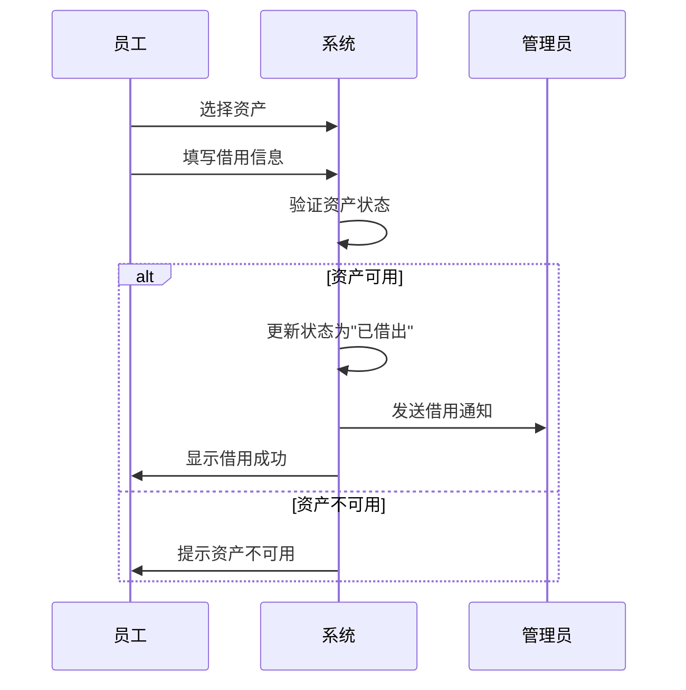
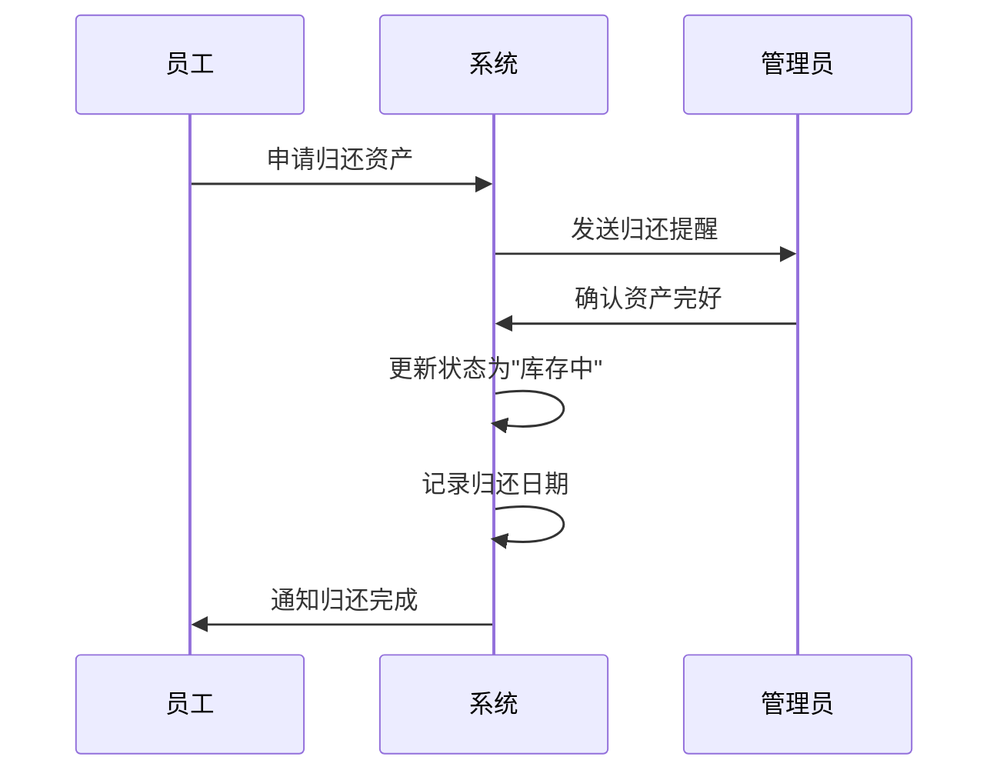
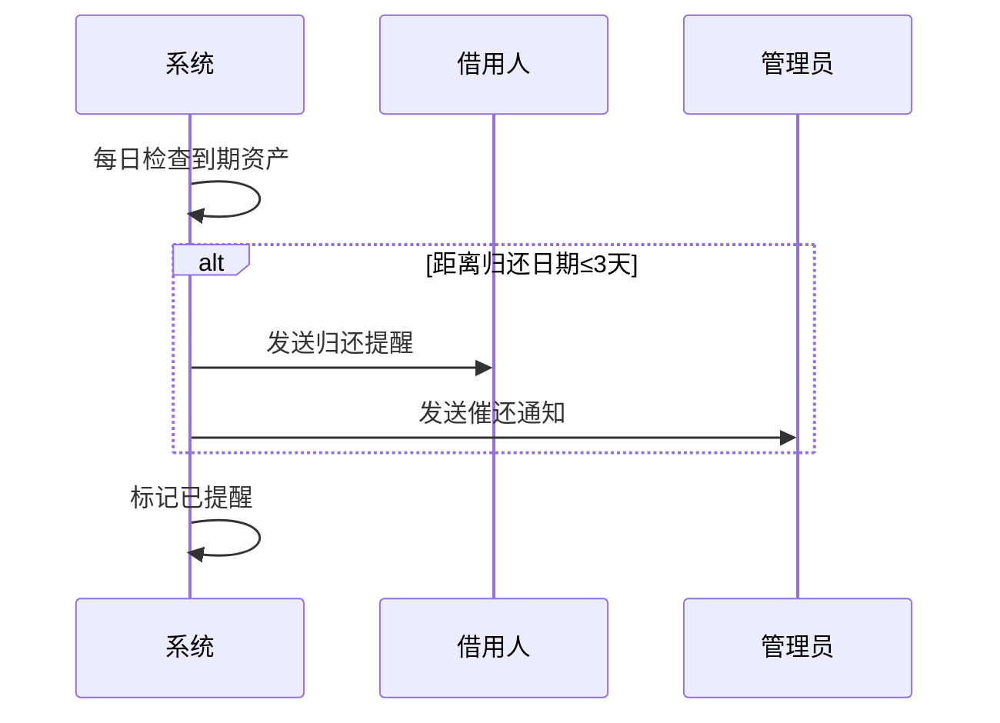

# 资产管理模块 - 功能需求规范

> **文档类型**: 功能需求规范
> **模块**: 资产管理
> **创建日期**: 2026-01-09
> **版本**: v1.0.0

---

## 1. 功能概述

管理公司的固定资产、办公设备等资源,支持资产的入库、借用、归还、维修、报废等全生命周期管理。

### 1.1 业务价值
- 提高资产利用率,减少闲置浪费
- 实现资产标准化管理,便于盘点和追踪
- 自动化折旧计算,提供财务决策依据
- 预警提醒功能,避免资产流失

### 1.2 目标用户
- **资产管理员**: 负责资产的入库、盘点、维护
- **普通员工**: 借用和归还资产
- **财务人员**: 查看资产折旧和统计分析

---

## 2. 用户故事

### 2.1 资产入库
> 作为资产管理员,我希望能够录入新购置的资产信息,包括名称、类别、品牌型号、购置日期和金额,以便系统能够统一管理所有资产。

**验收标准**:
- 可以填写资产基本信息
- 系统自动生成唯一资产编号(格式: ASSET+序号)
- 支持上传资产图片
- 支持批量导入资产

### 2.2 资产借用
> 作为普通员工,我希望能够申请借用公司资产,并选择预计归还日期,以便系统能够跟踪资产去向。

**验收标准**:
- 可以选择要借用的资产
- 可以填写借用人和预计归还日期
- 借用成功后资产状态自动变更为"已借出"
- 系统在归还前3天自动提醒

### 2.3 资产归还
> 作为资产管理员,我希望能够处理员工的资产归还请求,以便资产能够重新入库供他人使用。

**验收标准**:
- 可以查看已借出的资产列表
- 可以确认资产归还
- 归还后资产状态恢复为"库存中"
- 记录归还日期和资产状态

### 2.4 资产查看
> 作为员工,我希望能够通过多种视图(表格、看板、画廊)查看资产信息,以便快速找到需要的资产。

**验收标准**:
- 表格视图: 列表展示所有资产
- 看板视图: 按状态分组,支持拖拽改变状态
- 画廊视图: 卡片网格布局,展示资产图片
- 支持按关键字、类别、状态筛选

### 2.5 资产统计
> 作为财务人员,我希望能够查看资产的分类占比、折旧趋势和借出情况,以便了解资产使用状况。

**验收标准**:
- 饼图展示资产分类占比
- 柱状图展示月度折旧趋势
- 折线图展示借出趋势
- 支持按时间范围筛选

---

## 3. 功能清单

### 3.1 资产基础管理
- [ ] 新增资产
- [ ] 编辑资产信息
- [ ] 删除资产(二次确认)
- [ ] 查看资产详情
- [ ] 批量导入资产
- [ ] 批量导出资产

### 3.2 借还管理
- [ ] 借出资产
- [ ] 归还资产
- [ ] 查看借还历史
- [ ] 到期提醒(归还前3天)
- [ ] 逾期资产列表

### 3.3 多视图展示
- [ ] 表格视图
- [ ] 看板视图(支持拖拽)
- [ ] 画廊视图
- [ ] 视图切换

### 3.4 筛选与搜索
- [ ] 关键字搜索
- [ ] 按类别筛选
- [ ] 按状态筛选
- [ ] 按使用人筛选
- [ ] 高级筛选组合

### 3.5 统计分析
- [ ] 资产分类统计(饼图)
- [ ] 月度折旧趋势(柱状图)
- [ ] 借出趋势(折线图)
- [ ] 自定义时间范围

### 3.6 资产维护
- [ ] 维护记录
- [ ] 维修登记
- [ ] 报废处理
- [ ] 资产盘点

---

## 4. 交互流程

### 4.1 资产借用流程

### 4.2 资产归还流程

### 4.3 到期提醒流程

---

## 5. 业务规则

### 5.1 资产状态规则

| 当前状态 | 允许的下一状态 | 说明 |
|---------|--------------|------|
| stock (库存中) | in_use, borrowed, maintenance, scrapped | 可以投入使用、借出、维修、报废 |
| in_use (使用中) | stock, maintenance, scrapped | 可以回收、维修、报废 |
| borrowed (已借出) | stock | 必须先归还才能改变状态 |
| maintenance (维修中) | stock, in_use, scrapped | 维修完成后可以重新入库或投入使用,也可以直接报废 |
| scrapped (报废) | - | 终态,不可变更 |

### 5.2 借用规则
- 每位员工同时最多可借用5件资产
- 借用期限最长为30天
- 超期未还将自动标记为"逾期"状态
- 逾期资产不可再次借用
- 管理员可以强制收回借出的资产

### 5.3 折旧计算规则
- 月折旧率: 1% (可配置)
- 计算公式: 当前价值 = 购置金额 × (1 - 月折旧率 × 月数)
- 折旧到0为止,不会出现负值
- 购置当月不计折旧,次月开始计算

### 5.4 提醒规则
- 归还前3天开始提醒
- 每天提醒一次,直到归还
- 逾期后每天提醒管理员
- 提醒方式: 系统通知 + 站内消息

### 5.5 资产编号规则
- 格式: ASSET + 6位序号 (如: ASSET000001)
- 自动递增,不可重复
- 删除资产后编号不重用
- 批量导入时自动分配编号

### 5.6 权限规则
- 所有员工可以查看资产列表和借用
- 只有管理员可以新增、编辑、删除资产
- 只有管理员可以确认归还和处理报废
- 财务人员可以查看统计报表

---

## 6. 边界情况处理

### 6.1 并发借用
- 多人同时借用同一资产时,采用乐观锁机制
- 第一个提交成功,其他提示"资产已被借用"

### 6.2 数据一致性
- 资产状态变更时,同步更新历史记录
- 借还记录不可删除,只能作废

### 6.3 异常情况
- 资产损坏: 标记为维修状态,记录损坏情况
- 资产丢失: 标记为报废,说明丢失原因
- 逾期未还: 每天提醒,累计逾期超过7天自动上报管理员

---

**文档版本**: v1.0.0
