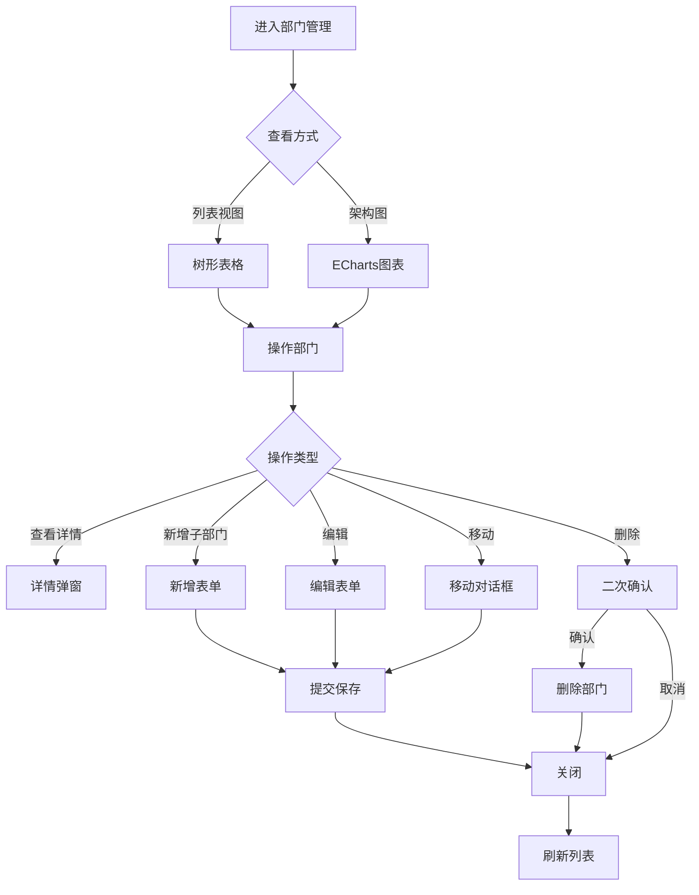

# 部门管理模块开发规范

> **模块类型**: 核心基础
> **复杂度**: ⭐⭐⭐ (3星)
> **预计工期**: 0.5-1天 (AI辅助) vs 2-3天 (传统)
> **参考模块**: `src/modules/employee/`
> **创建日期**: 2026-01-09
> **最后更新**: 2026-01-09

---

## 📋 目录

- [1. 功能概述](#1-功能概述)
- [2. 功能需求](#2-功能需求)
- [3. 数据结构](#3-数据结构)
- [4. API接口](#4-api接口)
- [5. 验证规则](#5-验证规则)
- [6. UI规范](#6-ui规范)
- [7. 业务规则](#7-业务规则)
- [8. 参考实现](#8-参考实现)
- [9. 特殊说明](#9-特殊说明)

---

## 1. 功能概述

### 1.1 模块简介
部门管理模块是OA系统的核心基础模块,用于管理公司的组织架构,支持树形结构的部门层级关系,提供部门CRUD、组织架构图可视化、部门成员管理等功能。

### 1.2 功能目标
- 灵活管理公司组织架构,支持多级部门嵌套
- 可视化展示组织架构图
- 实时统计部门人数和层级信息
- 支持部门的创建、编辑、删除、移动
- 管理部门成员和负责人

### 1.3 用户角色
- **系统管理员**: 全部权限(创建、编辑、删除、移动部门)
- **部门管理员**: 查看本部门及下级部门,编辑本部门信息
- **普通员工**: 仅查看部门信息

---

## 2. 功能需求

### 2.1 用户故事
```
作为系统管理员,
我想要灵活管理公司的组织架构,
以便快速调整部门结构和人员配置。

作为部门负责人,
我想要查看本部门及下级部门的信息,
以便了解部门整体情况。

作为普通员工,
我想要查看公司组织架构,
以便了解公司的部门设置和人员分布。
```

### 2.2 功能清单

#### 部门列表页面
- [ ] 树形表格展示部门层级
- [ ] 支持展开/收起子部门
- [ ] 显示部门名称、负责人、人数、层级等信息
- [ ] 右键菜单操作(新增子部门、编辑、删除、移动)
- [ ] 搜索部门(按名称、简称)
- [ ] 筛选(按层级、负责人)
- [ ] 导出部门列表

#### 组织架构图页面
- [ ] ECharts Graph可视化展示
- [ ] 支持缩放、拖拽
- [ ] 点击节点查看部门详情
- [ ] 高亮选中部门及其上级路径
- [ ] 显示部门人数信息
- [ ] 美观的卡片式节点设计

#### 部门详情弹窗
- [ ] 部门基本信息展示
- [ ] 部门负责人信息
- [ ] 部门成员列表(关联员工表)
- [ ] 上级部门信息
- [ ] 子部门列表
- [ ] 操作按钮(编辑、删除、添加成员)

#### 部门表单
- [ ] 新增部门表单
- [ ] 编辑部门表单
- [ ] 移动部门(更改上级部门)
- [ ] 选择部门负责人(员工下拉搜索)
- [ ] 上传部门图标
- [ ] 实时验证部门名称唯一性

### 2.3 交互流程



---

## 3. 数据结构

### 3.1 TypeScript类型定义

```typescript
/**
 * 部门信息
 */
interface Department {
  /** 部门编号 - 唯一标识 */
  id: string

  /** 部门名称 */
  name: string

  /** 部门简称 */
  shortName?: string

  /** 上级部门ID */
  parentId?: string | null

  /** 部门负责人ID */
  leaderId: string

  /** 部门级数(从1开始) */
  level: number

  /** 排序号 */
  sort: number

  /** 成立时间 */
  establishedDate?: string

  /** 部门描述 */
  description?: string

  /** 部门图标URL */
  icon?: string

  /** 状态: active-正常 disabled-停用 */
  status: 'active' | 'disabled'

  /** 创建时间 */
  createdAt: string

  /** 更新时间 */
  updatedAt: string

  /** 子部门列表(树形结构时使用) */
  children?: Department[]

  /** 部门人数(虚拟字段,从员工表汇总) */
  employeeCount?: number

  /** 部门负责人信息(关联查询) */
  leader?: Employee
}

/**
 * 部门筛选条件
 */
interface DepartmentFilter {
  /** 关键词搜索(名称/简称) */
  keyword?: string

  /** 状态筛选 */
  status?: 'active' | 'disabled'

  /** 负责人筛选 */
  leaderId?: string

  /** 层级筛选 */
  level?: number
}

/**
 * 部门表单数据
 */
interface DepartmentForm {
  /** 部门名称 */
  name: string

  /** 部门简称 */
  shortName?: string

  /** 上级部门ID */
  parentId?: string | null

  /** 部门负责人ID */
  leaderId: string

  /** 排序号 */
  sort?: number

  /** 成立时间 */
  establishedDate?: string

  /** 部门描述 */
  description?: string

  /** 部门图标 */
  icon?: string
}

/**
 * 部门移动请求
 */
interface MoveDepartmentRequest {
  /** 部门ID */
  departmentId: string

  /** 新的上级部门ID */
  newParentId: string | null
}

/**
 * 部门统计数据
 */
interface DepartmentStatistics {
  /** 总部门数 */
  total: number

  /** 一级部门数 */
  level1Count: number

  /** 最大层级深度 */
  maxLevel: number

  /** 有负责人的部门数 */
  withLeaderCount: number

  /** 总员工数(去重) */
  totalEmployees: number
}
```

### 3.2 字段说明

| 字段名 | 类型 | 必填 | 默认值 | 说明 | 示例 |
|-------|------|------|--------|------|------|
| id | string | ✅ | - | 唯一标识,格式: DEPT+序号 | DEPT001 |
| name | string | ✅ | - | 部门全称 | 技术部 |
| shortName | string | ❌ | - | 部门简称,用于快速检索 | 技术部 |
| parentId | string \| null | ❌ | null | 上级部门ID,null表示顶级部门 | DEPT001 |
| leaderId | string | ✅ | - | 部门负责人ID,关联员工表 | EMP001 |
| level | number | ✅ | - | 部门层级,顶级部门为1 | 2 |
| sort | number | ❌ | 0 | 排序号,同级部门按此排序 | 1 |
| establishedDate | string | ❌ | - | 成立日期 | 2020-01-01 |
| description | string | ❌ | - | 部门职责说明 | 负责产品研发 |
| icon | string | ❌ | - | 部门图标URL | /uploads/icons/dept1.png |
| status | string | ✅ | active | 状态: active正常, disabled停用 | active |
| createdAt | string | ✅ | - | 创建时间 | 2026-01-09 10:00:00 |
| updatedAt | string | ✅ | - | 更新时间 | 2026-01-09 10:00:00 |

### 3.3 枚举类型

```typescript
/**
 * 部门状态枚举
 */
enum DepartmentStatus {
  ACTIVE = 'active',      // 正常
  DISABLED = 'disabled'   // 停用
}
```

---

## 4. API接口

### 4.1 接口列表

| 方法 | 路径 | 说明 | 权限 |
|------|------|------|------|
| GET | /api/departments | 获取部门列表(树形或扁平) | 所有用户 |
| GET | /api/departments/:id | 获取部门详情 | 所有用户 |
| GET | /api/departments/:id/children | 获取子部门列表 | 所有用户 |
| GET | /api/departments/:id/employees | 获取部门成员 | 所有用户 |
| POST | /api/departments | 创建部门 | 管理员 |
| PUT | /api/departments/:id | 更新部门信息 | 管理员 |
| PUT | /api/departments/:id/move | 移动部门 | 管理员 |
| DELETE | /api/departments/:id | 删除部门 | 管理员 |
| GET | /api/departments/statistics | 获取部门统计 | 管理员 |

### 4.2 请求/响应示例

#### 4.2.1 获取部门列表

**请求**:
```typescript
GET /api/departments?type=tree&status=active
```

**参数**:
- type: 'tree' | 'flat' - 返回树形或扁平数据
- status: 'active' | 'disabled' - 状态筛选

**响应**:
```typescript
interface DepartmentListResponse {
  code: number
  message: string
  data: Department[]  // type=tree时返回树形结构
}

interface FlatListResponse {
  code: number
  message: string
  data: {
    list: Department[]
    total: number
  }
}
```

#### 4.2.2 获取部门详情

**请求**:
```typescript
GET /api/departments/:id
```

**响应**:
```typescript
interface DepartmentDetailResponse {
  code: number
  message: string
  data: Department & {
    leader?: Employee
    parent?: Department
    children?: Department[]
    employees?: Employee[]
  }
}
```

#### 4.2.3 创建部门

**请求**:
```typescript
POST /api/departments
{
  "name": "技术部",
  "shortName": "技术",
  "parentId": "DEPT001",
  "leaderId": "EMP001",
  "sort": 1,
  "description": "负责产品研发"
}
```

**响应**:
```typescript
interface CreateDepartmentResponse {
  code: number
  message: string
  data: {
    id: string  // 新创建的部门ID
  }
}
```

#### 4.2.4 移动部门

**请求**:
```typescript
PUT /api/departments/:id/move
{
  "newParentId": "DEPT002"  // null表示移动到顶级
}
```

**响应**:
```typescript
interface MoveDepartmentResponse {
  code: number
  message: string
  data: Department  // 更新后的部门信息
}
```

#### 4.2.5 删除部门

**请求**:
```typescript
DELETE /api/departments/:id
```

**响应**:
```typescript
interface DeleteDepartmentResponse {
  code: number
  message: string
}
```

### 4.3 API实现要求

```typescript
// src/modules/department/api/index.ts
import request from '@/utils/request'
import type {
  Department,
  DepartmentFilter,
  DepartmentForm,
  MoveDepartmentRequest,
  DepartmentStatistics
} from '../types'

/**
 * 获取部门列表
 * @param params 查询参数
 */
export function getList(params?: DepartmentFilter & { type?: 'tree' | 'flat' }) {
  return request.get<{
    list?: Department[]
    total?: number
  } | Department[]>('/api/departments', { params })
}

/**
 * 获取部门详情
 * @param id 部门ID
 */
export function getDetail(id: string) {
  return request.get<Department>(`/api/departments/${id}`)
}

/**
 * 获取子部门列表
 * @param id 部门ID
 */
export function getChildren(id: string) {
  return request.get<Department[]>(`/api/departments/${id}/children`)
}

/**
 * 获取部门成员
 * @param id 部门ID
 */
export function getEmployees(id: string) {
  return request.get(`/api/departments/${id}/employees`)
}

/**
 * 创建部门
 * @param data 表单数据
 */
export function create(data: DepartmentForm) {
  return request.post<{ id: string }>('/api/departments', data)
}

/**
 * 更新部门
 * @param id 部门ID
 * @param data 表单数据
 */
export function update(id: string, data: Partial<DepartmentForm>) {
  return request.put<Department>(`/api/departments/${id}`, data)
}

/**
 * 移动部门
 * @param data 移动请求
 */
export function move(data: MoveDepartmentRequest) {
  return request.put<Department>(
    `/api/departments/${data.departmentId}/move`,
    { newParentId: data.newParentId }
  )
}

/**
 * 删除部门
 * @param id 部门ID
 */
export function remove(id: string) {
  return request.delete(`/api/departments/${id}`)
}

/**
 * 获取部门统计
 */
export function getStatistics() {
  return request.get<DepartmentStatistics>('/api/departments/statistics')
}
```

---

## 5. 验证规则

### 5.1 前端验证

#### 5.1.1 表单验证规则

```typescript
// src/modules/department/components/DepartmentForm.vue
const rules = {
  name: [
    { required: true, message: '请输入部门名称', trigger: 'blur' },
    { min: 2, max: 50, message: '长度在 2 到 50 个字符', trigger: 'blur' },
    {
      validator: async (rule: any, value: string, callback: any) => {
        // 异步验证部门名称唯一性
        if (value && value !== originalName.value) {
          const exists = await checkDepartmentNameExists(value)
          if (exists) {
            callback(new Error('部门名称已存在'))
          } else {
            callback()
          }
        } else {
          callback()
        }
      },
      trigger: 'blur'
    }
  ],
  shortName: [
    { min: 2, max: 20, message: '长度在 2 到 20 个字符', trigger: 'blur' }
  ],
  leaderId: [
    { required: true, message: '请选择部门负责人', trigger: 'change' }
  ],
  parentId: [
    {
      validator: (rule: any, value: string, callback: any) => {
        // 不能选择自己或自己的子部门作为上级部门
        if (value && value === currentDepartmentId.value) {
          callback(new Error('不能选择自己作为上级部门'))
        } else if (isChildDepartment(value)) {
          callback(new Error('不能选择子部门作为上级部门'))
        } else {
          callback()
        }
      },
      trigger: 'change'
    }
  ],
  sort: [
    { type: 'number', min: 0, message: '排序号必须大于等于0', trigger: 'blur' }
  ]
}
```

#### 5.1.2 业务逻辑验证

```typescript
// 验证部门名称唯一性
async function checkDepartmentNameExists(name: string): Promise<boolean> {
  const { data } = await api.getList({ keyword: name })
  return data.some((dept: Department) => dept.name === name)
}

// 判断是否为子部门
function isChildDepartment(parentId: string): boolean {
  // 递归检查所有子部门
  const allChildren = getAllChildDepartments(currentDepartmentId.value)
  return allChildren.some((child: Department) => child.id === parentId)
}

// 获取所有子部门(递归)
function getAllChildDepartments(parentId: string): Department[] {
  const children: Department[] = []
  const directChildren = departmentStore.list.filter(d => d.parentId === parentId)

  directChildren.forEach(child => {
    children.push(child)
    children.push(...getAllChildDepartments(child.id))
  })

  return children
}
```

### 5.2 后端验证

- [ ] 部门名称唯一性(同级部门内)
- [ ] 上级部门存在性检查
- [ ] 不能选择自己或子部门作为上级部门
- [ ] 部门层级限制(最多3-5级)
- [ ] 删除前检查是否有子部门
- [ ] 删除前检查是否有成员
- [ ] 负责人必须是有效员工

---

## 6. UI规范

### 6.1 组件选择

| 功能 | 组件 | 说明 |
|------|------|------|
| 树形表格 | el-table | 树形数据展示 |
| 架构图 | ECharts Graph | 组织架构可视化 |
| 部门表单 | el-form | 表单组件 |
| 部门详情 | el-drawer | 抽屉式详情页 |
| 员工选择 | el-select | 远程搜索员工 |

### 6.2 页面布局

#### 6.2.1 部门列表页

```
┌─────────────────────────────────────────────────┐
│  PageHeader: 组织架构    [新增部门] [导出]       │
├─────────────────────────────────────────────────┤
│  Tab: [列表视图] [架构图]                         │
├───────────┬─────────────────────────────────────┤
│           │                                      │
│ Filter    │  树形表格 / ECharts图                 │
│ Panel     │  - 部门名称                          │
│           │  - 负责人                            │
│           │  - 人数                              │
│           │  - 操作                              │
│           │                                      │
├───────────┴─────────────────────────────────────┤
│  统计卡片: 总部门数 | 一级部门 | 最大层级         │
└─────────────────────────────────────────────────┘
```

#### 6.2.2 部门详情抽屉

```
┌────────────────────────────────────────────────┐
│  部门详情                              [X]       │
├────────────────────────────────────────────────┤
│  基本信息                                       │
│  - 部门名称: 技术部                            │
│  - 部门简称: 技术                              │
│  - 上级部门: 研发中心                          │
│  - 部门负责人: 张三                            │
│  - 部门人数: 25人                              │
│  - 成立时间: 2020-01-01                        │
│                                                 │
│  Tabs: [成员列表] [子部门] [操作记录]           │
│  ────────────────────────────────────────      │
│  [成员表格]                                    │
│                                                 │
├────────────────────────────────────────────────┤
│  [编辑] [删除] [添加子部门]                     │
└────────────────────────────────────────────────┘
```

### 6.3 组织架构图要求

```typescript
// ECharts Graph 配置
const graphOption = {
  tooltip: {
    trigger: 'item',
    formatter: '{b}: {c}人'
  },
  series: [{
    type: 'graph',
    layout: 'tree',
    symbol: 'rect',
    symbolSize: [120, 60],
    roam: true,  // 支持缩放拖拽
    label: {
      show: true,
      position: 'inside',
      fontSize: 14,
      formatter: '{b}\n{c}人'
    },
    edgeSymbol: ['circle', 'arrow'],
    edgeSymbolSize: [4, 10],
    data: graphData,
    links: graphLinks,
    itemStyle: {
      color: '#1890FF',
      borderColor: '#1890FF'
    },
    lineStyle: {
      color: '#ccc',
      curveness: 0.3
    },
    emphasis: {
      focus: 'adjacency',
      lineStyle: {
        width: 3
      }
    }
  }]
}
```

### 6.4 树形表格要求

```vue
<el-table
  :data="departmentList"
  row-key="id"
  :tree-props="{ children: 'children', hasChildren: 'hasChildren' }"
  default-expand-all
  :expand-row-keys="expandedKeys"
>
  <el-table-column prop="name" label="部门名称" min-width="200" />
  <el-table-column prop="leader.name" label="负责人" width="120" />
  <el-table-column prop="employeeCount" label="人数" width="80" align="center" />
  <el-table-column prop="level" label="层级" width="80" align="center" />
  <el-table-column label="操作" width="200" fixed="right">
    <template #default="{ row }">
      <el-button link type="primary" @click="handleAddChild(row)">添加子部门</el-button>
      <el-button link type="primary" @click="handleEdit(row)">编辑</el-button>
      <el-button link type="danger" @click="handleDelete(row)">删除</el-button>
    </template>
  </el-table-column>
</el-table>
```

---

## 7. 业务规则

### 7.1 数据规则

```typescript
// 部门编号自动生成
function generateDepartmentId(): string {
  // 格式: DEPT + 序号(4位)
  const count = await getNextDepartmentSequence()
  return `DEPT${String(count).padStart(4, '0')}`
}

// 部门层级自动计算
function calculateLevel(parentId: string | null): number {
  if (!parentId) {
    return 1  // 顶级部门
  }
  const parent = await getDepartment(parentId)
  return parent.level + 1
}

// 部门人数汇总(从员工表统计)
async function calculateEmployeeCount(departmentId: string): Promise<number> {
  const employees = await getEmployeesByDepartment(departmentId)
  return employees.filter(e => e.status === 'active').length
}
```

### 7.2 层级限制

```typescript
// 限制部门层级深度(最多5级)
const MAX_DEPARTMENT_LEVEL = 5

function validateDepartmentLevel(parentId: string | null): boolean {
  if (!parentId) return true

  const parent = await getDepartment(parentId)
  if (parent.level >= MAX_DEPARTMENT_LEVEL - 1) {
    throw new Error(`部门层级不能超过${MAX_DEPARTMENT_LEVEL}级`)
  }

  return true
}
```

### 7.3 删除规则

```typescript
// 删除部门前检查
async function validateDelete(departmentId: string): Promise<boolean> {
  // 1. 检查是否有子部门
  const children = await getChildren(departmentId)
  if (children.length > 0) {
    throw new Error('请先删除或移动所有子部门')
  }

  // 2. 检查是否有成员
  const employees = await getEmployees(departmentId)
  if (employees.length > 0) {
    throw new Error('请先转移或删除所有部门成员')
  }

  return true
}
```

### 7.4 移动规则

```typescript
// 移动部门验证
async function validateMove(
  departmentId: string,
  newParentId: string | null
): Promise<boolean> {
  // 1. 不能移动到自己
  if (departmentId === newParentId) {
    throw new Error('不能移动到自己')
  }

  // 2. 不能移动到自己的子部门
  const allChildren = getAllChildDepartments(departmentId)
  if (allChildren.some(c => c.id === newParentId)) {
    throw new Error('不能移动到自己的子部门')
  }

  // 3. 检查目标层级是否超限
  const newLevel = newParentId
    ? (await getDepartment(newParentId)).level + 1
    : 1

  if (newLevel > MAX_DEPARTMENT_LEVEL) {
    throw new Error(`移动后层级将超过${MAX_DEPARTMENT_LEVEL}级`)
  }

  return true
}
```

---

## 8. 参考实现

### 8.1 参考模块

**路径**: `src/modules/employee/`

**可复用的组件**:
- `@/components/common/PageHeader.vue`
- `@/components/common/StatusTag.vue`

**需要参考的模式**:
- Store结构
- API封装方式
- 表单验证模式
- 列表页布局

### 8.2 树形数据处理工具

```typescript
// src/utils/tree.ts
/**
 * 扁平数组转树形结构
 */
export function buildTree<T extends { id: string; parentId: string | null }>(
  flatList: T[],
  options?: {
    rootId?: string | null
    childrenKey?: string
  }
): T[] {
  const { rootId = null, childrenKey = 'children' } = options || {}

  const map = new Map<string, T>()
  const roots: T[] = []

  // 先建立映射
  flatList.forEach(item => {
    map.set(item.id, { ...item, [childrenKey]: [] })
  })

  // 建立树形关系
  flatList.forEach(item => {
    const node = map.get(item.id)!
    if (item.parentId === rootId) {
      roots.push(node)
    } else {
      const parent = map.get(item.parentId)
      if (parent) {
        ;(parent as any)[childrenKey].push(node)
      }
    }
  })

  return roots
}

/**
 * 树形转扁平数组
 */
export function flattenTree<T extends { children?: T[] }>(
  tree: T[],
  childrenKey = 'children'
): T[] {
  const result: T[] = []

  function traverse(nodes: T[]) {
    nodes.forEach(node => {
      const { [childrenKey]: children, ...rest } = node as any
      result.push(rest)
      if (children?.length > 0) {
        traverse(children)
      }
    })
  }

  traverse(tree)
  return result
}

/**
 * 获取节点路径(从根到当前节点)
 */
export function getNodePath<T extends { id: string; parentId: string | null }>(
  nodeId: string,
  flatList: T[]
): T[] {
  const path: T[] = []
  let current = flatList.find(item => item.id === nodeId)

  while (current) {
    path.unshift(current)
    if (!current.parentId) break
    current = flatList.find(item => item.id === current.parentId)
  }

  return path
}

/**
 * 计算节点层级
 */
export function calculateNodeLevel<T extends { parentId: string | null }>(
  nodeId: string,
  flatList: T[]
): number {
  let level = 1
  let current = flatList.find(item => item.id === nodeId)

  while (current?.parentId) {
    level++
    current = flatList.find(item => item.id === current.parentId)
  }

  return level
}

/**
 * 获取所有子孙节点
 */
export function getAllDescendants<T extends { id: string; children?: T[] }>(
  node: T,
  childrenKey = 'children'
): T[] {
  const descendants: T[] = []
  const children = (node as any)[childrenKey] || []

  children.forEach((child: T) => {
    descendants.push(child)
    descendants.push(...getAllDescendants(child, childrenKey))
  })

  return descendants
}
```

### 8.3 ECharts集成示例

```vue
<!-- src/modules/department/components/OrganizationChart.vue -->
<script setup lang="ts">
import { ref, onMounted, onUnmounted } from 'vue'
import * as echarts from 'echarts'
import type { Department } from '../types'

interface Props {
  data: Department[]
}

const props = defineProps<Props>()
const chartRef = ref<HTMLDivElement>()
let chartInstance: echarts.ECharts

onMounted(() => {
  initChart()
  window.addEventListener('resize', handleResize)
})

onUnmounted(() => {
  window.removeEventListener('resize', handleResize)
  chartInstance?.dispose()
})

function initChart() {
  chartInstance = echarts.init(chartRef.value!)

  const { data, links } = convertToGraphData(props.data)

  const option = {
    tooltip: {},
    series: [{
      type: 'graph',
      layout: 'tree',
      data,
      links,
      symbol: 'rect',
      symbolSize: [120, 60],
      roam: true,
      label: {
        show: true,
        position: 'inside',
        formatter: '{b}\n{c}人'
      },
      // ... 其他配置
    }]
  }

  chartInstance.setOption(option)
}

function handleResize() {
  chartInstance?.resize()
}

function convertToGraphData(departments: Department[]) {
  // 转换部门数据为ECharts Graph格式
  // ...
}
</script>

<template>
  <div ref="chartRef" style="width: 100%; height: 600px"></div>
</template>
```

---

## 9. 特殊说明

### 9.1 性能要求

- [ ] 支持大量部门数据(>1000个部门)
- [ ] 树形数据懒加载(按需加载子部门)
- [ ] ECharts图性能优化(节点过多时使用虚拟滚动)

### 9.2 用户体验

- [ ] 部门名称过长时省略显示,悬浮显示完整名称
- [ ] 树形表格支持虚拟滚动
- [ ] 组织架构图支持缩放、拖拽、导出图片
- [ ] 移动部门时提供可视化预览

### 9.3 数据同步

- [ ] 部门删除/移动时,级联更新子部门的level
- [ ] 员工部门的关联更新
- [ ] 实时统计部门人数(考虑性能可定期缓存)

### 9.4 权限控制

- [ ] 普通员工只能查看,不能编辑
- [ ] 部门管理员只能编辑本部门
- [ ] 系统管理员拥有全部权限

---

## 附录

### A. 开发检查清单

**编码阶段**:
- [ ] 完成Department类型定义
- [ ] 完成API接口封装
- [ ] 完成Store实现
- [ ] 完成树形表格列表页
- [ ] 完成组织架构图页
- [ ] 完成部门表单组件
- [ ] 实现树形数据处理工具函数

**测试阶段**:
- [ ] 部门CRUD功能测试
- [ ] 树形结构展示测试
- [ ] 部门移动功能测试
- [ ] 层级限制验证测试
- [ ] 删除约束测试
- [ ] ECharts图表交互测试

**性能测试**:
- [ ] 1000+部门数据测试
- [ ] 深层级(5级+)结构测试

### B. AI生成提示词

```
根据 specs/core/department-spec.md 规范,生成部门管理模块:

重点实现:
1. 树形数据处理(buildTree/flattenTree等工具函数)
2. ECharts Graph组织架构图
3. 部门移动功能(层级更新)
4. 删除约束检查(子部门、成员)

参考: src/modules/employee/ 的代码结构和风格
```

---

**文档版本**: v1.0.0
**创建人**: AI开发助手
**最后更新**: 2026-01-09
