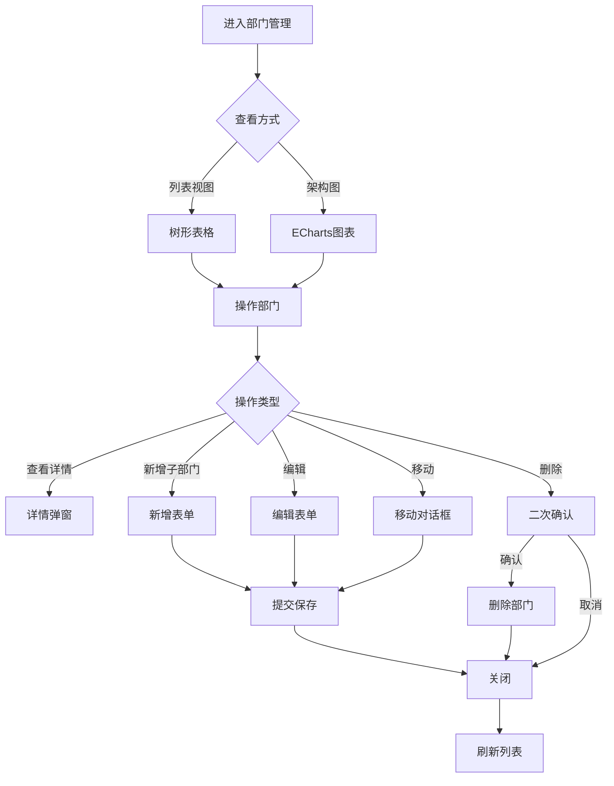

# 部门管理模块 - 功能需求规范

> **文档类型**: 功能需求规范
> **模块类型**: 核心基础
> **复杂度**: ⭐⭐⭐ (3星)
> **参考模块**: `src/modules/employee/`
> **创建日期**: 2026-01-09
> **最后更新**: 2026-01-09

---

## 📋 目录

- [1. 功能概述](#1-功能概述)
- [2. 用户故事](#2-用户故事)
- [3. 功能清单](#3-功能清单)
- [4. 交互流程](#4-交互流程)
- [5. 业务规则](#5-业务规则)

---

## 1. 功能概述

### 1.1 模块简介
部门管理模块是OA系统的核心基础模块,用于管理公司的组织架构,支持树形结构的部门层级关系,提供部门CRUD、组织架构图可视化、部门成员管理等功能。

### 1.2 功能目标
- 灵活管理公司组织架构,支持多级部门嵌套
- 可视化展示组织架构图
- 实时统计部门人数和层级信息
- 支持部门的创建、编辑、删除、移动
- 管理部门成员和负责人

### 1.3 用户角色
- **系统管理员**: 全部权限(创建、编辑、删除、移动部门)
- **部门管理员**: 查看本部门及下级部门,编辑本部门信息
- **普通员工**: 仅查看部门信息

---

## 2. 用户故事

```
作为系统管理员,
我想要灵活管理公司的组织架构,
以便快速调整部门结构和人员配置。

作为部门负责人,
我想要查看本部门及下级部门的信息,
以便了解部门整体情况。

作为普通员工,
我想要查看公司组织架构,
以便了解公司的部门设置和人员分布。
```

---

## 3. 功能清单

### 3.1 部门列表页面
- [ ] 树形表格展示部门层级
- [ ] 支持展开/收起子部门
- [ ] 显示部门名称、负责人、人数、层级等信息
- [ ] 右键菜单操作(新增子部门、编辑、删除、移动)
- [ ] 搜索部门(按名称、简称)
- [ ] 筛选(按层级、负责人)
- [ ] 导出部门列表

### 3.2 组织架构图页面
- [ ] ECharts Graph可视化展示
- [ ] 支持缩放、拖拽
- [ ] 点击节点查看部门详情
- [ ] 高亮选中部门及其上级路径
- [ ] 显示部门人数信息
- [ ] 美观的卡片式节点设计

### 3.3 部门详情弹窗
- [ ] 部门基本信息展示
- [ ] 部门负责人信息
- [ ] 部门成员列表(关联员工表)
- [ ] 上级部门信息
- [ ] 子部门列表
- [ ] 操作按钮(编辑、删除、添加成员)

### 3.4 部门表单
- [ ] 新增部门表单
- [ ] 编辑部门表单
- [ ] 移动部门(更改上级部门)
- [ ] 选择部门负责人(员工下拉搜索)
- [ ] 上传部门图标
- [ ] 实时验证部门名称唯一性

---

## 4. 交互流程

### 4.1 主要业务流程



### 4.2 用户操作说明

#### 4.2.1 查看部门信息
1. 进入部门管理页面
2. 选择查看方式:列表视图或组织架构图
3. 点击部门节点查看详情
4. 查看部门成员、子部门等信息

#### 4.2.2 新增部门
1. 在列表页面点击"新增部门"或右键菜单选择"添加子部门"
2. 填写部门基本信息(名称、简称、负责人等)
3. 选择上级部门
4. 上传部门图标(可选)
5. 系统自动验证名称唯一性
6. 保存并刷新列表

#### 4.2.3 编辑部门
1. 右键点击部门,选择"编辑"
2. 修改部门信息
3. 系统验证数据有效性
4. 保存更新

#### 4.2.4 移动部门
1. 右键点击部门,选择"移动"
2. 选择新的上级部门
3. 预览移动后的层级结构
4. 确认移动,系统自动更新层级

#### 4.2.5 删除部门
1. 右键点击部门,选择"删除"
2. 系统检查是否有子部门和成员
3. 如有约束,提示用户先处理
4. 二次确认删除操作
5. 执行删除并刷新

---

## 5. 业务规则

### 5.1 数据规则

#### 5.1.1 部门编号
- 格式: DEPT + 4位序号 (如: DEPT0001)
- 系统自动生成,不可手动修改
- 全局唯一,不可重复

#### 5.1.2 部门层级
- 顶级部门层级为1
- 子部门层级 = 父部门层级 + 1
- 层级上限为5级
- 移动部门时自动更新所有子部门层级

#### 5.1.3 部门人数
- 实时统计本部门在职员工数
- 不包括子部门员工
- 仅统计status='active'的员工

#### 5.1.4 部门排序
- 同级部门按sort字段升序排列
- sort默认值为0
- 支持手动调整排序号

### 5.2 操作约束

#### 5.2.1 唯一性约束
- 同级部门名称不能重复
- 部门简称在同一层级内不能重复
- 部门编号全局唯一

#### 5.2.2 层级约束
- 部门层级不能超过5级
- 不能选择自己作为上级部门
- 不能选择自己的子部门作为上级部门

#### 5.2.3 删除约束
- 有子部门的部门不能删除
- 有成员的部门不能删除
- 删除前必须先转移或清空子部门
- 删除前必须先转移或删除成员

#### 5.2.4 移动约束
- 不能移动到自己
- 不能移动到自己的子部门
- 移动后层级不能超过上限
- 移动后所有子部门层级自动更新

### 5.3 权限规则

#### 5.3.1 系统管理员
- 创建、编辑、删除任意部门
- 移动任意部门
- 查看所有部门及成员信息
- 导出部门数据

#### 5.3.2 部门管理员
- 查看本部门及下级部门信息
- 编辑本部门基本信息
- 不能删除或移动本部门
- 不能编辑上级部门

#### 5.3.3 普通员工
- 仅查看部门信息
- 查看组织架构图
- 不能进行任何编辑操作

### 5.4 数据同步规则

#### 5.4.1 层级更新
- 移动部门时自动更新本部门level
- 级联更新所有子部门level
- 更新操作在事务中执行

#### 5.4.2 人数统计
- 部门人数实时从员工表统计
- 可考虑定期缓存优化性能
- 员工部门变更时自动更新统计

#### 5.4.3 负责人关联
- 负责人必须是有效的员工记录
- 员工删除时需处理部门负责人关联
- 负责人信息支持级联查询

### 5.5 业务场景

#### 5.5.1 公司组织架构调整
场景: 公司业务调整,需要重组部门结构
1. 创建新的部门结构
2. 将现有部门移动到新结构下
3. 系统自动更新层级关系
4. 验证结构合理性(层级、成员等)

#### 5.5.2 部门合并
场景: 两个部门合并为一个部门
1. 将部门A的所有成员转移到部门B
2. 将部门A的子部门移动到部门B下
3. 删除空的部门A
4. 更新部门B的基本信息

#### 5.5.3 部门拆分
场景: 一个部门拆分为多个子部门
1. 创建新的子部门
2. 将成员分配到不同子部门
3. 设置各部门负责人
4. 调整部门层级和排序

#### 5.5.4 新员工入职
场景: 新员工入职,需要分配到部门
1. 创建或编辑员工信息
2. 选择所属部门
3. 部门人数自动更新
4. 可设置为部门负责人

---

## 6. 功能优先级

### 6.1 P0 - 核心功能 (必须实现)
- 部门CRUD操作
- 树形结构展示
- 部门层级管理
- 基础验证规则

### 6.2 P1 - 重要功能 (优先实现)
- 组织架构图可视化
- 部门移动功能
- 部门成员管理
- 导出功能

### 6.3 P2 - 增强功能 (后续实现)
- 部门图标上传
- 高级筛选和搜索
- 批量操作
- 操作记录审计

---

## 7. 用户体验要求

### 7.1 操作便捷性
- 右键菜单提供快捷操作
- 支持拖拽移动部门
- 常用操作一键完成
- 智能提示和自动补全

### 7.2 信息展示
- 树形表格清晰展示层级
- 组织架构图直观美观
- 重要信息突出显示
- 加载状态友好提示

### 7.3 错误处理
- 友好的错误提示信息
- 明确的约束说明
- 操作失败保留用户输入
- 提供解决方案建议

### 7.4 性能体验
- 大数据量时流畅操作
- 懒加载子部门
- 快速响应交互
- 合理的加载动画

---

## 8. 验收标准

### 8.1 功能验收
- [ ] 所有P0功能正常运行
- [ ] 业务规则正确执行
- [ ] 验证规则有效触发
- [ ] 权限控制准确

### 8.2 性能验收
- [ ] 1000+部门数据流畅展示
- [ ] 操作响应时间<500ms
- [ ] 图表渲染流畅
- [ ] 无明显卡顿

### 8.3 兼容性验收
- [ ] 主流浏览器兼容
- [ ] 不同分辨率适配
- [ ] 深层级结构正常显示

### 8.4 安全性验收
- [ ] 权限验证有效
- [ ] 数据验证完整
- [ ] 无SQL注入风险
- [ ] 无XSS漏洞

---

**文档版本**: v1.0.0
**创建人**: AI开发助手
**最后更新**: 2026-01-09
