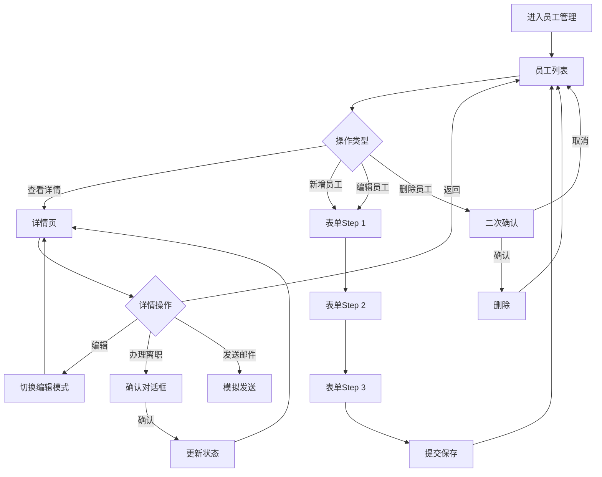

# 员工管理模块开发规范

> **模块类型**: 核心基础
> **复杂度**: ⭐⭐⭐ (3星)
> **状态**: ✅ 已完成 (参考实现)
> **参考模块**: `src/modules/employee/`
> **创建日期**: 2026-01-09
> **最后更新**: 2026-01-09

---

## 📋 目录

- [1. 功能概述](#1-功能概述)
- [2. 功能需求](#2-功能需求)
- [3. 数据结构](#3-数据结构)
- [4. API接口](#4-api接口)
- [5. 验证规则](#5-验证规则)
- [6. UI规范](#6-ui规范)
- [7. 业务规则](#7-业务规则)
- [8. 自动化功能](#8-自动化功能)
- [9. 参考实现](#9-参考实现)
- [10. 特殊说明](#10-特殊说明)

---

## 1. 功能概述

### 1.1 模块简介
员工管理模块是OA系统最核心的基础模块,用于管理公司全体员工的信息档案,包括基本信息、工作信息、联系方式等,提供完整的CRUD功能、筛选搜索、统计分析等功能。

### 1.2 功能目标
- 集中管理员工信息档案
- 支持员工入职、转正、离职全生命周期管理
- 提供灵活的筛选和搜索功能
- 实时统计员工数据(在职人数、试用期等)
- 自动化提醒(生日、转正评估等)

### 1.3 用户角色
- **系统管理员**: 全部权限(查看、新增、编辑、删除所有员工)
- **部门管理员**: 查看本部门员工,编辑基本信息
- **普通员工**: 仅查看自己和公开信息

---

## 2. 功能需求

### 2.1 用户故事
```
作为HR管理员,
我想要集中管理所有员工的信息,
以便快速查询和维护员工档案。

作为部门负责人,
我想要查看本部门员工信息,
以便了解部门人员构成。

作为员工,
我想要查看和编辑自己的基本信息,
以便保持信息准确性。
```

### 2.2 功能清单

#### 员工列表页面
- [ ] 表格视图展示所有员工
- [ ] 卡片视图展示(可选)
- [ ] 视图切换(表格/卡片)
- [ ] 关键词搜索(姓名/工号/手机号)
- [ ] 多条件筛选
  - 员工状态(在职/离职/停薪留职)
  - 部门筛选(多选)
  - 职位筛选
  - 试用期状态(试用期内/已转正)
  - 性别筛选
  - 入职时间范围
- [ ] 分页功能(20/50/100条/页)
- [ ] 新增员工
- [ ] 编辑员工
- [ ] 删除员工(二次确认)
- [ ] 查看员工详情
- [ ] 批量导入
- [ ] 导出列表

#### 统计面板
- [ ] 总员工数
- [ ] 在职人数(带趋势图标)
- [ ] 试用期人数(黄色提醒)
- [ ] 本月新入职

#### 员工详情页面
- [ ] 左侧: 员工信息卡片
  - 大尺寸圆形头像(150px)
  - 员工编号(大字体)
  - 姓名(大字体加粗)
  - 职位标签
  - 部门链接(可点击跳转)
  - 员工状态标签
- [ ] 右侧: 详细信息标签页
  - **基本信息tab**: 英文名、性别、出生日期、联系电话、邮箱、办公位置、紧急联系人
  - **工作信息tab**: 入职日期、试用期状态、转正日期、直属上级、工龄(自动计算)
  - **操作记录tab**: 时间轴形式,显示所有变更记录
- [ ] 操作按钮
  - 编辑/保存(切换编辑模式)
  - 发送邮件(模拟)
  - 重置密码(模拟)
  - 办理离职(二次确认)
  - 删除员工(二次确认)

#### 员工表单
- [ ] 步骤式表单(el-steps)
  - **Step 1**: 基本信息(必填)
    - 员工编号(自动生成)
    - 姓名
    - 性别
    - 英文名
    - 联系电话(手机号验证)
    - 邮箱(格式验证)
    - 部门(下拉选择)
    - 职位
    - 入职日期
  - **Step 2**: 详细信息(可选)
    - 出生日期
    - 办公位置
    - 紧急联系人
    - 紧急联系电话
    - 直属上级(员工下拉搜索)
    - 头像上传
  - **Step 3**: 确认提交
    - 汇总显示所有填写信息
    - 最终确认
- [ ] 表单验证
  - 必填项验证
  - 手机号格式验证
  - 邮箱格式验证
  - 实时验证反馈

### 2.3 交互流程



---

## 3. 数据结构

### 3.1 TypeScript类型定义

```typescript
/**
 * 员工信息
 */
interface Employee {
  /** 员工编号 - 唯一标识,格式: EMP+YYYYMMDD+序号 */
  id: string

  /** 基本信息 */
  name: string                    // 姓名
  englishName?: string            // 英文名
  gender: 'male' | 'female'       // 性别
  birthDate?: string              // 出生日期
  phone: string                   // 联系电话
  email: string                   // 邮箱
  avatar?: string                 // 头像URL

  /** 工作信息 */
  departmentId: string            // 部门ID
  departmentName?: string         // 部门名称(关联查询)
  position: string                // 职位
  level?: string                  // 职级
  managerId?: string              // 直属上级ID
  managerName?: string            // 直属上级姓名(关联查询)
  joinDate: string                // 入职日期
  probationStatus?: 'probation' | 'regular' | 'resigned'  // 试用期状态
  probationEndDate?: string       // 试用期结束日期
  workYears?: number              // 工龄(自动计算)

  /** 状态 */
  status: 'active' | 'resigned' | 'suspended'  // 员工状态

  /** 其他信息 */
  officeLocation?: string         // 办公位置
  emergencyContact?: string       // 紧急联系人
  emergencyPhone?: string         // 紧急联系电话

  /** 系统字段 */
  createdAt: string
  updatedAt: string
}

/**
 * 员工筛选条件
 */
interface EmployeeFilter {
  /** 关键词搜索(姓名/工号/手机号) */
  keyword?: string

  /** 员工状态 */
  status?: 'active' | 'resigned' | 'suspended'

  /** 部门筛选(多选) */
  departmentIds?: string[]

  /** 职位筛选 */
  position?: string

  /** 试用期状态 */
  probationStatus?: 'probation' | 'regular'

  /** 性别筛选 */
  gender?: 'male' | 'female'

  /** 入职时间范围 */
  joinDateRange?: [string, string]
}

/**
 * 员工表单数据
 */
interface EmployeeForm {
  /** 基本信息(必填) */
  name: string
  gender: 'male' | 'female'
  englishName?: string
  phone: string
  email: string
  departmentId: string
  position: string
  joinDate: string

  /** 详细信息(可选) */
  birthDate?: string
  officeLocation?: string
  emergencyContact?: string
  emergencyPhone?: string
  managerId?: string
  avatar?: string
  probationEndDate?: string
}

/**
 * 操作记录
 */
interface OperationLog {
  id: string
  employeeId: string
  operation: string              // 操作类型
  operator: string               // 操作人
  timestamp: string              // 操作时间
  details?: string               // 详细信息
}

/**
 * 员工统计数据
 */
interface EmployeeStatistics {
  /** 总员工数 */
  total: number

  /** 在职人数 */
  active: number

  /** 离职人数 */
  resigned: number

  /** 试用期人数 */
  probation: number

  /** 本月新入职 */
  newThisMonth: number

  /** 部门分布 */
  byDepartment: {
    departmentId: string
    departmentName: string
    count: number
  }[]
}
```

### 3.2 字段说明

| 字段名 | 类型 | 必填 | 默认值 | 说明 | 示例 |
|-------|------|------|--------|------|------|
| id | string | ✅ | - | 员工编号,格式: EMP+YYYYMMDD+序号 | EMP20260109001 |
| name | string | ✅ | - | 姓名 | 张三 |
| englishName | string | ❌ | - | 英文名或昵称 | Tom |
| gender | string | ✅ | - | 性别: male/female | male |
| birthDate | string | ❌ | - | 出生日期 | 1990-01-01 |
| phone | string | ✅ | - | 联系电话 | 13800138000 |
| email | string | ✅ | - | 公司邮箱 | zhangsan@company.com |
| avatar | string | ❌ | - | 头像URL | /uploads/avatar.jpg |
| departmentId | string | ✅ | - | 部门ID | DEPT001 |
| position | string | ✅ | - | 职位 | 软件工程师 |
| managerId | string | ❌ | - | 直属上级ID | EMP001 |
| joinDate | string | ✅ | - | 入职日期 | 2024-01-01 |
| probationStatus | string | ❌ | regular | 试用期状态 | probation |
| probationEndDate | string | ❌ | - | 试用期结束日期 | 2024-04-01 |
| status | string | ✅ | active | 员工状态 | active |
| workYears | number | ❌ | - | 工龄(自动计算) | 2 |
| officeLocation | string | ❌ | - | 办公位置 | 3楼A区 |
| emergencyContact | string | ❌ | - | 紧急联系人 | 李四 |
| emergencyPhone | string | ❌ | - | 紧急联系电话 | 13900139000 |

### 3.3 枚举类型

```typescript
/**
 * 性别枚举
 */
enum Gender {
  MALE = 'male',        // 男
  FEMALE = 'female'     // 女
}

/**
 * 员工状态枚举
 */
enum EmployeeStatus {
  ACTIVE = 'active',        // 在职
  RESIGNED = 'resigned',    // 离职
  SUSPENDED = 'suspended'   // 停薪留职
}

/**
 * 试用期状态枚举
 */
enum ProbationStatus {
  PROBATION = 'probation',  // 试用期内
  REGULAR = 'regular',      // 已转正
  RESIGNED = 'resigned'     // 已离职
}
```

---

## 4. API接口

### 4.1 接口列表

| 方法 | 路径 | 说明 | 权限 |
|------|------|------|------|
| GET | /api/employees | 获取员工列表 | 所有用户 |
| GET | /api/employees/:id | 获取员工详情 | 所有用户 |
| GET | /api/employees/:id/logs | 获取操作记录 | 所有用户 |
| POST | /api/employees | 创建员工 | 管理员 |
| PUT | /api/employees/:id | 更新员工信息 | 管理员 |
| PUT | /api/employees/:id/status | 更新员工状态 | 管理员 |
| DELETE | /api/employees/:id | 删除员工 | 管理员 |
| GET | /api/employees/statistics | 获取统计数据 | 管理员 |
| GET | /api/departments | 获取部门列表 | 所有用户 |
| GET | /api/positions | 获取职位列表 | 所有用户 |
| POST | /api/employees/import | 批量导入 | 管理员 |
| GET | /api/employees/export | 导出列表 | 管理员 |

### 4.2 请求/响应示例

#### 4.2.1 获取员工列表

**请求**:
```typescript
GET /api/employees?page=1&pageSize=20&keyword=张三&status=active
```

**参数**:
- page: 页码
- pageSize: 每页数量
- keyword: 关键词(姓名/工号/手机号)
- status: 员工状态
- departmentIds: 部门ID列表(逗号分隔)
- position: 职位
- probationStatus: 试用期状态
- gender: 性别
- joinDateStart: 入职开始日期
- joinDateEnd: 入职结束日期

**响应**:
```typescript
interface EmployeeListResponse {
  code: number
  message: string
  data: {
    list: Employee[]
    total: number
    page: number
    pageSize: number
  }
}
```

#### 4.2.2 获取员工详情

**请求**:
```typescript
GET /api/employees/:id
```

**响应**:
```typescript
interface EmployeeDetailResponse {
  code: number
  message: string
  data: Employee & {
    department?: Department
    manager?: Employee
    logs?: OperationLog[]
  }
}
```

#### 4.2.3 创建员工

**请求**:
```typescript
POST /api/employees
{
  "name": "张三",
  "gender": "male",
  "phone": "13800138000",
  "email": "zhangsan@company.com",
  "departmentId": "DEPT001",
  "position": "软件工程师",
  "joinDate": "2024-01-01"
}
```

**响应**:
```typescript
interface CreateEmployeeResponse {
  code: number
  message: string
  data: {
    id: string  // 新创建的员工ID
  }
}
```

#### 4.2.4 更新员工信息

**请求**:
```typescript
PUT /api/employees/:id
{
  "name": "张三",
  "position": "高级软件工程师",
  "managerId": "EMP002"
}
```

**响应**:
```typescript
interface UpdateEmployeeResponse {
  code: number
  message: string
  data: Employee
}
```

#### 4.2.5 更新员工状态(办理离职)

**请求**:
```typescript
PUT /api/employees/:id/status
{
  "status": "resigned",
  "reason": "个人原因"
}
```

**响应**:
```typescript
interface UpdateStatusResponse {
  code: number
  message: string
  data: Employee
}
```

#### 4.2.6 获取统计数据

**请求**:
```typescript
GET /api/employees/statistics
```

**响应**:
```typescript
interface StatisticsResponse {
  code: number
  message: string
  data: EmployeeStatistics
}
```

### 4.3 API实现要求

```typescript
// src/modules/employee/api/index.ts
import request from '@/utils/request'
import type {
  Employee,
  EmployeeFilter,
  EmployeeForm,
  OperationLog,
  EmployeeStatistics
} from '../types'

/**
 * 获取员工列表
 * @param params 查询参数
 */
export function getList(params: EmployeeFilter & {
  page: number
  pageSize: number
}) {
  return request.get<{
    list: Employee[]
    total: number
    page: number
    pageSize: number
  }>('/api/employees', { params })
}

/**
 * 获取员工详情
 * @param id 员工ID
 */
export function getDetail(id: string) {
  return request.get<Employee & {
    department?: any
    manager?: any
    logs?: OperationLog[]
  }>(`/api/employees/${id}`)
}

/**
 * 获取操作记录
 * @param id 员工ID
 */
export function getOperationLogs(id: string) {
  return request.get<OperationLog[]>(`/api/employees/${id}/logs`)
}

/**
 * 创建员工
 * @param data 表单数据
 */
export function create(data: EmployeeForm) {
  return request.post<{ id: string }>('/api/employees', data)
}

/**
 * 更新员工
 * @param id 员工ID
 * @param data 表单数据
 */
export function update(id: string, data: Partial<EmployeeForm>) {
  return request.put<Employee>(`/api/employees/${id}`, data)
}

/**
 * 更新员工状态
 * @param id 员工ID
 * @param status 状态
 * @param reason 原因
 */
export function updateStatus(
  id: string,
  status: Employee['status'],
  reason?: string
) {
  return request.put<Employee>(`/api/employees/${id}/status`, {
    status,
    reason
  })
}

/**
 * 删除员工
 * @param id 员工ID
 */
export function remove(id: string) {
  return request.delete(`/api/employees/${id}`)
}

/**
 * 获取统计数据
 */
export function getStatistics() {
  return request.get<EmployeeStatistics>('/api/employees/statistics')
}

/**
 * 获取部门列表
 */
export function getDepartmentList() {
  return request.get<{ id: string; name: string }[]>('/api/departments')
}

/**
 * 获取职位列表
 */
export function getPositionList() {
  return request.get<string[]>('/api/positions')
}

/**
 * 批量导入
 * @param file Excel文件
 */
export function importEmployees(file: File) {
  const formData = new FormData()
  formData.append('file', file)
  return request.post<{ success: number; failed: number }>('/api/employees/import', formData)
}

/**
 * 导出列表
 * @param params 查询参数
 */
export function exportEmployees(params: EmployeeFilter) {
  return request.get('/api/employees/export', {
    params,
    responseType: 'blob'
  })
}
```

---

## 5. 验证规则

### 5.1 前端验证

#### 5.1.1 表单验证规则

```typescript
// src/modules/employee/components/EmployeeForm.vue
const rules = {
  // Step 1: 基本信息
  name: [
    { required: true, message: '请输入姓名', trigger: 'blur' },
    { min: 2, max: 20, message: '长度在 2 到 20 个字符', trigger: 'blur' }
  ],
  gender: [
    { required: true, message: '请选择性别', trigger: 'change' }
  ],
  phone: [
    { required: true, message: '请输入联系电话', trigger: 'blur' },
    { pattern: /^1[3-9]\d{9}$/, message: '请输入正确的手机号', trigger: 'blur' }
  ],
  email: [
    { required: true, message: '请输入邮箱', trigger: 'blur' },
    { type: 'email', message: '请输入正确的邮箱格式', trigger: 'blur' },
    {
      validator: async (rule: any, value: string, callback: any) => {
        // 验证邮箱唯一性
        if (value && value !== originalEmail.value) {
          const exists = await checkEmailExists(value)
          if (exists) {
            callback(new Error('该邮箱已被使用'))
          } else {
            callback()
          }
        } else {
          callback()
        }
      },
      trigger: 'blur'
    }
  ],
  departmentId: [
    { required: true, message: '请选择部门', trigger: 'change' }
  ],
  position: [
    { required: true, message: '请输入职位', trigger: 'blur' },
    { min: 2, max: 50, message: '长度在 2 到 50 个字符', trigger: 'blur' }
  ],
  joinDate: [
    { required: true, message: '请选择入职日期', trigger: 'change' },
    {
      validator: (rule: any, value: string, callback: any) => {
        // 不能选择未来日期
        if (new Date(value) > new Date()) {
          callback(new Error('入职日期不能晚于今天'))
        } else {
          callback()
        }
      },
      trigger: 'change'
    }
  ],

  // Step 2: 详细信息
  emergencyPhone: [
    {
      pattern: /^1[3-9]\d{9}$/,
      message: '请输入正确的手机号',
      trigger: 'blur'
    }
  ]
}
```

#### 5.1.2 唯一性验证

```typescript
// 验证邮箱唯一性
async function checkEmailExists(email: string): Promise<boolean> {
  const { data } = await api.getList({ email, page: 1, pageSize: 1 })
  return data.list.length > 0
}

// 验证手机号唯一性
async function checkPhoneExists(phone: string): Promise<boolean> {
  const { data } = await api.getList({ phone, page: 1, pageSize: 1 })
  return data.list.length > 0
}
```

### 5.2 后端验证

- [ ] 必填字段验证
- [ ] 字段类型验证
- [ ] 字段长度验证
- [ ] 格式验证(手机号/邮箱)
- [ ] 唯一性验证(邮箱/手机号)
- [ ] 关联数据验证(部门是否存在/上级是否有效)

---

## 6. UI规范

### 6.1 组件选择

| 功能 | 组件 | 说明 |
|------|------|------|
| 数据展示 | el-table | 表格组件 |
| 卡片展示 | el-card | 卡片组件 |
| 数据录入 | el-form | 表单组件 |
| 步骤指示 | el-steps | 步骤条 |
| 对话框 | el-dialog | 对话框 |
| 确认操作 | el-popconfirm | 气泡确认框 |
| 状态标签 | StatusTag | 自定义组件 |
| 页面头部 | PageHeader | 自定义组件 |

### 6.2 页面布局

#### 6.2.1 员工列表页

```
┌─────────────────────────────────────────────────┐
│  PageHeader: 员工管理    [新增] [导入] [导出]    │
├───────────┬───────────────────────────┬─────────┤
│           │                           │         │
│ Filter    │    Data Table             │  Stats  │
│ Panel     │    - Table View           │  Panel  │
│ (可折叠)  │    - Card View            │         │
│           │                           │         │
│ 筛选条件: │    姓名  部门  职位        │  总数   │
│ - 关键词  │    状态  操作             │  在职   │
│ - 状态    │                           │  试用期 │
│ - 部门    │                           │  新入职 │
│ - 职位    │                           │         │
│ - ...     │                           │         │
├───────────┴───────────────────────────┴─────────┤
│  Pagination: 上一页 [1] [2] [3] ... 下一页     │
└─────────────────────────────────────────────────┘
```

**要求**:
- 筛选面板可折叠
- 支持表格/卡片视图切换
- 统计面板固定在右侧
- 分页器在底部居中

#### 6.2.2 员工详情页

```
┌─────────────────────────────────────────────────┐
│  ← 员工详情          [编辑] [更多操作 ▼]         │
├─────────────────┬───────────────────────────────┤
│                 │  Tabs:                       │
│  Info Card      │  [基本信息] [工作信息] [操作记录] │
│  ┌───────────┐ │  ─────────────────────────────│
│  │   头像    │ │                                 │
│  │  (150px)  │ │  基本信息 Tab:                  │
│  └───────────┘ │  - 英文名: Tom                  │
│               │  - 性别: 男                     │
│  EMP0001      │  - 出生日期: 1990-01-01          │
│  张三         │  - 手机: 138****8000             │
│  软件工程师   │  - 邮箱: zhangsan@company.com    │
│               │  - 办公位置: 3楼A区              │
│  [技术部]     │  - 紧急联系人: 李四              │
│  ● 在职      │                                 │
│               │  编辑模式时显示输入框            │
├─────────────────┴───────────────────────────────┤
│  [保存] [取消] [发送邮件] [办理离职] [删除]      │
└─────────────────────────────────────────────────┘
```

**要求**:
- 左侧信息卡片固定(300px)
- 右侧标签页可滚动
- 支持编辑模式切换
- 操作按钮固定在底部

#### 6.2.3 员工表单

```
┌─────────────────────────────────────────────────┐
│  新增员工                          [X]          │
├─────────────────────────────────────────────────┤
│  Step 1: 基本信息  ▶ Step 2: 详细信息  ▶ Step 3 │
├─────────────────────────────────────────────────┤
│                                                  │
│  姓名 *                                          │
│  [________________]                              │
│                                                  │
│  性别 *                                          │
│  (•) 男  ( ) 女                                  │
│                                                  │
│  联系电话 *                                      │
│  [________________]  ✅ 格式正确                 │
│                                                  │
│  邮箱 *                                          │
│  [________________]  ✅ 邮箱可用                 │
│                                                  │
│  部门 *                                          │
│  [请选择部门 ▼]                                  │
│                                                  │
│  ...                                             │
├─────────────────────────────────────────────────┤
│  [上一步] [下一步] [取消]                        │
└─────────────────────────────────────────────────┘
```

**要求**:
- 步骤式表单(3步)
- 实时验证反馈
- 必填项红色星号标识
- 错误提示清晰明确

### 6.3 状态标签颜色

```typescript
// src/components/common/StatusTag.vue
const statusConfig = {
  // 员工状态
  active: { text: '在职', color: 'success' },
  resigned: { text: '离职', color: 'info' },
  suspended: { text: '停薪留职', color: 'warning' },

  // 试用期状态
  probation: { text: '试用期内', color: 'warning' },
  regular: { text: '已转正', color: 'success' },

  // 性别
  male: { text: '男', color: 'primary' },
  female: { text: '女', color: 'danger' }
}
```

---

## 7. 业务规则

### 7.1 工龄计算

```typescript
/**
 * 计算工龄
 * @param joinDate 入职日期
 * @returns 工龄(年)
 */
function calculateWorkYears(joinDate: string): number {
  const join = new Date(joinDate)
  const now = new Date()

  // 计算年份差
  let years = now.getFullYear() - join.getFullYear()

  // 如果还没到入职月份,减1年
  if (now.getMonth() < join.getMonth()) {
    years--
  }
  // 如果是入职月份但还没到入职日,减1年
  else if (now.getMonth() === join.getMonth() && now.getDate() < join.getDate()) {
    years--
  }

  return Math.max(0, years)
}
```

### 7.2 员工编号生成

```typescript
/**
 * 生成员工编号
 * 格式: EMP + YYYYMMDD + 序号(3位)
 * 示例: EMP20260109001
 */
async function generateEmployeeId(joinDate: string): Promise<string> {
  const dateStr = joinDate.replace(/-/g, '')

  // 查询当天入职人数
  const todayStart = `${joinDate} 00:00:00`
  const todayEnd = `${joinDate} 23:59:59`
  const count = await getEmployeeCountByDateRange(todayStart, todayEnd)

  // 生成序号
  const sequence = String(count + 1).padStart(3, '0')

  return `EMP${dateStr}${sequence}`
}
```

### 7.3 试用期计算

```typescript
/**
 * 计算试用期结束日期
 * 默认试用期3个月
 * @param joinDate 入职日期
 * @param months 试用期月数(默认3)
 */
function calculateProbationEndDate(joinDate: string, months: number = 3): string {
  const join = new Date(joinDate)
  const endDate = new Date(join)

  endDate.setMonth(endDate.getMonth() + months)

  return formatDate(endDate, 'YYYY-MM-DD')
}
```

### 7.4 离职处理

```typescript
/**
 * 办理离职
 * @param employeeId 员工ID
 * @param reason 离职原因
 */
async function handleResignation(employeeId: string, reason: string): Promise<void> {
  // 1. 更新员工状态
  await updateEmployeeStatus(employeeId, 'resigned')

  // 2. 记录操作日志
  await createOperationLog({
    employeeId,
    operation: 'resignation',
    operator: getCurrentUserName(),
    details: `办理离职, 原因: ${reason}`
  })

  // 3. 停用账号(如果有系统账号)
  await disableUserAccount(employeeId)

  // 4. 归还资产
  await returnAllAssets(employeeId)

  // 5. 发送通知
  await sendNotification({
    to: [employeeId],
    type: 'resignation_notice',
    title: '离职办理完成',
    message: '您的离职手续已办理完成'
  })
}
```

---

## 8. 自动化功能

### 8.1 自动提醒

```typescript
/**
 * 生日提醒
 * 每天早上9点检查当天过生日的员工
 */
async function checkBirthdayReminders(): Promise<void> {
  const today = new Date()
  const todayStr = `${today.getMonth() + 1}-${today.getDate()}`

  // 查询今天生日的员工
  const birthdayEmployees = await getEmployeesByBirthDate(todayStr)

  for (const employee of birthdayEmployees) {
    // 发送生日祝福
    await sendNotification({
      to: [employee.id],
      type: 'birthday_wish',
      title: '生日快乐',
      message: `亲爱的${employee.name}, 祝您生日快乐!`
    })

    // 发送邮件
    await sendEmail({
      to: employee.email,
      subject: '生日快乐',
      template: 'birthday',
      data: { name: employee.name }
    })
  }
}

/**
 * 转正提醒
 * 试用期到期前7天提醒
 */
async function checkProbationReminders(): Promise<void> {
  const in7Days = new Date()
  in7Days.setDate(in7Days.getDate() + 7)

  // 查询即将到期试用期员工
  const expiringEmployees = await getEmployeesWithProbationEnding(in7Days)

  for (const employee of expiringEmployees) {
    // 通知员工本人
    await sendNotification({
      to: [employee.id],
      type: 'probation_reminder',
      title: '转正提醒',
      message: '您的试用期即将在7天后结束,请准备转正材料'
    })

    // 通知HR和部门负责人
    await sendNotification({
      to: [employee.managerId, 'hr_department'],
      type: 'probation_review',
      title: '员工转正评估',
      message: `${employee.name}的试用期即将结束,请进行转正评估`
    })
  }
}

// 定时任务(每天早上9点执行)
schedule.scheduleJob({ hour: 9, minute: 0 }, () => {
  checkBirthdayReminders()
  checkProbationReminders()
})
```

### 8.2 自动计算

```typescript
// 工龄自动更新
async function updateAllWorkYears(): Promise<void> {
  const employees = await getAllActiveEmployees()

  for (const employee of employees) {
    const workYears = calculateWorkYears(employee.joinDate)
    await updateEmployee(employee.id, { workYears })
  }
}

// 每月1号更新工龄
schedule.scheduleJob({ date: 1, hour: 0, minute: 0 }, () => {
  updateAllWorkYears()
})
```

---

## 9. 参考实现

### 9.1 参考模块

**路径**: `src/modules/employee/`

**文件结构**:
```
employee/
├── types/
│   └── index.ts              # TypeScript类型定义
├── mock/
│   └── data.ts               # Mock数据
├── api/
│   └── index.ts              # API接口封装
├── store/
│   └── index.ts              # Pinia Store
├── components/
│   ├── EmployeeForm.vue      # 员工表单组件
│   └── FilterPanel.vue       # 筛选面板组件
└── views/
    ├── EmployeeList.vue      # 员工列表页
    └── EmployeeDetail.vue    # 员工详情页
```

### 9.2 可复用组件

- `@/components/common/PageHeader.vue` - 页面头部
- `@/components/common/StatusTag.vue` - 状态标签

### 9.3 工具函数

```typescript
// src/utils/format.ts
import {
  formatDate,
  formatMoney,
  maskPhone,
  maskEmail,
  debounce,
  throttle
} from '@/utils/format'

// 日期格式化
formatDate(new Date(), 'YYYY-MM-DD HH:mm:ss')  // 2026-01-09 10:30:00

// 手机号脱敏
maskPhone('13800138000')  // 138****8000

// 邮箱脱敏
maskEmail('zhangsan@company.com')  // zha***@company.com
```

---

## 10. 特殊说明

### 10.1 权限控制

```typescript
// 数据权限
const dataPermissions = {
  // 系统管理员: 查看所有员工
  admin: {
    canView: 'all',
    canEdit: 'all',
    canDelete: true
  },

  // 部门管理员: 查看本部门员工
  department_manager: {
    canView: 'department',
    canEdit: 'basic_info_only',
    canDelete: false
  },

  // 普通员工: 只能查看自己
  employee: {
    canView: 'self_only',
    canEdit: 'self_basic_info',
    canDelete: false
  }
}

// 权限判断函数
function canEditEmployee(currentUser: User, targetEmployee: Employee): boolean {
  const permission = dataPermissions[currentUser.role]

  if (permission.canEdit === 'all') return true
  if (permission.canEdit === 'basic_info_only' && targetEmployee.departmentId === currentUser.departmentId) return true
  if (permission.canEdit === 'self_basic_info' && targetEmployee.id === currentUser.id) return true

  return false
}
```

### 10.2 数据导入导出

```typescript
// 导入Excel
async function importEmployees(file: File): Promise<{
  success: number
  failed: number
  errors: string[]
}> {
  const data = await readExcelFile(file)

  let success = 0
  let failed = 0
  const errors: string[] = []

  for (let i = 0; i < data.length; i++) {
    try {
      // 验证数据
      validateEmployeeData(data[i])

      // 创建员工
      await create(data[i])
      success++
    } catch (error) {
      failed++
      errors.push(`第${i + 2}行: ${error.message}`)
    }
  }

  return { success, failed, errors }
}

// 导出到Excel
async function exportEmployees(filter: EmployeeFilter): Promise<Blob> {
  const employees = await getAllEmployees(filter)

  // 转换为Excel格式
  const excelData = employees.map(e => ({
    '员工编号': e.id,
    '姓名': e.name,
    '性别': e.gender === 'male' ? '男' : '女',
    '手机号': e.phone,
    '邮箱': e.email,
    '部门': e.departmentName,
    '职位': e.position,
    '入职日期': e.joinDate,
    '状态': e.status === 'active' ? '在职' : '离职'
  }))

  // 生成Excel文件
  return generateExcel(excelData, '员工列表')
}
```

### 10.3 性能优化

```typescript
// 1. 列表虚拟滚动(>1000条数据)
import { useVirtualList } from '@vueuse/core'

const { list, containerProps, wrapperProps } = useVirtualList(
  largeEmployeeList,
  { itemHeight: 60 }
)

// 2. 防抖搜索
const handleSearch = debounce(async (keyword: string) => {
  await fetchList({ keyword })
}, 300)

// 3. 计算属性缓存
const activeEmployees = computed(() =>
  employeeList.value.filter(e => e.status === 'active')
)

// 4. 图片懒加载

```

---

## 附录

### A. 开发检查清单

**编码阶段**:
- [ ] 完成Employee类型定义
- [ ] 完成API接口封装
- [ ] 完成Store实现
- [ ] 完成列表页(表格/卡片视图)
- [ ] 完成详情页
- [ ] 完成表单组件(3步骤)
- [ ] 完成筛选面板

**测试阶段**:
- [ ] 员工CRUD功能测试
- [ ] 筛选搜索测试
- [ ] 表单验证测试
- [ ] 权限控制测试
- [ ] 导入导出测试

**性能测试**:
- [ ] 1000+员工数据测试
- [ ] 大数据量筛选测试

### B. AI生成提示词

```
根据 specs/core/employee-spec.md 规范,生成员工管理模块:

参考实现已存在于 src/modules/employee/,可参考其代码结构。

重点实现:
1. 员工CRUD完整功能
2. 步骤式表单(3步)
3. 工龄自动计算
4. 生日/转正自动提醒
5. 数据导入导出

技术栈: Vue 3 + TypeScript + Element Plus + Pinia
```

---

**文档版本**: v1.0.0
**创建人**: AI开发助手
**最后更新**: 2026-01-09
**参考实现**: ✅ 已完成
