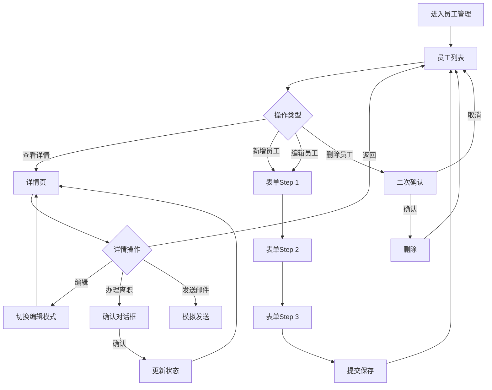

# 员工管理功能需求规范

> **规范类型**: 第一层 - 功能需求规范
> **模块**: 员工管理
> **版本**: v1.0.0
> **创建日期**: 2026-01-09

---

## 📋 目录

- [1. 功能概述](#1-功能概述)
- [2. 功能需求](#2-功能需求)
- [3. 业务规则](#3-业务规则)

---

## 1. 功能概述

### 1.1 模块简介

员工管理模块是OA系统最核心的基础模块,用于管理公司全体员工的信息档案,包括基本信息、工作信息、联系方式等,提供完整的CRUD功能、筛选搜索、统计分析等功能。

### 1.2 功能目标

- 集中管理员工信息档案
- 支持员工入职、转正、离职全生命周期管理
- 提供灵活的筛选和搜索功能
- 实时统计员工数据(在职人数、试用期等)
- 自动化提醒(生日、转正评估等)

### 1.3 用户角色

- **系统管理员**: 全部权限(查看、新增、编辑、删除所有员工)
- **部门管理员**: 查看本部门员工,编辑基本信息
- **普通员工**: 仅查看自己和公开信息

---

## 2. 功能需求

### 2.1 用户故事

```
作为HR管理员,
我想要集中管理所有员工的信息,
以便快速查询和维护员工档案。

作为部门负责人,
我想要查看本部门员工信息,
以便了解部门人员构成。

作为员工,
我想要查看和编辑自己的基本信息,
以便保持信息准确性。
```

### 2.2 功能清单

#### 2.2.1 员工列表页面

- [ ] 表格视图展示所有员工
- [ ] 卡片视图展示(可选)
- [ ] 视图切换(表格/卡片)
- [ ] 关键词搜索(姓名/工号/手机号)
- [ ] 多条件筛选
  - 员工状态(在职/离职/停薪留职)
  - 部门筛选(多选)
  - 职位筛选
  - 试用期状态(试用期内/已转正)
  - 性别筛选
  - 入职时间范围
- [ ] 分页功能(20/50/100条/页)
- [ ] 新增员工
- [ ] 编辑员工
- [ ] 删除员工(二次确认)
- [ ] 查看员工详情
- [ ] 批量导入
- [ ] 导出列表

#### 2.2.2 统计面板

- [ ] 总员工数
- [ ] 在职人数(带趋势图标)
- [ ] 试用期人数(黄色提醒)
- [ ] 本月新入职

#### 2.2.3 员工详情页面

- [ ] 左侧: 员工信息卡片
  - 大尺寸圆形头像(150px)
  - 员工编号(大字体)
  - 姓名(大字体加粗)
  - 职位标签
  - 部门链接(可点击跳转)
  - 员工状态标签
- [ ] 右侧: 详细信息标签页
  - **基本信息tab**: 英文名、性别、出生日期、联系电话、邮箱、办公位置、紧急联系人
  - **工作信息tab**: 入职日期、试用期状态、转正日期、直属上级、工龄(自动计算)
  - **操作记录tab**: 时间轴形式,显示所有变更记录
- [ ] 操作按钮
  - 编辑/保存(切换编辑模式)
  - 发送邮件(模拟)
  - 重置密码(模拟)
  - 办理离职(二次确认)
  - 删除员工(二次确认)

#### 2.2.4 员工表单

- [ ] 步骤式表单(el-steps)
  - **Step 1**: 基本信息(必填)
    - 员工编号(自动生成)
    - 姓名
    - 性别
    - 英文名
    - 联系电话(手机号验证)
    - 邮箱(格式验证)
    - 部门(下拉选择)
    - 职位
    - 入职日期
  - **Step 2**: 详细信息(可选)
    - 出生日期
    - 办公位置
    - 紧急联系人
    - 紧急联系电话
    - 直属上级(员工下拉搜索)
    - 头像上传
  - **Step 3**: 确认提交
    - 汇总显示所有填写信息
    - 最终确认
- [ ] 表单验证
  - 必填项验证
  - 手机号格式验证
  - 邮箱格式验证
  - 实时验证反馈

### 2.3 交互流程



---

## 3. 业务规则

### 3.1 工龄计算规则

工龄根据入职日期自动计算,精确到年份:
- 计算当前日期与入职日期的年份差
- 如果当前月份小于入职月份,则减1年
- 如果月份相同但当前日期小于入职日期,则减1年
- 最小值为0年

### 3.2 员工编号生成规则

格式: `EMP + YYYYMMDD + 序号(3位)`
- 前缀: EMP
- 日期: 入职日期(YYYYMMDD)
- 序号: 当天入职序号,从001开始
- 示例: `EMP20260109001`

### 3.3 试用期计算规则

- 默认试用期: 3个月
- 试用期结束日期 = 入职日期 + 3个月
- 试用期状态: 试用期内(probation) / 已转正(regular)

### 3.4 离职处理流程

1. 更新员工状态为"离职"
2. 记录操作日志
3. 停用系统账号
4. 归还所有资产
5. 发送离职通知

### 3.5 自动提醒功能

#### 3.5.1 生日提醒

- 检查时间: 每天早上9点
- 提醒对象: 当天生日的员工
- 提醒方式: 系统通知 + 邮件

#### 3.5.2 转正提醒

- 检查时间: 每天早上9点
- 提醒对象: 试用期到期前7天的员工
- 提醒方式:
  - 通知员工本人
  - 通知HR和部门负责人

### 3.6 权限控制规则

#### 3.6.1 数据权限

| 角色 | 查看权限 | 编辑权限 | 删除权限 |
|------|---------|---------|---------|
| 系统管理员 | 所有员工 | 所有信息 | ✅ |
| 部门管理员 | 本部门员工 | 基本信息 | ❌ |
| 普通员工 | 仅自己 | 基本信息 | ❌ |

#### 3.6.2 操作权限

- 新增员工: 仅系统管理员
- 删除员工: 仅系统管理员(需二次确认)
- 办理离职: 系统管理员和部门管理员
- 导入导出: 仅系统管理员

---

## 附录

### A. 功能优先级

**P0 (核心功能)**:
- 员工列表展示
- 员工CRUD操作
- 基本筛选搜索
- 统计数据展示

**P1 (重要功能)**:
- 步骤式表单
- 员工详情页
- 批量导入导出
- 工龄自动计算

**P2 (增强功能)**:
- 生日提醒
- 转正提醒
- 卡片视图
- 操作记录

### B. 功能测试要点

**功能测试**:
- 员工CRUD完整性
- 筛选搜索准确性
- 表单验证规则
- 权限控制有效性

**业务规则测试**:
- 工龄计算准确性
- 员工编号唯一性
- 试用期计算正确性
- 离职流程完整性

**用户体验测试**:
- 交互流程流畅性
- 错误提示友好性
- 响应速度合理性

---

**文档版本**: v1.0.0
**创建人**: AI开发助手
**最后更新**: 2026-01-09
