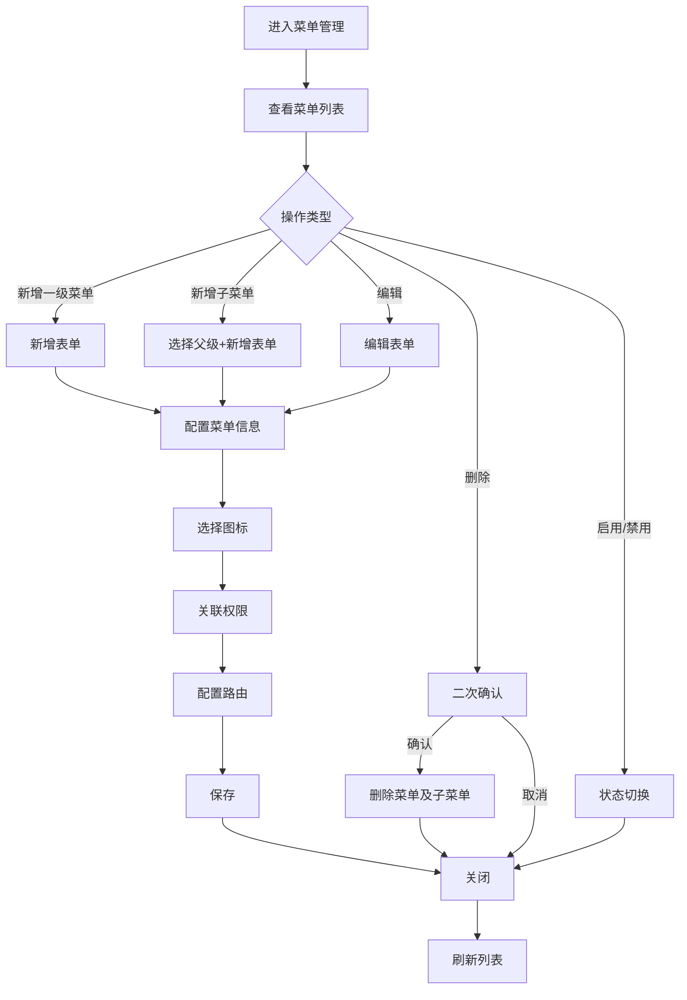

# 菜单管理模块 - 功能需求规范

> **文档类型**: 功能需求规范 (Functional Requirements)
> **模块类型**: 核心基础
> **复杂度**: ⭐⭐⭐ (3星)
> **创建日期**: 2026-01-10
> **版本**: v1.0.0

---

## 📋 目录

- [1. 功能概述](#1-功能概述)
- [2. 用户故事](#2-用户故事)
- [3. 功能清单](#3-功能清单)
- [4. 交互流程](#4-交互流程)
- [5. 业务规则](#5-业务规则)

---

## 1. 功能概述

### 1.1 模块简介
菜单管理模块是OA系统的核心基础模块,用于管理系统后台菜单配置,支持树形结构的菜单层级关系,提供菜单CRUD、图标配置、权限关联、路由配置等功能。

### 1.2 功能目标
- 灵活管理系统后台菜单结构
- 支持多级菜单嵌套(最多3级)
- 可视化配置菜单图标和路由
- 动态控制菜单显示权限
- 支持菜单排序和启用/禁用

### 1.3 用户角色
- **系统管理员**: 全部权限(创建、编辑、删除、配置菜单)
- **普通用户**: 仅查看有权限访问的菜单

---

## 2. 用户故事

```
作为系统管理员,
我想要灵活管理系统的菜单结构,
以便快速调整系统功能布局和权限控制。

作为普通用户,
我想要查看自己有权限访问的菜单,
以便使用系统提供的各项功能。
```

---

## 3. 功能清单

### 3.1 菜单列表页面
- [ ] 树形表格展示菜单层级
- [ ] 支持展开/收起子菜单
- [ ] 显示菜单名称、图标、路由、类型、排序、状态等信息
- [ ] 右键菜单操作(新增子菜单、编辑、删除、启用/禁用)
- [ ] 搜索菜单(按名称、路由)
- [ ] 筛选(按类型、状态)
- [ ] 导出菜单配置

### 3.2 菜单详情弹窗
- [ ] 菜单基本信息展示
- [ ] 父级菜单信息
- [ ] 子菜单列表
- [ ] 关联权限列表
- [ ] 关联路由信息
- [ ] 操作按钮(编辑、删除、添加子菜单)

### 3.3 菜单表单
- [ ] 新增菜单表单
- [ ] 编辑菜单表单
- [ ] 菜单名称输入
- [ ] 菜单类型选择(目录/菜单/按钮)
- [ ] 菜单图标选择器
- [ ] 路由路径配置
- [ ] 组件路径配置
- [ ] 权限标识配置
- [ ] 排序号设置
- [ ] 显示/隐藏开关
- [ ] 缓存配置
- [ ] 外链配置

### 3.4 图标选择器
- [ ] 图标列表展示
- [ ] 图标搜索功能
- [ ] 图标分类筛选
- [ ] 图标预览
- [ ] 自定义图标上传

### 3.5 权限管理集成
- [ ] 菜单与权限关联
- [ ] 权限标识配置
- [ ] 动态菜单权限过滤
- [ ] 菜单权限预览

### 3.6 路由管理集成
- [ ] 路由自动注册
- [ ] 路由参数配置
- [ ] 路由缓存配置
- [ ] 外链路由支持

---

## 4. 交互流程

### 4.1 主要业务流程



### 4.2 用户操作说明

#### 4.2.1 新增一级菜单
1. 在列表页面点击"新增菜单"按钮
2. 父级菜单选择"无(一级菜单)"
3. 填写菜单基本信息(名称、类型、图标、路由等)
4. 选择关联权限
5. 保存并刷新列表

#### 4.2.2 新增子菜单
1. 右键点击父菜单,选择"添加子菜单"
2. 父级菜单自动选中
3. 填写子菜单信息
4. 配置子菜单专属属性(组件路径、路由参数等)
5. 保存并刷新列表

#### 4.2.3 编辑菜单
1. 右键点击菜单,选择"编辑"
2. 修改菜单信息
3. 系统验证数据有效性
4. 保存更新

#### 4.2.4 删除菜单
1. 右键点击菜单,选择"删除"
2. 系统检查是否有子菜单
3. 如有子菜单,提示用户先处理子菜单
4. 二次确认删除操作
5. 执行删除并刷新

#### 4.2.5 启用/禁用菜单
1. 右键点击菜单,选择"启用"或"禁用"
2. 系统立即更新菜单状态
3. 禁用后菜单在前端不显示
4. 刷新列表

---

## 5. 业务规则

### 5.1 数据规则

#### 5.1.1 菜单编号
- 格式: MENU + 4位序号 (如: MENU0001)
- 系统自动生成,不可手动修改
- 全局唯一,不可重复

#### 5.1.2 菜单层级
- 一级菜单层级为1
- 子菜单层级 = 父菜单层级 + 1
- 层级上限为3级
- 移动菜单时自动更新所有子菜单层级

#### 5.1.3 菜单类型
- **目录(Directory)**: 仅用于分组,不含实际页面,不可点击
- **菜单(Menu)**: 可点击,跳转到具体页面
- **按钮(Button)**: 页面内的操作按钮权限标识

#### 5.1.4 菜单排序
- 同级菜单按sort字段升序排列
- sort默认值为0
- 支持手动调整排序号

#### 5.1.5 菜单名称
- 一级菜单名称: 2-10个字符
- 子菜单名称: 2-15个字符
- 支持中英文、数字、特殊字符

### 5.2 操作约束

#### 5.2.1 唯一性约束
- 同一父级下菜单名称不能重复
- 菜单编号全局唯一
- 同一路由路径不能重复

#### 5.2.2 层级约束
- 菜单层级不能超过3级
- 不能选择自己作为父级菜单
- 不能选择自己的子菜单作为父级菜单

#### 5.2.3 删除约束
- 有子菜单的菜单不能删除
- 删除前必须先删除或移动子菜单
- 系统菜单不能删除

#### 5.2.4 类型约束
- 目录类型不能配置路由和组件路径
- 菜单类型必须配置路由路径
- 按钮类型必须配置权限标识

#### 5.2.5 系统菜单约束
- 系统核心菜单(首页、个人中心等)不能删除
- 系统菜单不能修改父级关系
- 系统菜单可以编辑基本信息

### 5.3 权限规则

#### 5.3.1 系统管理员
- 创建、编辑、删除任意菜单
- 查看所有菜单配置
- 导出菜单数据
- 配置菜单权限关联

#### 5.3.2 普通用户
- 仅查看有权限访问的菜单
- 不能进行任何编辑操作

#### 5.3.3 菜单显示权限
- 菜单根据用户权限动态显示
- 无权限访问的菜单自动隐藏
- 至少有一个子菜单有权限时,父级菜单显示

#### 5.3.4 字段级权限控制

| 字段 | 系统管理员 | 普通用户 |
|------|-----------|---------|
| 基本信息(名称/图标) | ✅ 查看/编辑 | ✅ 查看(有权限的) |
| 菜单类型 | ✅ 查看/编辑 | ✅ 查看 |
| 路由配置 | ✅ 查看/编辑 | ❌ |
| 组件配置 | ✅ 查看/编辑 | ❌ |
| 权限标识 | ✅ 查看/编辑 | ❌ |
| 排序号 | ✅ 查看/编辑 | ❌ |
| 菜单状态 | ✅ 查看/编辑 | ✅ 查看 |
| 系统标识 | ✅ 查看 | ❌ |

---

### 5.4 数据字典集成

#### 5.4.1 依赖的数据字典类型

菜单管理模块依赖以下数据字典类型:

| 字典类型 | 字典编码 | 用途 | 是否必填 |
|---------|---------|------|---------|
| 菜单类型 | `menu_type` | 菜单类型(目录/菜单/按钮) | ✅ |
| 菜单状态 | `menu_status` | 菜单状态(启用/禁用) | ✅ |
| 菜单目标 | `menu_target` | 链接打开方式(当前页/新页) | ❌ |

#### 5.4.2 数据字典使用场景

**1. 菜单类型选择**
```typescript
// 从数据字典加载菜单类型选项
const typeOptions = [
  { label: '目录', value: 'directory', dictCode: 'menu_type' },
  { label: '菜单', value: 'menu', dictCode: 'menu_type' },
  { label: '按钮', value: 'button', dictCode: 'menu_type' }
]
```

**2. 菜单状态筛选**
```typescript
// 从数据字典加载菜单状态选项
const statusOptions = [
  { label: '启用', value: 'active', dictCode: 'menu_status' },
  { label: '禁用', value: 'disabled', dictCode: 'menu_status' }
]
```

**3. 链接目标选择**
```typescript
// 从数据字典加载链接目标选项
const targetOptions = await getDictList('menu_target')
// 返回: [{ label: '当前页', value: '_self' }, { label: '新页', value: '_blank' }]
```

#### 5.4.3 数据字典初始化要求

- **模块加载时**: 预加载菜单类型、菜单状态字典
- **表单编辑时**: 动态加载链接目标字典
- **筛选面板**: 使用缓存的字典数据
- **字典刷新**: 监听字典变更事件,自动更新界面显示

#### 5.4.4 数据字典缓存策略

```typescript
// 字典数据缓存管理
const dictCache = {
  // 常用字典: 启动时预加载
  preload: ['menu_type', 'menu_status'],

  // 低频字典: 按需加载
  onDemand: ['menu_target'],

  // 缓存过期时间: 30分钟
  expireTime: 30 * 60 * 1000
}
```

---

### 5.5 权限管理集成

#### 5.5.1 菜单管理权限定义

| 权限编码 | 权限名称 | 权限描述 | 依赖角色 |
|---------|---------|---------|---------|
| `menu:view` | 查看菜单 | 查看菜单列表和详情 | 所有用户 |
| `menu:view_all` | 查看所有菜单 | 查看所有菜单配置 | 系统管理员 |
| `menu:create` | 新增菜单 | 创建新菜单 | 系统管理员 |
| `menu:edit` | 编辑菜单 | 编辑菜单基本信息 | 系统管理员 |
| `menu:delete` | 删除菜单 | 删除菜单 | 系统管理员 |
| `menu:sort` | 菜单排序 | 调整菜单排序 | 系统管理员 |
| `menu:enable` | 启用禁用 | 启用/禁用菜单 | 系统管理员 |
| `menu:export` | 导出配置 | 导出菜单配置 | 系统管理员 |

#### 5.5.2 功能权限矩阵

| 功能 | 系统管理员 | 普通用户 |
|------|-----------|---------|
| 查看所有菜单 | ✅ menu:view_all | ✅ menu:view(有权限的) |
| 查看菜单详情 | ✅ menu:view_all | ✅ menu:view(有权限的) |
| 新增菜单 | ✅ menu:create | ❌ |
| 编辑菜单 | ✅ menu:edit | ❌ |
| 删除菜单 | ✅ menu:delete | ❌ |
| 菜单排序 | ✅ menu:sort | ❌ |
| 启用/禁用 | ✅ menu:enable | ❌ |
| 导出配置 | ✅ menu:export | ❌ |

#### 5.5.3 权限检查实现

```typescript
// 权限检查函数
function checkPermission(permission: string): boolean {
  const authStore = useAuthStore()
  return authStore.hasPermission(permission)
}

// 使用示例
const canCreate = computed(() => checkPermission('menu:create'))
const canEdit = computed(() => checkPermission('menu:edit'))
const canDelete = computed(() => checkPermission('menu:delete'))

// 数据权限过滤
const filteredMenus = computed(() => {
  if (checkPermission('menu:view_all')) {
    return menuList.value // 返回所有菜单
  } else {
    // 只返回有权限访问的菜单
    return menuList.value.filter(menu => hasMenuPermission(menu.id))
  }
})
```

#### 5.5.4 按钮级权限控制

```vue
<!-- 根据权限显示/隐藏按钮 -->
<el-button
  v-if="hasPermission('menu:create')"
  type="primary"
  @click="handleCreate"
>
  新增菜单
</el-button>

<el-button
  v-if="hasPermission('menu:edit')"
  @click="handleEdit(row)"
>
  编辑
</el-button>

<el-button
  v-if="hasPermission('menu:delete')"
  type="danger"
  @click="handleDelete(row)"
>
  删除
</el-button>

<el-button
  v-if="hasPermission('menu:enable')"
  @click="handleToggleStatus(row)"
>
  {{ row.status === 'active' ? '禁用' : '启用' }}
</el-button>
```

#### 5.5.5 字段级权限控制

```typescript
// 敏感字段权限判断
const fieldPermissions = {
  routePath: {
    editable: computed(() => hasPermission('menu:edit'))
  },
  componentPath: {
    editable: computed(() => hasPermission('menu:edit'))
  },
  permission: {
    editable: computed(() => hasPermission('menu:edit'))
  }
}

// 表单中使用
const canEditMenu = computed(() => hasPermission('menu:edit'))
const canEditSystemMenu = computed(() => {
  return hasPermission('menu:edit') && !form.value.isSystem
})
```

---

### 5.6 路由管理集成

#### 5.6.1 路由自动注册

菜单配置自动转换为Vue Router路由配置:

```typescript
// 菜单配置示例
const menuConfig = {
  id: 'MENU0001',
  name: '系统管理',
  type: 'directory',
  path: '/system',
  icon: 'Setting',
  sort: 1,
  status: 'active'
}

// 自动生成的路由配置
const routeConfig = {
  path: '/system',
  name: 'System',
  component: LayoutView,
  meta: {
    title: '系统管理',
    icon: 'Setting',
    hidden: false,
    permissions: []
  },
  children: []
}
```

#### 5.6.2 动态路由加载

```typescript
// 从后端加载菜单配置
async function loadMenuRoutes() {
  const menus = await api.getMenus()

  // 过滤有权限的菜单
  const authorizedMenus = menus.filter(menu =>
    hasPermission(menu.permission)
  )

  // 转换为路由配置
  const routes = transformMenusToRoutes(authorizedMenus)

  // 动态添加路由
  routes.forEach(route => {
    router.addRoute(route)
  })
}
```

#### 5.6.3 路由缓存配置

```typescript
// 菜单配置中的缓存设置
const menuWithCache = {
  id: 'MENU0002',
  name: '用户管理',
  keepAlive: true, // 启用缓存
  cacheKey: 'UserManagement' // 缓存key
}

// 路由配置
const routeConfig = {
  path: '/system/user',
  component: () => import('@/views/system/User/index.vue'),
  meta: {
    keepAlive: true,
    cacheKey: 'UserManagement'
  }
}
```

---

### 5.7 图标管理

#### 5.7.1 图标类型
- **Element Plus Icons**: Element Plus内置图标
- **自定义SVG**: 上传自定义SVG图标
- **Font Awesome**: Font Awesome图标库

#### 5.7.2 图标选择器
```vue
<!-- 图标选择器 -->
<el-select v-model="form.icon" filterable>
  <el-option
    v-for="icon in iconList"
    :key="icon.name"
    :label="icon.title"
    :value="icon.name"
  >
    <span class="icon-option">
      <el-icon><component :is="icon.name" /></el-icon>
      {{ icon.title }}
    </span>
  </el-option>
</el-select>
```

#### 5.7.3 图标预览
- 选择图标后实时预览
- 支持图标搜索
- 支持图标分类筛选

---

### 5.8 系统菜单保护

#### 5.8.1 系统菜单标识
- 系统菜单通过`isSystem`字段标识
- 系统菜单包括: 首页、个人中心、登录页、404页等

#### 5.8.2 系统菜单约束
- 系统菜单不能删除
- 系统菜单不能修改父级
- 系统菜单可以编辑基本信息(名称、图标等)

#### 5.8.3 系统菜单列表
```typescript
const systemMenus = [
  { id: 'DASHBOARD', name: '首页', path: '/dashboard' },
  { id: 'PROFILE', name: '个人中心', path: '/profile' },
  { id: 'LOGIN', name: '登录', path: '/login' },
  { id: '404', name: '404', path: '/404' }
]
```

---

## 6. 功能优先级

### 6.1 P0 - 核心功能 (必须实现)
- 菜单CRUD操作
- 树形结构展示
- 菜单层级管理(最多3级)
- 基础验证规则

### 6.2 P1 - 重要功能 (优先实现)
- 图标选择器
- 菜单权限关联
- 动态路由注册
- 菜单启用/禁用

### 6.3 P2 - 增强功能 (后续实现)
- 自定义图标上传
- 菜单拖拽排序
- 菜单导入导出
- 操作记录审计

---

## 7. 验收标准

### 7.1 功能验收
- 所有P0功能正常运行
- 菜单层级正确维护
- 验证规则有效触发
- 权限控制准确
- 路由自动注册成功

### 7.2 性能验收
- 100+菜单数据流畅展示
- 操作响应时间<500ms
- 图标选择器流畅加载

### 7.3 兼容性验收
- 主流浏览器兼容
- 不同分辨率适配
- 3级嵌套结构正常显示

### 7.4 安全性验收
- 权限验证有效
- 数据验证完整
- 无XSS漏洞
- 系统菜单保护有效

---

**文档版本**: v1.0.0
**创建人**: AI开发助手
**最后更新**: 2026-01-10
