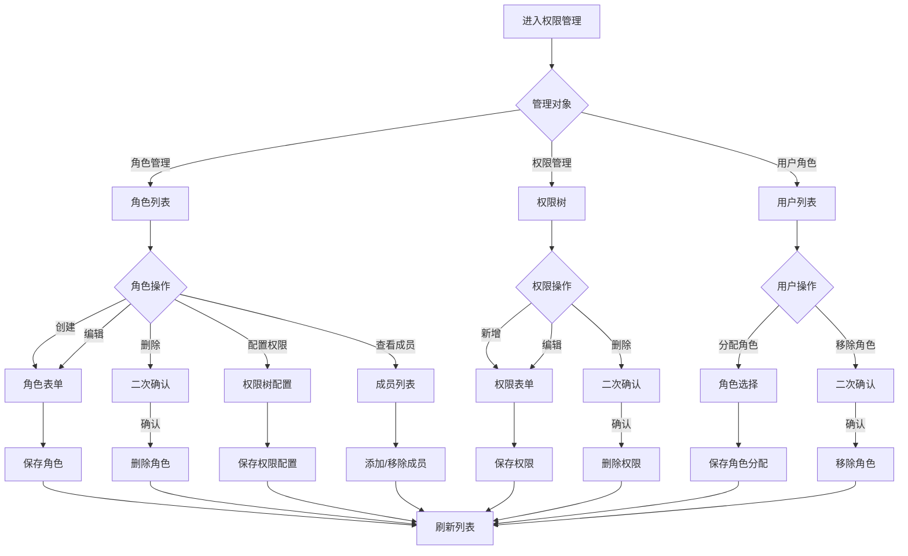

# 权限控制模块 - 功能需求规范

> **文档类型**: 功能需求规范
> **模块类型**: 核心基础
> **复杂度**: ⭐⭐⭐⭐ (4星)
> **参考模块**: `src/modules/employee/`
> **创建日期**: 2026-01-10
> **最后更新**: 2026-01-10

---

## 📋 目录

- [1. 功能概述](#1-功能概述)
- [2. 用户故事](#2-用户故事)
- [3. 功能清单](#3-功能清单)
- [4. 交互流程](#4-交互流程)
- [5. 业务规则](#5-业务规则)

---

## 1. 功能概述

### 1.1 模块简介
权限控制模块是OA系统的安全核心,基于RBAC(Role-Based Access Control)模型,实现灵活的权限管理。支持角色管理、权限分配、用户角色绑定,以及菜单权限、操作权限、数据权限等多维度权限控制。

### 1.2 功能目标
- 提供灵活的RBAC权限模型
- 支持角色的创建、编辑、删除和权限分配
- 支持权限的细粒度控制(菜单、操作、数据)
- 支持用户角色的动态分配
- 提供权限验证中间件和工具函数
- 支持权限模板快速配置
- 实现权限的前后端双重验证

### 1.3 用户角色
- **系统管理员**: 管理所有角色和权限,分配用户角色
- **部门管理员**: 管理本部门用户角色(可选)
- **普通用户**: 查看自己的角色和权限

---

## 2. 用户故事

```
作为系统管理员,
我想要创建不同的角色并分配相应的权限,
以便控制不同用户对系统功能的访问。

作为系统管理员,
我想要为用户分配角色,
以便用户能够获得对应的权限集合。

作为系统管理员,
我想要定义权限模板,
以便快速配置常用角色权限。

作为开发者,
我想要使用权限验证工具,
以便在代码中便捷地检查用户权限。

作为普通用户,
我想要查看自己拥有的权限,
以便了解我能使用哪些功能。
```

---

## 3. 功能清单

### 3.1 角色管理页面
- [ ] 角色列表展示(表格形式)
- [ ] 角色搜索(按名称、编码)
- [ ] 角色筛选(按状态、类型)
- [ ] 创建角色
- [ ] 编辑角色信息
- [ ] 删除角色(带验证)
- [ ] 复制角色
- [ ] 设置角色状态(启用/停用)
- [ ] 查看角色权限详情
- [ ] 查看角色成员列表

### 3.2 权限管理页面
- [ ] 权限树形展示(菜单权限)
- [ ] 权限分组(按模块)
- [ ] 创建权限
- [ ] 编辑权限信息
- [ ] 删除权限
- [ ] 权限编码管理
- [ ] 权限类型管理(菜单/按钮/接口)
- [ ] 查看权限关联角色

### 3.3 角色权限配置
- [ ] 权限树勾选配置
- [ ] 权限批量分配
- [ ] 权限继承查看
- [ ] 权限冲突提示
- [ ] 配置预览
- [ ] 保存权限配置

### 3.4 用户角色管理
- [ ] 用户角色分配
- [ ] 多角色支持
- [ ] 角色有效期设置
- [ ] 角色优先级配置
- [ ] 批量分配角色
- [ ] 角色移除
- [ ] 角色成员查看

### 3.5 权限模板管理
- [ ] 模板列表展示
- [ ] 创建角色模板
- [ ] 基于模板创建角色
- [ ] 模板编辑和删除
- [ ] 模板应用
- [ ] 预置模板(管理员、普通用户等)

### 3.6 权限验证功能
- [ ] 路由级权限验证
- [ ] 菜单级权限显示
- [ ] 按钮级权限控制
- [ ] 接口级权限验证
- [ ] 数据级权限过滤
- [ ] 权限指令(v-auth)
- [ ] 权限工具函数

---

## 4. 交互流程

### 4.1 主要业务流程



### 4.2 用户操作说明

#### 4.2.1 创建角色
1. 进入角色管理页面
2. 点击"新增角色"按钮
3. 填写角色基本信息(名称、编码、描述)
4. 选择角色类型(系统角色/自定义角色)
5. 点击确定保存角色
6. 系统自动生成角色ID
7. 可选: 立即配置角色权限

#### 4.2.2 配置角色权限
1. 在角色列表点击"配置权限"
2. 打开权限树对话框
3. 树形展示所有可用权限
4. 勾选该角色拥有的权限
5. 支持父节点全选子节点
6. 点击保存提交配置
7. 系统验证权限有效性
8. 保存成功后刷新权限缓存

#### 4.2.3 分配用户角色
1. 进入用户管理页面
2. 选择目标用户
3. 点击"分配角色"按钮
4. 在角色列表中勾选角色
5. 可设置角色有效期
6. 保存角色分配
7. 用户重新登录后生效

#### 4.2.4 创建权限
1. 进入权限管理页面
2. 点击"新增权限"按钮
3. 选择权限类型(菜单/按钮/接口)
4. 填写权限基本信息
5. 设置权限所属模块
6. 设置权限编码(唯一标识)
7. 可选: 设置接口地址、请求方式
8. 保存权限

#### 4.2.5 使用权限模板
1. 进入角色管理页面
2. 点击"从模板创建"
3. 选择合适的角色模板
4. 系统自动填充角色信息和权限
5. 可调整权限配置
6. 保存角色

---

## 5. 业务规则

### 5.1 数据规则

#### 5.1.1 角色编号
- 格式: ROLE + 4位序号 (如: ROLE0001)
- 系统自动生成,不可手动修改
- 全局唯一,不可重复
- 预置角色编号: ROLE0001(超级管理员)

#### 5.1.2 权限编码
- 格式: 模块:操作:对象 (如: system:user:add)
- 全局唯一,不可重复
- 使用冒号分隔层级
- 小写字母和下划线
- 示例: `employee:view:list`, `department:edit:info`

#### 5.1.3 角色类型
- **系统角色**: 预置角色,不可删除,可编辑权限
- **自定义角色**: 用户创建的角色,可完全管理
- **临时角色**: 有有效期的角色分配

#### 5.1.4 权限类型
- **菜单权限**: 控制菜单和路由访问
- **按钮权限**: 控制页面内按钮显示和操作
- **接口权限**: 控制后端API访问
- **数据权限**: 控制数据范围(本部门/全公司等)

### 5.2 操作约束

#### 5.2.1 唯一性约束
- 角色名称在同一类型内不能重复
- 角色编码全局唯一
- 权限编码全局唯一
- 权限名称在同一分组内不能重复

#### 5.2.2 删除约束
- 系统预置角色不能删除
- 有成员的角色不能删除
- 删除前必须先移除所有成员
- 被引用的权限不能删除

#### 5.2.3 权限继承规则
- 角色权限不继承(每个角色独立配置)
- 用户拥有多个角色时,权限取并集
- 权限冲突时采用"允许优先"原则
- 禁止权限优先于允许权限

#### 5.2.4 分配约束
- 用户可分配多个角色
- 不能重复分配同一角色
- 临时角色到期自动失效
- 超级管理员角色只能分配给系统管理员

### 5.3 权限验证规则

#### 5.3.1 前端验证
- 路由守卫验证菜单权限
- v-auth指令控制按钮显示
- 权限函数hasPermission()验证
- 根据权限动态生成菜单

#### 5.3.2 后端验证
- 所有API接口验证权限
- 使用权限中间件拦截
- 基于用户角色和权限验证
- 数据权限过滤查询结果

#### 5.3.3 数据权限规则
- **全部数据**: 可查看所有数据
- **本部门及下级**: 可查看本部门和下级部门数据
- **本部门**: 仅可查看本部门数据
- **本人**: 仅可查看自己的数据

### 5.4 权限缓存规则

#### 5.4.1 缓存策略
- 用户权限缓存到Redis
- 缓存键: `user:permissions:{userId}`
- 缓存时间: 30分钟
- 权限变更时自动清除缓存

#### 5.4.2 缓存更新
- 角色权限变更 → 清除所有该角色成员缓存
- 用户角色分配 → 清除该用户缓存
- 权限删除 → 清除所有相关缓存

### 5.5 业务场景

#### 5.5.1 新员工入职权限配置
场景: 新员工入职,需要配置系统访问权限
1. 创建员工账号
2. 根据岗位选择角色模板
3. 分配相应角色给员工
4. 特殊需求可额外分配其他角色
5. 员工登录后获得相应权限

#### 5.5.2 员工调岗权限调整
场景: 员工从技术部调到市场部
1. 移除原岗位相关角色
2. 分配新岗位角色
3. 清除用户权限缓存
4. 用户重新登录生效

#### 5.5.3 临时权限授予
场景: 项目经理需要临时查看财务数据
1. 为用户分配临时角色
2. 设置角色有效期(如1周)
3. 到期后自动移除角色
4. 可提前手动撤销

#### 5.5.4 权限审计
场景: 定期审计用户权限
1. 查看角色成员列表
2. 识别异常权限分配
3. 清理不合理的权限
4. 生成权限审计报告

---

## 6. 功能优先级

### 6.1 P0 - 核心功能 (必须实现)
- RBAC权限模型实现
- 角色CRUD操作
- 权限CRUD操作
- 用户角色分配
- 基础权限验证(路由、按钮)

### 6.2 P1 - 重要功能 (优先实现)
- 权限树形配置
- 权限模板管理
- 接口级权限验证
- 权限缓存机制
- 角色成员管理

### 6.3 P2 - 增强功能 (后续实现)
- 数据权限控制
- 权限审计日志
- 权限申请流程
- 权限统计分析
- 权限测试工具

---

## 7. 用户体验要求

### 7.1 操作便捷性
- 权限树支持快速搜索
- 支持批量操作
- 提供权限模板快速配置
- 智能提示和自动补全
- 权限冲突实时检测

### 7.2 信息展示
- 权限树清晰展示层级
- 角色权限可视化展示
- 权限关系明确显示
- 成员列表快速加载
- 权限统计信息展示

### 7.3 错误处理
- 友好的错误提示信息
- 明确的约束说明
- 操作失败保留用户输入
- 提供解决方案建议
- 权限冲突智能提示

### 7.4 性能体验
- 大量权限数据流畅操作
- 权限树懒加载
- 快速响应交互
- 权限验证无感知
- 缓存优化访问速度

---

## 8. 验收标准

### 8.1 功能验收
- [ ] 所有P0功能正常运行
- [ ] RBAC模型正确实现
- [ ] 权限验证准确有效
- [ ] 角色和权限管理完整
- [ ] 用户角色分配正确

### 8.2 性能验收
- [ ] 权限验证响应<100ms
- [ ] 1000+权限数据流畅展示
- [ ] 权限树渲染流畅
- [ ] 缓存命中率>90%

### 8.3 安全性验收
- [ ] 无权限绕过漏洞
- [ ] 前后端权限一致
- [ ] 无SQL注入风险
- [ ] 无XSS漏洞
- [ ] 权限验证完整

### 8.4 兼容性验收
- [ ] 主流浏览器兼容
- [ ] 不同角色正常工作
- [ ] 权限缓存正常
- [ ] 多角色组合正常

---

**文档版本**: v1.0.0
**创建人**: AI开发助手
**最后更新**: 2026-01-10
