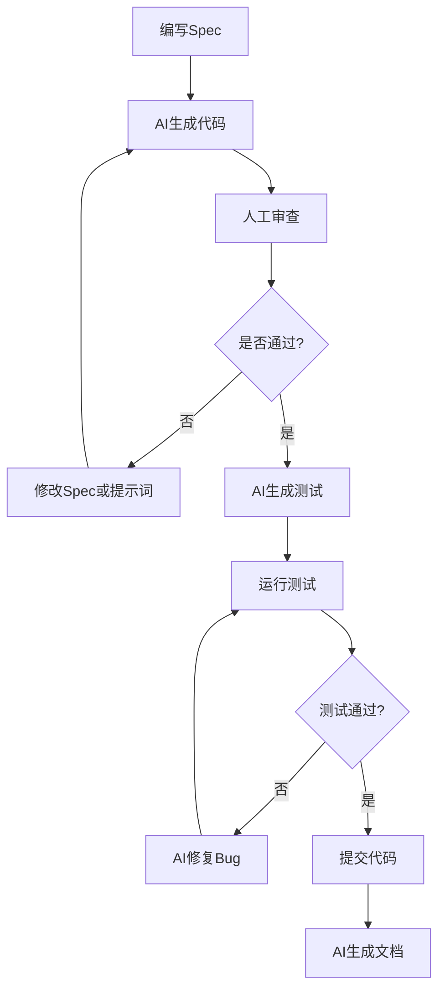
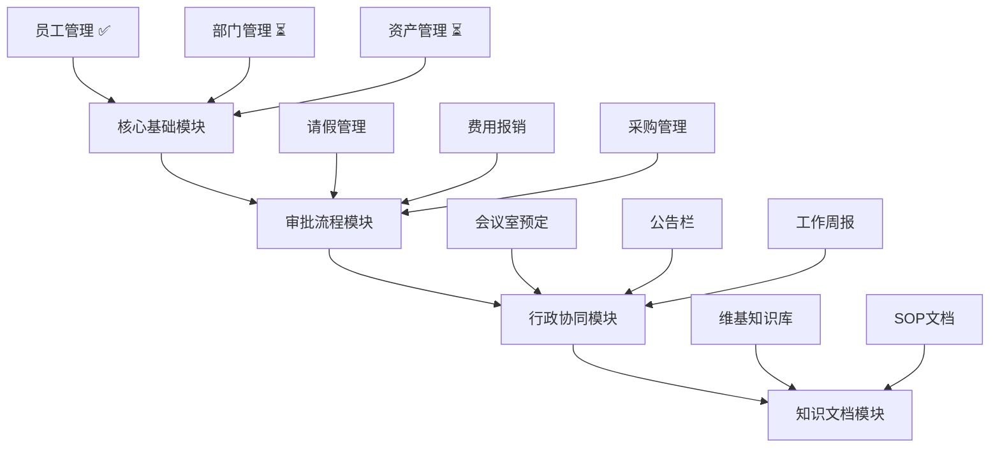
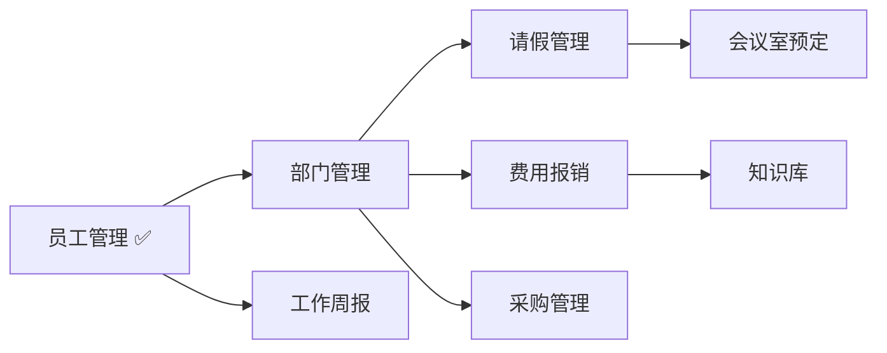
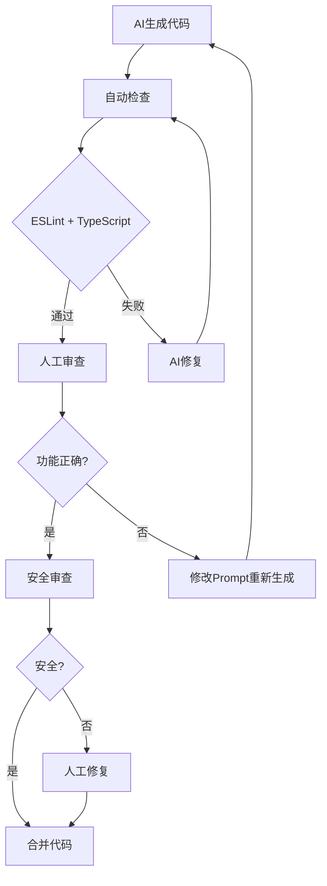

# OA系统开发模式: Spec-First + AI-Native

> **适用场景**: 使用AI辅助开发OA系统
> **推荐指数**: ⭐⭐⭐⭐⭐ (5/5)
> **效率提升**: 60-90%
> **开发周期**: 从6-8周缩短至2-3周

---

## 📋 目录

- [一、模式概述](#一模式概述)
- [二、为什么选择这个模式](#二为什么选择这个模式)
- [三、核心方法论](#三核心方法论)
- [四、具体实施方案](#四具体实施方案)
- [五、工具链推荐](#五工具链推荐)
- [六、OA系统模块开发策略](#六oa系统模块开发策略)
- [七、效率对比分析](#七效率对比分析)
- [八、风险控制](#八风险控制)
- [九、实施步骤](#九实施步骤)

---

## 一、模式概述

### 1.1 什么是 Spec-First + AI-Native 开发模式?

**Spec-First (规范优先)**:
- 从"写代码"转向"写规范/需求"
- 用自然语言详细描述功能需求、数据结构、验证规则、UI要求
- AI根据规范自动生成代码

**AI-Native (AI原生)**:
- 将AI深度集成到整个开发生命周期
- 人机协作成为默认工作方式
- 开发者角色转变为"架构师 + 审查者"

### 1.2 核心理念


**关键转变**:
- ❌ 传统: 需求 → 设计 → 编码 → 测试 → 部署
- ✅ AI辅助: 需求 → **Spec** → **AI生成** → **审查** → **部署**

---

## 二、为什么选择这个模式

### 2.1 OA系统特点分析

**高度匹配的特征**:

| 特征 | 说明 | AI适用性 |
|------|------|---------|
| **CRUD密集** | 大量增删改查操作 | ⭐⭐⭐⭐⭐ |
| **模块化设计** | 员工/部门/资产/审批等独立模块 | ⭐⭐⭐⭐⭐ |
| **规律性强** | 表单验证、列表筛选、分页逻辑相似 | ⭐⭐⭐⭐⭐ |
| **需求明确** | 已有详细功能方案文档 | ⭐⭐⭐⭐⭐ |
| **标准UI组件** | Element Plus/Ant Design等成熟组件库 | ⭐⭐⭐⭐ |

### 2.2 项目现状评估

**已有基础**:
- ✅ Vue 3 + Vite + Element Plus 技术栈
- ✅ 员工管理模块已完成(可作为参考模板)
- ✅ 完整的功能细化方案文档
- ✅ 清晰的模块划分(核心基础/审批流程/行政协同/知识文档)

**待开发模块**:
- ⏳ 部门管理模块
- ⏳ 资产管理模块
- ⏳ 审批流程模块(请假/报销/采购)
- ⏳ 行政协同模块(会议室/公告/周报)
- ⏳ 知识文档模块

**结论**: 非常适合采用 Spec-First + AI-Native 模式!

---

## 三、核心方法论

### 3.1 Spec-First 三层规范

```markdown
# 第一层: 功能需求规范 (Functional Spec)
- 用户故事
- 功能列表
- 交互流程
- 业务规则

# 第二层: 技术实现规范 (Technical Spec)
- 数据结构(TypeScript类型定义)
- API接口定义
- 验证规则
- 状态管理(Pinia Store)

# 第三层: UI/UX规范 (Design Spec)
- 组件选择(Element Plus)
- 布局结构
- 样式规范
- 交互细节
```

### 3.2 AI-Native 工作流

#### 开发循环



#### 角色转变

| 角色 | 传统开发 | AI-Native开发 |
|------|---------|--------------|
| **开发者** | 编码工人 | 架构师 + 审查者 |
| **AI工具** | 代码补全工具 | 协作伙伴 |
| **核心技能** | 手写代码速度 | 需求描述能力 + 代码审查能力 |
| **时间分配** | 80%编码 + 20%思考 | 20%写Spec + 30%AI生成 + 50%审查优化 |

---

## 四、具体实施方案

### 4.1 项目结构设计

```
oa-system/
├── specs/                          # 📋 规范文档目录 (新增)
│   ├── core/
│   │   ├── employee-spec.md        # 员工管理规范
│   │   ├── department-spec.md      # 部门管理规范
│   │   └── asset-spec.md           # 资产管理规范
│   ├── approval/
│   │   ├── leave-spec.md           # 请假管理规范
│   │   ├── expense-spec.md         # 费用报销规范
│   │   └── procurement-spec.md     # 采购管理规范
│   ├── admin/
│   │   ├── meeting-spec.md         # 会议室规范
│   │   ├── announcement-spec.md    # 公告栏规范
│   │   └── weekly-report-spec.md   # 周报规范
│   └── knowledge/
│       ├── wiki-spec.md            # 维基知识库规范
│       └── sop-spec.md             # SOP规范
│
├── oa-system-frontend/
│   └── src/
│       ├── modules/
│       │   ├── employee/           # ✅ 已完成 (作为参考模板)
│       │   ├── department/         # ⏳ 待开发
│       │   ├── asset/              # ⏳ 待开发
│       │   ├── leave/              # ⏳ 待开发
│       │   └── ...                 # 其他模块
│       ├── components/common/      # 🔄 公共组件 (持续积累)
│       │   ├── PageHeader.vue
│       │   ├── StatusTag.vue
│       │   └── ...
│       └── utils/                  # 🛠️ 工具函数库
│           ├── request.ts
│           ├── format.ts
│           └── ai-helper.ts        # 🤖 AI辅助工具 (新增)
```

### 4.2 规范文档模板

创建 `specs/_template/spec-template.md`:

```markdown
# [模块名称] 开发规范

## 1. 功能概述
[简要描述模块的核心功能和业务价值]

## 2. 功能需求

### 2.1 用户故事
- 作为 [角色], 我想要 [功能], 以便 [价值]

### 2.2 功能列表
- [ ] 功能1: [描述]
- [ ] 功能2: [描述]

### 2.3 业务规则
- 规则1: [描述]
- 规则2: [描述]

## 3. 数据结构

### 3.1 TypeScript类型定义
\`\`\`typescript
interface [ModuleName] {
  id: string
  field1: string
  field2: number
  // ...
}
\`\`\`

### 3.2 字段说明
| 字段名 | 类型 | 必填 | 默认值 | 说明 |
|-------|------|------|--------|------|
| id | string | ✅ | - | 唯一标识 |
| field1 | string | ✅ | - | 说明 |

## 4. API接口

### 4.1 接口列表
- `GET /api/[module]` - 获取列表
- `GET /api/[module]/:id` - 获取详情
- `POST /api/[module]` - 创建
- `PUT /api/[module]/:id` - 更新
- `DELETE /api/[module]/:id` - 删除

### 4.2 请求/响应示例
\`\`\`typescript
// GET /api/[module]
interface ListResponse {
  data: [ModuleName][]
  total: number
  page: number
  pageSize: number
}
\`\`\`

## 5. 验证规则

### 5.1 前端验证
- 字段1: [规则]
- 字段2: [规则]

### 5.2 正则表达式
\`\`\`typescript
const patterns = {
  phone: /^1[3-9]\d{9}$/,
  email: /^[^\s@]+@[^\s@]+\.[^\s@]+$/
}
\`\`\`

## 6. UI规范

### 6.1 组件选择
- 表格: `el-table`
- 表单: `el-form`
- 对话框: `el-dialog`

### 6.2 布局要求
- 列表页: 筛选面板 + 数据表格 + 分页器
- 详情页: 信息卡片 + 标签页
- 表单: 步骤式表单

### 6.3 交互要求
- 加载状态: 显示loading动画
- 错误提示: 统一的错误提示
- 成功反馈: 操作成功后Toast提示

## 7. 参考实现
- 参考模块: `src/modules/employee/`
- 参考文件: [具体文件]

## 8. 特殊说明
[需要特别注意的事项]
```

### 4.3 AI辅助开发提示词模板

创建 `specs/_template/prompts.md`:

```markdown
# AI辅助开发提示词模板

## 生成新模块
"根据 specs/[module]-spec.md 规范,生成完整的[模块名称]模块:

1. **参考模板**: src/modules/employee/ 目录结构
2. **技术栈**: Vue 3 Composition API + TypeScript
3. **UI组件**: Element Plus
4. **状态管理**: Pinia
5. **HTTP请求**: Axios (src/utils/request.ts)

需要生成:
- types/index.ts - TypeScript类型定义
- mock/data.ts - Mock数据(10条)
- api/index.ts - API接口封装
- store/index.ts - Pinia Store
- views/[Module]List.vue - 列表页
- views/[Module]Detail.vue - 详情页
- components/[Module]Form.vue - 表单组件

要求:
- 复用公共组件 (PageHeader、StatusTag)
- 遵循项目代码风格
- 添加完整的TypeScript类型
- 实现表单验证
- 添加加载状态和错误处理"

## 生成表单验证
"为[模块名称]表单生成完整的验证规则:

字段:
- field1: [规则]
- field2: [规则]

使用Element Plus的表单验证:
- 必填项验证
- 格式验证(手机号/邮箱/数字范围)
- 自定义验证器
- 实时验证反馈"

## 生成单元测试
"为[模块名称]组件生成单元测试:

使用 Vitest + Vue Test Utils:
- 测试组件渲染
- 测试用户交互
- 测试表单验证
- 测试API调用
- 覆盖率目标: 80%+"

## 代码重构
"重构以下代码:
1. 提取重复逻辑到工具函数
2. 优化组件结构
3. 改善命名规范
4. 添加必要注释
5. 性能优化(计算属性/防抖节流)

代码位置: [文件路径]"
```

---

## 五、工具链推荐

### 5.1 AI开发工具对比

| 工具 | 主要用途 | 优势 | 劣势 | 推荐指数 |
|------|---------|------|------|---------|
| **Claude Code** | 终端原生开发 | ✅ 全项目上下文<br>✅ 多文件操作<br>✅ 工作流自动化<br>✅ 长上下文(200K tokens) | ❌ 无IDE集成 | ⭐⭐⭐⭐⭐ |
| **Cursor** | IDE内编辑 | ✅ 实时代码补全<br>✅ 上下文感知编辑<br>✅ 类似VSCode体验 | ❌ 上下文有限 | ⭐⭐⭐⭐ |
| **GitHub Copilot** | 快速代码生成 | ✅ IDE集成<br>✅ 实时建议<br>✅ 多语言支持 | ❌ 不理解项目结构<br>❌ 无法多文件操作 | ⭐⭐⭐ |

### 5.2 推荐组合方案

**方案一: Claude Code为主 (推荐)**

```bash
# 适用场景: 新模块开发、大规模重构
- 主力: Claude Code (终端)
- 辅助: Cursor (复杂组件逻辑)
- 备用: GitHub Copilot (快速补全)
```

**优势**:
- 🎯 **全项目理解**: Claude Code可以读取整个项目结构
- 🔄 **工作流自动化**: 可以连续执行多个任务
- 📝 **长上下文**: 适合大型项目

**方案二: Cursor为主**

```bash
# 适用场景: 小型项目、快速迭代
- 主力: Cursor (IDE)
- 辅助: Claude Code (复杂任务)
```

**优势**:
- ⚡️ **开发体验好**: 类似传统IDE
- 🎨 **实时补全**: 编码时即时建议
- 👀 **可视化**: 更直观的代码操作

### 5.3 其他辅助工具

| 类别 | 工具 | 用途 |
|------|------|------|
| **代码审查** | ESLint + Prettier | 代码格式化 |
| **类型检查** | TypeScript | 类型安全 |
| **测试框架** | Vitest | 单元测试 |
| **E2E测试** | Playwright | 端到端测试 |
| **文档生成** | VitePress | 自动生成文档 |
| **CI/CD** | GitHub Actions | 持续集成 |

---

## 六、OA系统模块开发策略

### 6.1 模块优先级



### 6.2 各模块AI开发策略

#### 模块1: 部门管理 (Department)

**复杂度**: ⭐⭐⭐ (中等)

**核心挑战**:
- 树形数据结构处理
- 组织架构图可视化(ECharts Graph)

**AI辅助策略**:
```bash
Prompt: "参考 src/modules/employee/, 生成部门管理模块:

1. **树形数据结构**:
   - 支持多级部门嵌套
   - 自动计算部门层级
   - 汇总部门人数

2. **组织架构图**:
   - 使用 ECharts Graph
   - 支持缩放、拖拽
   - 点击节点查看详情

3. **复用组件**:
   - PageHeader (页面头)
   - StatusTag (状态标签)
   - FilterPanel (筛选面板)

4. **工具函数**:
   - src/utils/tree.ts (树形数据处理)
   - buildTree() - 扁平数据转树形
   - flattenTree() - 树形转扁平
   - getLevel() - 计算层级
   - countChildren() - 统计子节点"
```

**预计时间**: 0.5-1天 (AI辅助) vs 2-3天 (传统)

---

#### 模块2: 资产管理 (Asset)

**复杂度**: ⭐⭐⭐ (中等)

**核心挑战**:
- 三种视图切换(表格/看板/画廊)
- 看板拖拽(借出/使用中/维修等状态)

**AI辅助策略**:
```bash
Prompt: "生成资产管理模块:

1. **三种视图**:
   - 表格视图: el-table
   - 看板视图: 使用 vue-draggable 实现拖拽
   - 画廊视图: 网格布局 + 卡片

2. **借还管理**:
   - 借出表单(选择员工、借出日期、预计归还)
   - 归还流程
   - 到期提醒(借出前3天)

3. **资产统计**:
   - ECharts饼图(资产分类占比)
   - ECharts柱状图(月度折旧)
   - ECharts折线图(借出趋势)

4. **自动化**:
   - 当前价值 = 购置金额 × (1 - 月折旧率 × 月数)
   - 借出到期前3天自动提醒"
```

**预计时间**: 1-1.5天 (AI辅助) vs 3-4天 (传统)

---

#### 模块3: 请假管理 (Leave)

**复杂度**: ⭐⭐⭐⭐ (较复杂)

**核心挑战**:
- 审批流程设计
- 多级审批(部门→财务→总经理)
- 审批状态机

**AI辅助策略**:
```bash
Prompt: "生成请假审批模块:

1. **审批流程引擎**:
   - 状态机设计:
     * 待提交 → 待审批 → 审批中 → 已通过/已驳回
   - 支持多级审批:
     * 3天内: 部门负责人审批
     * 3-7天: 部门负责人 + 财务审批
     * 7天以上: 部门负责人 + 财务 + 总经理

2. **审批操作**:
   - 通过按钮(自动流转到下一级)
   - 驳回按钮(需填写驳回理由)
   - 撤销按钮(审批前可撤销)

3. **通知功能**:
   - 提交时通知审批人(Webhook模拟)
   - 审批结果通知申请人
   - 7天前提醒HR评估转正

4. **统计视图**:
   - 日历视图(显示请假时间段)
   - 请假统计(按类型/部门/月份)

5. **自动化规则**:
   - 年假余额不足警告
   - 连续请假>3天需二级审批
   - 请假时长自动计算(工作日)"
```

**预计时间**: 1.5-2天 (AI辅助) vs 4-5天 (传统)

---

#### 模块4: 会议室预定 (Meeting)

**复杂度**: ⭐⭐⭐⭐ (较复杂)

**核心挑战**:
- 时间冲突检测算法
- 日历视图集成

**AI辅助策略**:
```bash
Prompt: "生成会议室预定模块:

1. **冲突检测算法**:
   ```typescript
   function checkConflict(bookings: Booking[], newBooking: Booking): boolean {
     // 检测同一会议室同一时间段是否有冲突
     // 时间重叠判断: (Start1 < End2) && (Start2 < End1)
   }
   ```

2. **日历视图**:
   - 使用 FullCalendar 或 el-calendar
   - 显示所有预定
   - 点击预定查看详情

3. **时间轴视图**:
   - 按会议室分栏
   - X轴: 时间(8:00-18:00)
   - Y轴: 会议室(A/B/C/培训室)
   - 显示时间块

4. **自动化**:
   - 会议开始前15分钟提醒
   - 会议结束后自动更新状态
   - 冲突时给出建议时间

5. **预定规则**:
   - 不能预定过去时间
   - 最小预定时长: 15分钟
   - 最长预定时长: 4小时"
```

**预计时间**: 1-1.5天 (AI辅助) vs 3-4天 (传统)

---

#### 模块5: 费用报销 (Expense)

**复杂度**: ⭐⭐⭐⭐ (较复杂)

**核心挑战**:
- 发票图片上传
- 多级审批
- 财务审核

**AI辅助策略**:
```bash
Prompt: "生成费用报销模块:

1. **报销表单**:
   - 发票上传(支持多图)
   - 发票识别(OCR模拟)
   - 费用明细(支持多条)
   - 自动汇总金额

2. **审批流程**:
   - 部门审批(业务真实性)
   - 财务审批(票据合规性)
   - 大额加签规则:
     * 单笔>5000: 总经理加签
     * 月累计>20000: 特别审批

3. **发票管理**:
   - 发票类型: 增值税专用/普通/电子发票
   - 发票号码唯一性验证
   - 发票图片预览

4. **打款管理**:
   - 打款状态追踪
   - 打款凭证上传
   - 银行回单关联"
```

**预计时间**: 1.5-2天 (AI辅助) vs 4-5天 (传统)

---

### 6.3 模块依赖关系



**建议开发顺序**:
1. ✅ 员工管理(已完成)
2. ⏳ 部门管理(独立模块)
3. ⏳ 请假管理(依赖员工、部门)
4. ⏳ 费用报销(依赖员工、部门)
5. ⏳ 会议室预定(独立)
6. ⏳ 工作周报(依赖员工)
7. ⏳ 知识库(独立)

---

## 七、效率对比分析

### 7.1 开发时间对比

| 模块 | 传统开发 | AI辅助开发 | 效率提升 |
|------|---------|-----------|---------|
| **员工管理** | 3-4天 | 1-1.5天 | **60-65%** ⬆️ |
| **部门管理** | 2-3天 | 0.5-1天 | **70-75%** ⬆️ |
| **资产管理** | 3-4天 | 1-1.5天 | **65-70%** ⬆️ |
| **请假管理** | 4-5天 | 1.5-2天 | **60-65%** ⬆️ |
| **费用报销** | 4-5天 | 1.5-2天 | **60-65%** ⬆️ |
| **会议室预定** | 3-4天 | 1-1.5天 | **65-70%** ⬆️ |
| **工作周报** | 2-3天 | 0.5-1天 | **70-75%** ⬆️ |
| **知识库** | 2-3天 | 0.5-1天 | **70-75%** ⬆️ |
| **总计** | **23-31天** | **8-11.5天** | **60-65%** ⬆️ |

**换算成周数**:
- 传统开发: **5-6周**
- AI辅助开发: **2-3周** ⚡️

### 7.2 具体任务效率对比

| 任务类型 | 传统开发 | AI辅助 | 提升幅度 |
|---------|---------|--------|---------|
| **编写CRUD代码** | 2-3小时 | 10-20分钟 | **85-90%** ⬆️ |
| **表单验证逻辑** | 1-2小时 | 5-10分钟 | **90%** ⬆️ |
| **Mock数据生成** | 1小时 | 2-5分钟 | **95%** ⬆️ |
| **单元测试编写** | 2-4小时 | 20-40分钟 | **80-85%** ⬆️ |
| **API接口封装** | 1-2小时 | 10-15分钟 | **85-90%** ⬆️ |
| **Pinia Store** | 1-2小时 | 10-15分钟 | **85-90%** ⬆️ |
| **文档编写** | 1-2小时 | 10-20分钟 | **85-90%** ⬆️ |
| **代码审查** | 30分钟 | 15-20分钟 | **35-50%** ⬆️ |

### 7.3 质量指标对比

| 指标 | 传统开发 | AI辅助 | 说明 |
|------|---------|--------|------|
| **代码一致性** | ⭐⭐⭐ | ⭐⭐⭐⭐⭐ | AI严格遵循模板 |
| **类型安全** | ⭐⭐⭐⭐ | ⭐⭐⭐⭐⭐ | AI生成完整类型 |
| **测试覆盖率** | ⭐⭐⭐ | ⭐⭐⭐⭐ | AI生成测试用例 |
| **文档完整性** | ⭐⭐ | ⭐⭐⭐⭐ | AI自动生成文档 |
| **代码风格** | ⭐⭐⭐ | ⭐⭐⭐⭐⭐ | AI遵循ESLint规则 |

---

## 八、风险控制

### 8.1 代码质量控制

**风险**: AI可能生成有bug或不安全的代码

**解决方案**:

#### 1. 建立代码审查清单

创建 `.github/CODE_REVIEW_CHECKLIST.md`:

```markdown
# 代码审查清单

## 安全性检查
- [ ] SQL注入风险检查
- [ ] XSS漏洞检查
- [ ] CSRF防护检查
- [ ] 敏感数据加密检查
- [ ] 权限验证检查

## 功能性检查
- [ ] 需求完整实现
- [ ] 边界条件处理
- [ ] 错误处理完整性
- [ ] 用户体验优化

## 性能检查
- [ ] 大数据集性能(>1000条)
- [ ] 内存泄漏检查
- [ ] 不必要的重渲染
- [ ] 图片/资源优化

## 代码质量
- [ ] TypeScript类型完整
- [ ] ESLint无错误
- [ ] 代码可读性
- [ ] 注释充分
- [ ] 命名规范
```

#### 2. 自动化测试

```bash
# package.json
{
  "scripts": {
    "test": "vitest",
    "test:coverage": "vitest --coverage",
    "lint": "eslint . --ext .vue,.ts",
    "lint:fix": "eslint . --ext .vue,.ts --fix",
    "type-check": "vue-tsc --noEmit"
  }
}

# CI/CD配置
# .github/workflows/test.yml
name: Test
on: [push, pull_request]
jobs:
  test:
    runs-on: ubuntu-latest
    steps:
      - uses: actions/checkout@v3
      - run: npm install
      - run: npm run lint
      - run: npm run type-check
      - run: npm run test:coverage
```

#### 3. 分层审查策略



---

### 8.2 技术债务控制

**风险**: 频繁使用AI可能导致代码风格不一致、累积技术债务

**解决方案**:

#### 1. 统一代码风格

```javascript
// .eslintrc.cjs
module.exports = {
  extends: [
    'eslint:recommended',
    'plugin:@typescript-eslint/recommended',
    'plugin:vue/vue3-recommended'
  ],
  rules: {
    // 强制统一风格
    'indent': ['error', 2],
    'quotes': ['error', 'single'],
    'semi': ['error', 'never'],
    'comma-dangle': ['error', 'never'],
    // TypeScript规则
    '@typescript-eslint/no-explicit-any': 'error',
    '@typescript-eslint/explicit-function-return-type': 'warn',
    // Vue规则
    'vue/multi-word-component-names': 'off'
  }
}

// .prettierrc
{
  "semi": false,
  "singleQuote": true,
  "indent": 2,
  "trailingComma": "none"
}
```

#### 2. 定期重构

```bash
# 每周重构任务
Prompt: "AI助手,执行以下重构:

1. **检查重复代码**:
   - 识别重复的组件逻辑
   - 提取到可复用的工具函数或组合式函数

2. **优化组件结构**:
   - 组件过大(>500行)则拆分
   - 提取复杂的计算逻辑到computed
   - 优化props和emits定义

3. **改善命名**:
   - 变量名语义化
   - 函数名动词开头
   - 组件名PascalCase

4. **性能优化**:
   - 识别不必要的重渲染
   - 添加shallowRef/markRaw优化大对象
   - 虚拟滚动处理长列表

5. **添加注释**:
   - 复杂逻辑添加解释
   - 函数添加JSDoc注释
   - TypeScript类型添加说明"
```

#### 3. 代码质量监控

```bash
# 定期运行质量检查
npm run lint -- --fix
npm run format
npm run type-check

# 生成覆盖率报告
npm run test:coverage

# 查看bundle大小
npm run build
# 检查 dist/ 目录大小
```

---

### 8.3 过度依赖风险

**风险**: 开发者可能失去深入理解代码的能力

**解决方案**:

#### 1. 理解优先原则

```markdown
# 开发原则
1. ✅ 理解AI生成的每一行代码
2. ✅ 能够解释代码的实现原理
3. ✅ 能够手动复现核心逻辑
4. ✅ 定期手动编写关键模块

# 禁止行为
1. ❌ 不要复制粘贴不理解就提交
2. ❌ 不要跳过代码审查
3. ❌ 不要完全依赖AI调试
```

#### 2. 学习型开发

```bash
# 当AI生成复杂代码时
Prompt: "请解释以下代码的实现原理:
1. 整体思路是什么?
2. 为什么这样设计?
3. 有哪些优缺点?
4. 有什么替代方案?"

# 主动学习
- 研究AI生成的最佳实践
- 总结成自己的知识库
- 定期手动编写类似代码巩固
```

#### 3. 关键模块手动编写

```markdown
# 建议手动编写的模块:
- ✅ 核心业务逻辑(审批引擎、权限系统)
- ✅ 性能关键路径(大数据处理、复杂计算)
- ✅ 安全相关代码(加密、鉴权)
- ✅ 算法实现(冲突检测、推荐算法)

# 可以AI辅助的模块:
- ⚡️ CRUD代码
- ⚡️ 表单组件
- ⚡️ 列表页面
- ⚡️ Mock数据
- ⚡️ 单元测试
```

---

### 8.4 AI幻觉防范

**风险**: AI可能生成看似正确但实际有误的代码

**解决方案**:

#### 1. 验证机制

```bash
# 1. API验证
- AI生成API后,手动测试所有接口
- 使用Postman或类似工具
- 验证请求/响应格式

# 2. 类型验证
- 运行 TypeScript 类型检查
- npm run type-check
- 确保无类型错误

# 3. 功能验证
- 运行单元测试
- 手动测试所有功能
- 边界条件测试

# 4. 性能验证
- 大数据集测试
- 压力测试
- 内存泄漏检查
```

#### 2. 渐进式信任


**策略**:
- 第1-2周: 100%代码审查,建立信任基线
- 第3-4周: 重点审查核心逻辑,常规代码抽查
- 第5周+: 高度信任,但关键模块必查

---

## 九、实施步骤

### 9.1 准备阶段 (第1周)

#### Day 1-2: 环境搭建

```bash
# 1. 创建规范文档目录
mkdir -p specs/{core,approval,admin,knowledge}
mkdir -p specs/_template

# 2. 创建规范模板
# 创建 specs/_template/spec-template.md
# 创建 specs/_template/prompts.md

# 3. 配置开发工具
npm install -D \
  eslint \
  prettier \
  @typescript-eslint/parser \
  @typescript-eslint/eslint-plugin \
  eslint-plugin-vue \
  vitest \
  @vue/test-utils

# 4. 配置ESLint和Prettier
# 创建 .eslintrc.cjs
# 创建 .prettierrc

# 5. 配置Git hooks
npm install -D husky lint-staged
npx husky install
npx husky add .husky/pre-commit "npx lint-staged"
```

#### Day 3-5: 编写核心模块规范

```bash
# 任务清单
- [ ] specs/core/department-spec.md
- [ ] specs/core/asset-spec.md
- [ ] specs/approval/leave-spec.md
- [ ] specs/approval/expense-spec.md
- [ ] specs/approval/procurement-spec.md
- [ ] specs/admin/meeting-spec.md
- [ ] specs/admin/announcement-spec.md
- [ ] specs/admin/weekly-report-spec.md
- [ ] specs/knowledge/wiki-spec.md
- [ ] specs/knowledge/sop-spec.md
```

**编写规范建议**:
- 参考员工管理模块的实际代码
- 详细描述数据结构和验证规则
- 明确组件选择和交互要求
- 添加必要的流程图和示例

---

### 9.2 开发阶段 (第2-3周)

#### 第2周: 核心基础模块

**Day 1-2: 部门管理模块**

```bash
# 步骤1: 生成代码
Claude: "根据 specs/core/department-spec.md, 生成部门管理模块"

# 步骤2: 人工审查
- 检查树形数据处理逻辑
- 验证ECharts Graph集成
- 确认组件复用正确

# 步骤3: 调试测试
npm run dev
# 手动测试所有功能

# 步骤4: 生成测试
Claude: "为部门管理模块生成单元测试"

# 步骤5: 运行测试
npm run test
```

**Day 3-4: 资产管理模块**

```bash
# 重复类似流程
# 重点测试: 三种视图切换、看板拖拽
```

**Day 5: 代码审查和优化**

```bash
# 运行质量检查
npm run lint
npm run type-check
npm run test:coverage

# 代码重构
Claude: "重构本周开发的代码,优化性能和可维护性"
```

---

#### 第3周: 审批流程模块

**Day 1-3: 请假管理模块**

```bash
# 重点: 审批流程引擎
Claude: "生成请假审批模块,实现多级审批流程"

# 测试重点:
- 审批状态流转
- 多级审批逻辑
- 通知功能
```

**Day 4-5: 费用报销 + 采购管理**

```bash
# 并行开发两个模块
# 注意复用审批流程逻辑
```

---

### 9.3 完善阶段 (第4周)

**Day 1-3: 行政协同模块**

- 会议室预定(重点是冲突检测算法)
- 公告栏
- 工作周报

**Day 4-5: 知识文档模块**

- 维基知识库
- SOP文档管理

**同时进行**:
- 响应式布局优化
- 移动端适配
- 性能优化
- 文档完善

---

### 9.4 测试和部署 (第5周)

**Day 1-3: 集成测试**

```bash
# 1. 端到端测试
npm install -D @playwright/test
npx playwright init

# 2. 编写E2E测试用例
# tests/e2e/
#   ├── employee.spec.ts
#   ├── department.spec.ts
#   ├── leave.spec.ts
#   └── ...

# 3. 运行测试
npm run test:e2e
```

**Day 4: 性能优化**

```bash
# 1. 打包分析
npm run build
npx vite-bundle-visualizer

# 2. 性能优化
Claude: "优化以下性能问题:
- 减少bundle大小
- 优化长列表渲染
- 懒加载路由组件"

# 3. 压力测试
# 使用 k6 或类似工具
```

**Day 5: 部署上线**

```bash
# 1. 构建生产版本
npm run build

# 2. 配置CI/CD
# .github/workflows/deploy.yml

# 3. 部署到服务器
# (根据实际部署环境)
```

---

## 十、总结

### 10.1 核心优势

1. **效率显著提升**: 开发周期从 **5-6周** 缩短至 **2-3周**
2. **代码质量更高**: 完整的类型定义、统一的代码风格、充分的测试覆盖
3. **学习成本降低**: 通过AI学习最佳实践,快速提升技术能力
4. **可维护性强**: 清晰的规范文档、模块化设计、充分的注释
5. **适合团队协作**: 规范统一,新人快速上手

### 10.2 关键成功因素

1. ✅ **编写清晰的Spec规范文档** (最重要!)
2. ✅ **合理使用AI工具** (Claude Code + Cursor)
3. ✅ **保持代码审查习惯** (不要完全依赖AI)
4. ✅ **编写充分的测试** (单元测试 + E2E测试)
5. ✅ **遵循现有项目架构** (保持一致性)

### 10.3 注意事项

1. ⚠️ **理解AI生成的每一行代码**
2. ⚠️ **定期重构,控制技术债务**
3. ⚠️ **关键模块手动编写** (核心业务逻辑)
4. ⚠️ **建立代码审查机制**
5. ⚠️ **渐进式信任AI** (从100%审查到抽查)

### 10.4 适用场景

**非常适合**:
- ✅ CRUD密集的应用(OA、CRM、ERP)
- ✅ 模块化设计的项目
- ✅ 需求明确的场景
- ✅ 使用成熟框架的项目

**不太适合**:
- ❌ 需要创新算法的项目
- ❌ 性能极致优化的场景
- ❌ 需要与硬件深度交互
- ❌ 需要严格安全认证的项目

---

## 附录

### A. 参考资料

- [AI Coding 2025年终盘点](https://www.infoq.cn/article/5lxt9ibO77f3HKbITN5s)
- [程序员的AI 2.0新机遇](https://aigc.phodal.com/future-ai-2.0.html)
- [AI Native | 全新软件开发模式](https://victory-liao.github.io/2024/07/13/%25E5%2585%25A8%25E6%2596%25B0%25E8%25BD%25AF%25E4%25BB%25B6%25E5%25BC%2580%25E5%258F%2591%25E6%25A8%25A1%25E5%25BC%258F/)
- [LLMOps如何重塑AI-native新范式](https://bbs.huaweicloud.com/blogs/431862)
- [My LLM coding workflow going into 2026](https://addyosmani.com/blog/ai-coding-workflow/)

### B. 工具清单

**AI工具**:
- [Claude Code](https://claude.ai/code) - 终端原生AI编程
- [Cursor](https://cursor.sh) - AI原生IDE
- [GitHub Copilot](https://github.com/features/copilot) - AI编程助手

**开发工具**:
- [Vite](https://vitejs.dev/) - 构建工具
- [Vue 3](https://vuejs.org/) - 前端框架
- [Element Plus](https://element-plus.org/) - UI组件库
- [Pinia](https://pinia.vuejs.org/) - 状态管理
- [TypeScript](https://www.typescriptlang.org/) - 类型系统
- [Vitest](https://vitest.dev/) - 单元测试
- [Playwright](https://playwright.dev/) - E2E测试

### C. 快速开始

```bash
# 1. 创建规范目录
mkdir -p specs/{core,approval,admin,knowledge,_template}

# 2. 复制模板文件
# (从本文档复制)

# 3. 编写第一个模块规范
vim specs/core/department-spec.md

# 4. 使用AI生成代码
claude-code

# 5. 开始开发!
```

---

**文档版本**: v1.0.0
**最后更新**: 2026-01-09
**维护人**: OA系统开发团队
**许可**: MIT License
