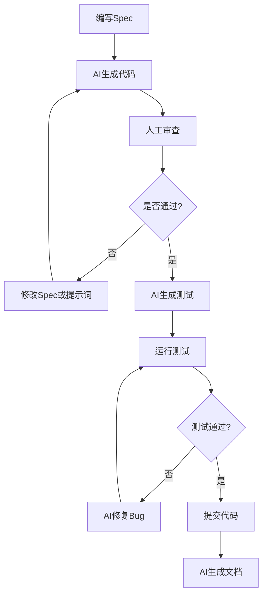

### 1.1 什么是 Spec-First + AI-Native 开发模式

**Spec-First (规范优先)**:
- 从"写代码"转向"写规范/需求"
- 用自然语言详细描述功能需求、数据结构、验证规则、UI要求
- AI根据规范自动生成代码

**AI-Native (AI原生)**:
- 将AI深度集成到整个开发生命周期
- 人机协作成为默认工作方式
- 开发者角色转变为"架构师 + 审查者"

### 1.2 核心理念


**关键转变**:
- ❌ 传统: 需求 → 设计 → 编码 → 测试 → 部署
- ✅ AI辅助: 需求 → **Spec** → **AI生成** → **审查** → **部署**

**待开发模块**:
- ⏳ 员工管理模块
- ⏳ 部门管理模块
- ⏳ 资产管理模块
- ⏳ 审批流程模块(请假/报销/采购)
- ⏳ 行政协同模块(会议室/公告/周报)
- ⏳ 知识文档模块

## 三、核心方法论

### 3.1 Spec-First 三层规范

```markdown
# 第一层: 功能需求规范 (Functional Spec)
- 用户故事
- 功能列表
- 交互流程
- 业务规则

# 第二层: 技术实现规范 (Technical Spec)
- 数据结构(TypeScript类型定义)
- API接口定义
- 验证规则
- 状态管理(Pinia Store)

# 第三层: UI/UX规范 (Design Spec)
- 组件选择(Element Plus)
- 布局结构
- 样式规范
- 交互细节
```

### 3.2 AI-Native 工作流

#### 开发循环



#### 角色转变

| 角色 | 传统开发 | AI-Native开发 |
|------|---------|--------------|
| **开发者** | 编码工人 | 架构师 + 审查者 |
| **AI工具** | 代码补全工具 | 协作伙伴 |
| **核心技能** | 手写代码速度 | 需求描述能力 + 代码审查能力 |
| **时间分配** | 80%编码 + 20%思考 | 20%写Spec + 30%AI生成 + 50%审查优化 |

## 四、具体实施方案
