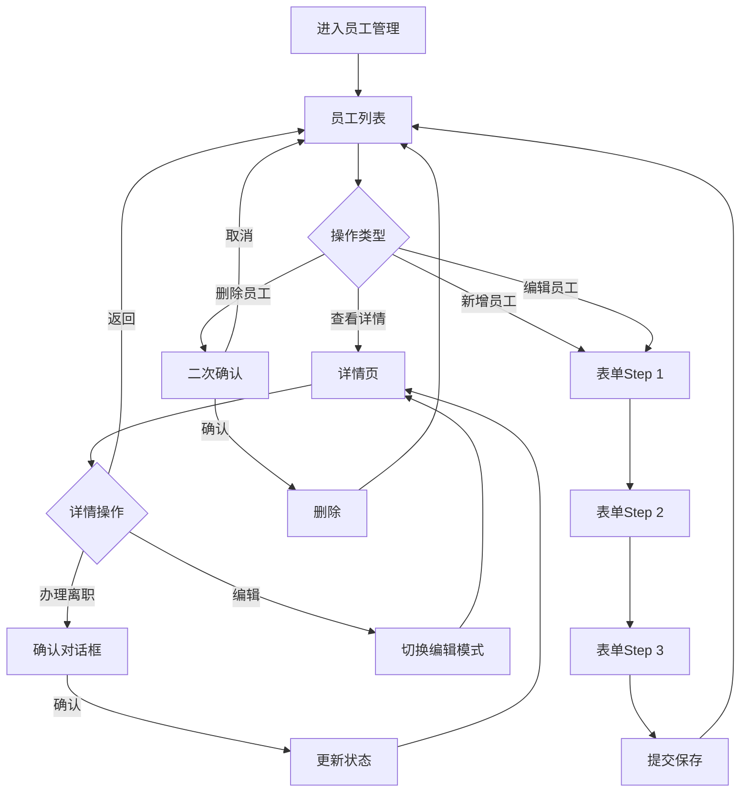
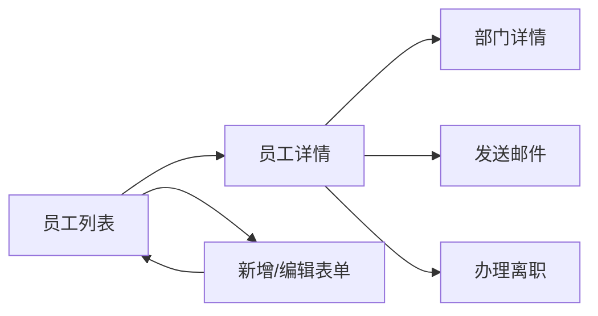
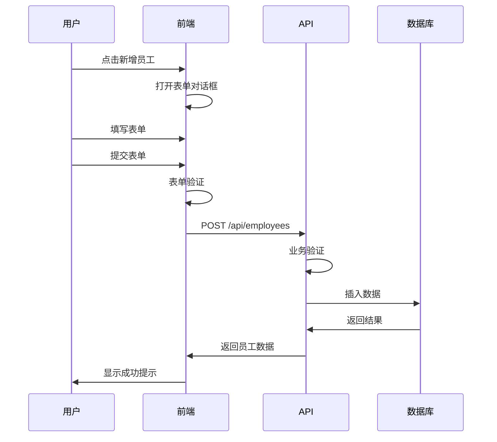

# [模块名称] 开发规范 (三层架构)

> **模块类型**: [核心基础 / 审批流程 / 行政协同 / 知识文档]
> **复杂度**: ⭐⭐⭐ (1-5星)
> **预计工期**: X天
> **参考模块**: `src/modules/employee/`
> **创建日期**: YYYY-MM-DD
> **最后更新**: YYYY-MM-DD

---

## 📋 目录

- [第一层: 功能需求规范 (Functional Spec)](#第一层-功能需求规范-functional-spec)
  - [1. 功能概述](#1-功能概述)
  - [2. 用户故事](#2-用户故事)
  - [3. 功能清单](#3-功能清单)
  - [4. 交互流程](#4-交互流程)
  - [5. 业务规则](#5-业务规则)

- [第二层: 技术实现规范 (Technical Spec)](#第二层-技术实现规范-technical-spec)
  - [6. 数据结构](#6-数据结构)
  - [7. API接口](#7-api接口)
  - [8. 验证规则](#8-验证规则)
  - [9. 算法实现](#9-算法实现)
  - [10. 自动化功能](#10-自动化功能)

- [第三层: UI/UX规范 (Design Spec)](#第三层-uiux规范-design-spec)
  - [11. 页面布局](#11-页面布局)
  - [12. 组件选择](#12-组件选择)
  - [13. 交互规范](#13-交互规范)
  - [14. 样式规范](#14-样式规范)
  - [15. 响应式设计](#15-响应式设计)

- [附录](#附录)
  - [16. 参考实现](#16-参考实现)
  - [17. 特殊说明](#17-特殊说明)

---

# 第一层: 功能需求规范 (Functional Spec)

> **定义**: 描述"做什么" - 从用户和业务角度定义功能需求

## 1. 功能概述

### 1.1 模块简介
[简要描述模块的核心功能、业务价值和目标用户]

**示例**:
```
员工管理模块是OA系统的核心基础模块,用于管理公司全体员工的信息档案,
包括基本信息、工作信息、联系方式等,提供完整的CRUD功能、筛选搜索、
统计分析等功能。
```

### 1.2 业务价值
- 价值1: [描述业务价值]
- 价值2: [描述业务价值]

**示例**:
```
- 集中管理员工信息,提高HR工作效率
- 实时统计员工数据,支持管理决策
- 自动化提醒,减少人工操作失误
```

### 1.3 目标用户
| 用户角色 | 使用场景 | 核心需求 |
|---------|---------|---------|
| HR管理员 | 日常维护员工档案 | 快速查找、批量操作 |
| 部门负责人 | 查看本部门员工 | 信息准确、实时更新 |
| 普通员工 | 查看个人信息 | 便捷访问、自我更新 |

### 1.4 功能目标
- 目标1: [描述]
- 目标2: [描述]

**示例**:
```
- 支持员工全生命周期管理(入职、转正、离职)
- 提供灵活的筛选和搜索功能
- 实时统计员工数据
- 自动化提醒(生日、转正评估)
```

---

## 2. 用户故事

### 2.1 用户故事模板
```
作为 [角色],
我想要 [功能],
以便 [价值/目标]
```

### 2.2 核心用户故事

**故事1: [功能名称]**
```
作为 HR管理员,
我想要快速查找员工信息,
以便高效处理日常人事工作
```

**验收标准**:
- [ ] 支持按姓名、工号、手机号搜索
- [ ] 搜索响应时间 < 1秒
- [ ] 支持模糊搜索

**故事2: [功能名称]**
```
作为部门负责人,
我想要查看本部门所有员工信息,
以便了解部门人员构成
```

**验收标准**:
- [ ] 只显示本部门员工
- [ ] 显示员工基本信息和状态
- [ ] 支持导出部门员工列表

**故事3: [功能名称]**
```
作为员工,
我想要查看和编辑自己的基本信息,
以便保持信息准确性
```

**验收标准**:
- [ ] 员工只能查看和编辑自己的信息
- [ ] 关键字段(如部门、职位)不可编辑
- [ ] 修改后需要管理员审核

---

## 3. 功能清单

### 3.1 功能优先级

| 优先级 | 功能模块 | 功能点 | 说明 |
|-------|---------|--------|------|
| P0 | 列表展示 | 员工列表页 | 必须实现 |
| P0 | 数据操作 | 新增员工 | 必须实现 |
| P0 | 数据操作 | 编辑员工 | 必须实现 |
| P0 | 数据操作 | 删除员工 | 必须实现 |
| P1 | 筛选搜索 | 多条件筛选 | 重要 |
| P1 | 数据展示 | 详情页 | 重要 |
| P2 | 高级功能 | 批量导入 | 可选 |
| P2 | 高级功能 | 数据导出 | 可选 |

### 3.2 详细功能列表

#### 3.2.1 列表页面
- [ ] 表格视图展示所有员工
  - 显示字段: 姓名、工号、部门、职位、联系电话、状态
  - 支持排序
  - 支持分页(20/50/100条/页)
- [ ] 卡片视图展示(可选)
- [ ] 视图切换(表格/卡片)
- [ ] 关键词搜索
  - 搜索范围: 姓名/工号/手机号/邮箱
  - 实时搜索结果
- [ ] 多条件筛选
  - 员工状态筛选(在职/离职/停薪留职)
  - 部门筛选(多选)
  - 职位筛选
  - 试用期状态筛选
  - 性别筛选
  - 入职时间范围
- [ ] 统计面板
  - 总员工数
  - 在职人数
  - 试用期人数(黄色提醒)
  - 本月新入职

#### 3.2.2 详情页面
- [ ] 员工信息卡片
  - 头像(150px圆形)
  - 员工编号(大字体)
  - 姓名(大字体加粗)
  - 职位标签
  - 部门链接(可点击跳转)
  - 员工状态标签
- [ ] 详细信息标签页
  - **基本信息tab**: 英文名、性别、出生日期、联系电话、邮箱、办公位置、紧急联系人
  - **工作信息tab**: 入职日期、试用期状态、转正日期、直属上级、工龄(自动计算)
  - **操作记录tab**: 时间轴形式,显示所有变更记录
- [ ] 操作按钮
  - 编辑/保存(切换编辑模式)
  - 发送邮件(模拟)
  - 重置密码(模拟)
  - 办理离职(二次确认)
  - 删除员工(二次确认)

#### 3.2.3 表单功能
- [ ] 新增员工表单
- [ ] 编辑员工表单
- [ ] 步骤式表单(el-steps)
  - Step 1: 基本信息(必填)
  - Step 2: 详细信息(可选)
  - Step 3: 确认提交
- [ ] 表单验证
  - 必填项验证
  - 手机号格式验证
  - 邮箱格式验证
  - 实时验证反馈

#### 3.2.4 批量操作
- [ ] 批量导入(Excel)
- [ ] 批量删除
- [ ] 批量导出
- [ ] 批量编辑

---

## 4. 交互流程

### 4.1 核心流程图



### 4.2 页面跳转流程



### 4.3 数据流转



---

## 5. 业务规则

### 5.1 数据约束

| 规则类型 | 规则说明 | 错误提示 |
|---------|---------|---------|
| 唯一性 | 邮箱必须唯一 | "该邮箱已被使用" |
| 唯一性 | 手机号必须唯一 | "该手机号已被使用" |
| 格式 | 手机号格式: 1[3-9]\\d{9} | "请输入正确的手机号" |
| 格式 | 邮箱格式: xxx@xxx.xxx | "请输入正确的邮箱" |
| 范围 | 入职日期不能晚于今天 | "入职日期不能晚于今天" |
| 关联 | 部门必须存在 | "所选部门不存在" |
| 关联 | 直属上级必须是有效员工 | "所选上级不存在" |

### 5.2 业务逻辑

**规则1: 工龄计算**
```
工龄 = 当前年份 - 入职年份
如果当前月份 < 入职月份,工龄 - 1
如果当前月份 = 入职月份且当前日期 < 入职日期,工龄 - 1
最小值: 0年
```

**规则2: 员工编号生成**
```
格式: EMP + YYYYMMDD + 序号(3位)
示例: EMP20260109001
规则: 同一天入职的员工按顺序递增
```

**规则3: 试用期计算**
```
默认试用期: 3个月
试用期结束日期 = 入职日期 + 3个月
提前7天提醒转正评估
```

**规则4: 离职处理**
```
离职条件:
1. 无未归还的资产
2. 无未完成的审批流程
3. 无未结清的财务事项

离职后操作:
1. 更新员工状态为"离职"
2. 停用系统账号
3. 记录操作日志
4. 发送离职通知
```

### 5.3 权限规则

| 角色 | 查看权限 | 编辑权限 | 删除权限 | 特殊权限 |
|------|---------|---------|---------|---------|
| 系统管理员 | 所有员工 | 所有字段 | 可删除 | 批量导入/导出 |
| 部门管理员 | 本部门员工 | 基本信息(不可改部门/职位) | 不可删除 | 查看统计 |
| 普通员工 | 仅自己 | 基本信息(不可改部门/职位/状态) | 不可删除 | 无 |

### 5.4 数据范围

**系统管理员**: 可以查看和操作所有员工数据

**部门管理员**:
- 查看范围: 本部门及下级部门的员工
- 操作范围: 只能编辑基本信息,不能修改部门、职位、状态

**普通员工**:
- 查看范围: 只能查看自己的信息
- 操作范围: 只能编辑自己的基本信息(姓名、英文名、办公位置、紧急联系人)

---

# 第二层: 技术实现规范 (Technical Spec)

> **定义**: 描述"怎么做" - 从技术角度定义实现方案

## 6. 数据结构

### 6.1 TypeScript类型定义

```typescript
/**
 * 员工信息
 */
interface Employee {
  /** 员工编号 - 唯一标识 */
  id: string

  /** 基本信息 */
  name: string                    // 姓名
  englishName?: string            // 英文名
  gender: 'male' | 'female'       // 性别
  birthDate?: string              // 出生日期
  phone: string                   // 联系电话
  email: string                   // 邮箱
  avatar?: string                 // 头像URL

  /** 工作信息 */
  departmentId: string            // 部门ID
  departmentName?: string         // 部门名称(关联查询)
  position: string                // 职位
  level?: string                  // 职级
  managerId?: string              // 直属上级ID
  managerName?: string            // 直属上级姓名(关联查询)
  joinDate: string                // 入职日期
  probationStatus?: 'probation' | 'regular'  // 试用期状态
  probationEndDate?: string       // 试用期结束日期
  workYears?: number              // 工龄(自动计算)

  /** 状态 */
  status: 'active' | 'resigned' | 'suspended'  // 员工状态

  /** 其他信息 */
  officeLocation?: string         // 办公位置
  emergencyContact?: string       // 紧急联系人
  emergencyPhone?: string         // 紧急联系电话

  /** 系统字段 */
  createdAt: string
  updatedAt: string
}

/**
 * 员工筛选条件
 */
interface EmployeeFilter {
  /** 关键词搜索 */
  keyword?: string
  /** 员工状态 */
  status?: Employee['status']
  /** 部门筛选 */
  departmentIds?: string[]
  /** 其他筛选条件 */
  [key: string]: any
}

/**
 * 员工表单数据
 */
interface EmployeeForm {
  /** 基本信息 */
  name: string
  gender: 'male' | 'female'
  englishName?: string
  phone: string
  email: string
  departmentId: string
  position: string
  joinDate: string

  /** 详细信息 */
  birthDate?: string
  officeLocation?: string
  emergencyContact?: string
  emergencyPhone?: string
  managerId?: string
  avatar?: string
}
```

### 6.2 字段说明表

| 字段名 | 类型 | 必填 | 默认值 | 说明 | 验证规则 |
|-------|------|------|--------|------|---------|
| id | string | ✅ | - | 员工编号 | 格式: EMP+YYYYMMDD+序号 |
| name | string | ✅ | - | 姓名 | 2-20字符 |
| phone | string | ✅ | - | 联系电话 | 格式: 1[3-9]\d{9} |
| email | string | ✅ | - | 邮箱 | 格式: email,唯一 |
| departmentId | string | ✅ | - | 部门ID | 外键关联 |
| status | string | ✅ | active | 员工状态 | 枚举值 |

### 6.3 数据库设计

```sql
-- 员工表
CREATE TABLE employees (
  id VARCHAR(20) PRIMARY KEY COMMENT '员工编号',
  name VARCHAR(50) NOT NULL COMMENT '姓名',
  english_name VARCHAR(50) COMMENT '英文名',
  gender ENUM('male', 'female') NOT NULL COMMENT '性别',
  birth_date DATE COMMENT '出生日期',
  phone VARCHAR(20) NOT NULL UNIQUE COMMENT '联系电话',
  email VARCHAR(100) NOT NULL UNIQUE COMMENT '邮箱',
  avatar VARCHAR(255) COMMENT '头像URL',

  department_id VARCHAR(20) NOT NULL COMMENT '部门ID',
  position VARCHAR(50) NOT NULL COMMENT '职位',
  level VARCHAR(50) COMMENT '职级',
  manager_id VARCHAR(20) COMMENT '直属上级ID',
  join_date DATE NOT NULL COMMENT '入职日期',
  probation_status ENUM('probation', 'regular') COMMENT '试用期状态',
  probation_end_date DATE COMMENT '试用期结束日期',
  work_years INT COMMENT '工龄',

  office_location VARCHAR(100) COMMENT '办公位置',
  emergency_contact VARCHAR(50) COMMENT '紧急联系人',
  emergency_phone VARCHAR(20) COMMENT '紧急联系电话',
  status ENUM('active', 'resigned', 'suspended') DEFAULT 'active',

  created_at TIMESTAMP DEFAULT CURRENT_TIMESTAMP,
  updated_at TIMESTAMP DEFAULT CURRENT_TIMESTAMP ON UPDATE CURRENT_TIMESTAMP,

  INDEX idx_department (department_id),
  INDEX idx_status (status),
  INDEX idx_join_date (join_date),
  FOREIGN KEY (department_id) REFERENCES departments(id)
) COMMENT='员工表';
```

---

## 7. API接口

### 7.1 RESTful API设计

| 方法 | 路径 | 说明 | 权限 |
|------|------|------|------|
| GET | /api/employees | 获取列表 | 所有用户 |
| GET | /api/employees/:id | 获取详情 | 所有用户 |
| POST | /api/employees | 创建 | 管理员 |
| PUT | /api/employees/:id | 更新 | 管理员 |
| DELETE | /api/employees/:id | 删除 | 管理员 |

### 7.2 接口详细定义

#### 7.2.1 获取员工列表

**请求**:
```http
GET /api/employees?page=1&pageSize=20&keyword=张三&status=active
```

**查询参数**:
```typescript
interface ListParams {
  page: number              // 页码,默认1
  pageSize: number          // 每页数量,默认20
  keyword?: string          // 关键词搜索
  status?: string           // 员工状态
  departmentIds?: string[]  // 部门ID列表
  position?: string         // 职位
  joinDateStart?: string    // 入职开始日期
  joinDateEnd?: string      // 入职结束日期
}
```

**响应**:
```typescript
interface ListResponse {
  code: number              // 状态码
  message: string           // 消息
  data: {
    list: Employee[]        // 员工列表
    total: number           // 总数
    page: number            // 当前页
    pageSize: number        // 每页数量
  }
}
```

**示例**:
```json
{
  "code": 200,
  "message": "success",
  "data": {
    "list": [
      {
        "id": "EMP20260109001",
        "name": "张三",
        "departmentName": "技术部",
        "position": "软件工程师",
        "status": "active"
      }
    ],
    "total": 100,
    "page": 1,
    "pageSize": 20
  }
}
```

#### 7.2.2 获取员工详情

**请求**:
```http
GET /api/employees/:id
```

**响应**:
```typescript
interface DetailResponse {
  code: number
  message: string
  data: Employee & {
    department?: Department      // 部门信息
    manager?: Employee           // 直属上级信息
    logs?: OperationLog[]        // 操作记录
  }
}
```

#### 7.2.3 创建员工

**请求**:
```http
POST /api/employees
Content-Type: application/json

{
  "name": "张三",
  "gender": "male",
  "phone": "13800138000",
  "email": "zhangsan@company.com",
  "departmentId": "DEPT001",
  "position": "软件工程师",
  "joinDate": "2024-01-01"
}
```

**响应**:
```typescript
interface CreateResponse {
  code: number
  message: string
  data: {
    id: string              // 新创建的员工ID
  }
}
```

#### 7.2.4 更新员工

**请求**:
```http
PUT /api/employees/:id
Content-Type: application/json

{
  "name": "张三",
  "position": "高级软件工程师"
}
```

**响应**:
```typescript
interface UpdateResponse {
  code: number
  message: string
  data: Employee            // 更新后的员工信息
}
```

#### 7.2.5 删除员工

**请求**:
```http
DELETE /api/employees/:id
```

**响应**:
```typescript
interface DeleteResponse {
  code: number
  message: string
}
```

### 7.3 错误码定义

| 错误码 | 说明 | HTTP状态码 |
|-------|------|-----------|
| 200 | 成功 | 200 |
| 400 | 参数错误 | 400 |
| 401 | 未登录 | 401 |
| 403 | 无权限 | 403 |
| 404 | 资源不存在 | 404 |
| 1001 | 邮箱已存在 | 400 |
| 1002 | 手机号已存在 | 400 |
| 1003 | 部门不存在 | 400 |

---

## 8. 验证规则

### 8.1 前端验证

```typescript
// src/modules/employee/components/EmployeeForm.vue
const rules = {
  name: [
    { required: true, message: '请输入姓名', trigger: 'blur' },
    { min: 2, max: 20, message: '长度在 2 到 20 个字符', trigger: 'blur' }
  ],
  phone: [
    { required: true, message: '请输入联系电话', trigger: 'blur' },
    { pattern: /^1[3-9]\d{9}$/, message: '请输入正确的手机号', trigger: 'blur' },
    {
      validator: async (rule, value, callback) => {
        // 异步验证手机号唯一性
        if (value && value !== originalPhone.value) {
          const exists = await checkPhoneExists(value)
          if (exists) {
            callback(new Error('该手机号已被使用'))
          } else {
            callback()
          }
        } else {
          callback()
        }
      },
      trigger: 'blur'
    }
  ],
  email: [
    { required: true, message: '请输入邮箱', trigger: 'blur' },
    { type: 'email', message: '请输入正确的邮箱格式', trigger: 'blur' }
  ],
  joinDate: [
    { required: true, message: '请选择入职日期', trigger: 'change' },
    {
      validator: (rule, value, callback) => {
        if (new Date(value) > new Date()) {
          callback(new Error('入职日期不能晚于今天'))
        } else {
          callback()
        }
      },
      trigger: 'change'
    }
  ]
}
```

### 8.2 后端验证

```typescript
// 后端验证规则
const validationRules = {
  name: {
    type: 'string',
    minLength: 2,
    maxLength: 20,
    required: true
  },
  phone: {
    type: 'string',
    pattern: /^1[3-9]\d{9}$/,
    required: true,
    unique: true  // 数据库唯一性
  },
  email: {
    type: 'email',
    required: true,
    unique: true
  },
  joinDate: {
    type: 'date',
    required: true,
    max: new Date()  // 不能晚于今天
  }
}
```

### 8.3 业务逻辑验证

```typescript
// 员工编号生成
async function generateEmployeeId(joinDate: string): Promise<string> {
  const dateStr = joinDate.replace(/-/g, '')
  const count = await getEmployeeCountByDate(joinDate)
  const sequence = String(count + 1).padStart(3, '0')
  return `EMP${dateStr}${sequence}`
}

// 工龄计算
function calculateWorkYears(joinDate: string): number {
  const join = new Date(joinDate)
  const now = new Date()
  let years = now.getFullYear() - join.getFullYear()

  if (now.getMonth() < join.getMonth()) {
    years--
  } else if (now.getMonth() === join.getMonth() && now.getDate() < join.getDate()) {
    years--
  }

  return Math.max(0, years)
}

// 试用期结束日期计算
function calculateProbationEndDate(joinDate: string, months = 3): string {
  const join = new Date(joinDate)
  const endDate = new Date(join)
  endDate.setMonth(endDate.getMonth() + months)
  return formatDate(endDate, 'YYYY-MM-DD')
}
```

---

## 9. 算法实现

### 9.1 员工编号生成算法

```typescript
/**
 * 生成员工编号
 * 格式: EMP + YYYYMMDD + 序号(3位)
 *
 * @param joinDate 入职日期
 * @returns 员工编号
 *
 * @example
 * generateEmployeeId('2026-01-09') // 'EMP20260109001'
 */
async function generateEmployeeId(joinDate: string): Promise<string> {
  // 1. 日期部分
  const dateStr = joinDate.replace(/-/g, '')

  // 2. 查询当天入职人数
  const todayStart = `${joinDate} 00:00:00`
  const todayEnd = `${joinDate} 23:59:59`
  const count = await db.query(
    'SELECT COUNT(*) as count FROM employees WHERE created_at BETWEEN ? AND ?',
    [todayStart, todayEnd]
  )

  // 3. 生成序号
  const sequence = String(count + 1).padStart(3, '0')

  // 4. 组合编号
  return `EMP${dateStr}${sequence}`
}
```

### 9.2 工龄计算算法

```typescript
/**
 * 计算工龄
 *
 * @param joinDate 入职日期
 * @returns 工龄(年)
 *
 * @example
 * calculateWorkYears('2020-01-01') // 6 (假设今天是2026-01-09)
 * calculateWorkYears('2024-06-01') // 1 (假设今天是2026-01-09)
 */
function calculateWorkYears(joinDate: string): number {
  const join = new Date(joinDate)
  const now = new Date()

  // 计算年份差
  let years = now.getFullYear() - join.getFullYear()

  // 如果还没到入职月份,减1年
  if (now.getMonth() < join.getMonth()) {
    years--
  }
  // 如果是入职月份但还没到入职日,减1年
  else if (now.getMonth() === join.getMonth() && now.getDate() < join.getDate()) {
    years--
  }

  return Math.max(0, years)
}
```

### 9.3 生日提醒算法

```typescript
/**
 * 检查今天是否是员工生日
 *
 * @returns 今天生日的员工列表
 */
async function checkBirthdayReminders(): Promise<Employee[]> {
  const today = new Date()
  const todayMonth = today.getMonth() + 1  // 1-12
  const todayDay = today.getDate()          // 1-31

  // 查询今天生日的员工
  const employees = await db.query(`
    SELECT * FROM employees
    WHERE MONTH(birth_date) = ?
      AND DAY(birth_date) = ?
      AND status = 'active'
  `, [todayMonth, todayDay])

  return employees
}
```

### 9.4 转正提醒算法

```typescript
/**
 * 检查即将到期的试用期
 *
 * @param days 提前天数(默认7天)
 * @returns 即将到期试用期员工列表
 */
async function checkProbationReminders(days = 7): Promise<Employee[]> {
  const today = new Date()
  const targetDate = new Date(today)
  targetDate.setDate(targetDate.getDate() + days)

  // 查询试用期在指定天数内到期的员工
  const employees = await db.query(`
    SELECT * FROM employees
    WHERE probation_end_date BETWEEN ? AND ?
      AND probation_status = 'probation'
      AND status = 'active'
  `, [today, targetDate])

  return employees
}
```

---

## 10. 自动化功能

### 10.1 自动计算

```typescript
// 自动计算工龄(每月1号执行)
schedule.scheduleJob({ date: 1, hour: 0, minute: 0 }, async () => {
  const employees = await getAllActiveEmployees()

  for (const employee of employees) {
    const workYears = calculateWorkYears(employee.joinDate)
    await updateEmployee(employee.id, { workYears })
  }
})

// 自动更新试用期状态
schedule.scheduleJob({ hour: 0, minute: 0 }, async () => {
  const today = new Date()

  // 查询试用期今天到期的员工
  const employees = await db.query(`
    SELECT * FROM employees
    WHERE probation_end_date = ?
      AND probation_status = 'probation'
  `, [formatDate(today, 'YYYY-MM-DD')])

  for (const employee of employees) {
    // 更新为已转正
    await updateEmployee(employee.id, {
      probationStatus: 'regular'
    })

    // 发送转正提醒
    await sendNotification({
      to: [employee.id, employee.managerId],
      type: 'probation_end',
      title: '试用期结束提醒',
      message: `${employee.name}的试用期已于今日结束`
    })
  }
})
```

### 10.2 自动提醒

```typescript
// 每天早上9点检查
schedule.scheduleJob({ hour: 9, minute: 0 }, async () => {
  // 1. 生日提醒
  const birthdayEmployees = await checkBirthdayReminders()
  for (const employee of birthdayEmployees) {
    await sendNotification({
      to: [employee.id],
      type: 'birthday_wish',
      title: '生日快乐',
      message: `亲爱的${employee.name}, 祝您生日快乐!`
    })
  }

  // 2. 转正提醒(提前7天)
  const probationEmployees = await checkProbationReminders(7)
  for (const employee of probationEmployees) {
    await sendNotification({
      to: [employee.id, employee.managerId],
      type: 'probation_reminder',
      title: '转正提醒',
      message: `${employee.name}的试用期将在7天后结束,请准备转正材料`
    })
  }
})
```

### 10.3 自动通知

```typescript
// 新员工入职欢迎
async function onEmployeeCreated(employee: Employee): Promise<void> {
  // 1. 发送欢迎邮件
  await sendEmail({
    to: employee.email,
    template: 'welcome',
    data: {
      name: employee.name,
      department: employee.departmentName,
      position: employee.position
    }
  })

  // 2. 创建系统账号
  await createUserAccount({
    employeeId: employee.id,
    username: employee.email,
    defaultPassword: generateRandomPassword()
  })

  // 3. 通知部门负责人
  await sendNotification({
    to: [employee.managerId],
    type: 'new_employee',
    title: '新员工入职',
    message: `${employee.name}已入职${employee.departmentName},请安排入职引导`
  })
}

// 员工离职处理
async function onEmployeeResigned(employeeId: string, reason: string): Promise<void> {
  // 1. 更新状态
  await updateEmployeeStatus(employeeId, 'resigned')

  // 2. 停用账号
  await disableUserAccount(employeeId)

  // 3. 归还资产
  await returnAllAssets(employeeId)

  // 4. 记录日志
  await createOperationLog({
    employeeId,
    operation: 'resignation',
    operator: getCurrentUserName(),
    details: `办理离职, 原因: ${reason}`
  })
}
```

---

# 第三层: UI/UX规范 (Design Spec)

> **定义**: 描述"长什么样" - 从用户体验角度定义界面设计

## 11. 页面布局

### 11.1 列表页布局

```
┌─────────────────────────────────────────────────┐
│  PageHeader: 员工管理    [新增] [导入] [导出]    │
├───────────┬───────────────────────────┬─────────┤
│           │                           │         │
│ Filter    │    Data Table             │  Stats  │
│ Panel     │    - Table View           │  Panel  │
│ (可折叠)  │    - Card View            │         │
│           │                           │         │
│ 筛选条件: │    姓名  部门  职位        │  ┌───┐  │
│ - 关键词  │    状态  操作             │  │100│  │
│ - 状态    │                           │  │  │  │
│ - 部门    │                           │  │80│  │
│ - 职位    │                           │  │  │  │
│ - ...     │                           │  └───┘  │
│           │                           │  在职   │
├───────────┴───────────────────────────┴─────────┤
│  Pagination: 上一页 [1] [2] [3] ... 下一页     │
└─────────────────────────────────────────────────┘
```

**布局说明**:
- 顶部: PageHeader组件,显示标题和操作按钮
- 左侧: 筛选面板,可折叠,宽度280px
- 中间: 数据表格/卡片,自适应宽度
- 右侧: 统计面板,固定宽度280px
- 底部: 分页器,居中显示

### 11.2 详情页布局

```
┌─────────────────────────────────────────────────┐
│  ← 员工详情          [编辑] [更多操作 ▼]         │
├─────────────────┬───────────────────────────────┤
│                 │  Tabs:                       │
│  Info Card      │  [基本信息] [工作信息] [操作记录] │
│  ┌───────────┐ │  ─────────────────────────────│
│  │   头像    │ │                                 │
│  │  (150px)  │ │  基本信息 Tab:                  │
│  └───────────┘ │  - 英文名: Tom                  │
│               │  - 性别: 男                     │
│  EMP0001      │  - 出生日期: 1990-01-01          │
│  张三         │  - 手机: 138****8000             │
│  软件工程师   │  - 邮箱: zhangsan@company.com    │
│               │  - 办公位置: 3楼A区              │
│  [技术部]     │  - 紧急联系人: 李四              │
│  ● 在职      │                                 │
│               │  编辑模式时显示输入框            │
├─────────────────┴───────────────────────────────┤
│  [保存] [取消] [发送邮件] [办理离职] [删除]      │
└─────────────────────────────────────────────────┘
```

**布局说明**:
- 左侧: 信息卡片,固定宽度300px
  - 头像: 圆形,150px
  - 员工编号: 大字体,20px
  - 姓名: 大字体加粗,24px
  - 职位、部门标签: el-tag
  - 状态标签: 彩色圆点+文字
- 右侧: 标签页内容,自适应宽度
  - 标签导航: 顶部对齐
  - 内容区域: 可滚动
- 底部: 操作按钮栏,固定底部

### 11.3 表单布局

```
┌─────────────────────────────────────────────────┐
│  新增员工                          [X]          │
├─────────────────────────────────────────────────┤
│  Step 1: 基本信息  ▶ Step 2: 详细信息  ▶ Step 3 │
├─────────────────────────────────────────────────┤
│                                                  │
│  姓名 *                                          │
│  [________________]                              │
│  ✅ 验证通过                                     │
│                                                  │
│  性别 *                                          │
│  (•) 男  ( ) 女                                  │
│                                                  │
│  联系电话 *                                      │
│  [________________]  ✅ 格式正确                 │
│                                                  │
│  邮箱 *                                          │
│  [________________]  ✅ 邮箱可用                 │
│                                                  │
│  部门 *                                          │
│  [请选择部门 ▼]                                  │
│                                                  │
│  ...                                             │
├─────────────────────────────────────────────────┤
│  [上一步] [下一步] [取消]                        │
└─────────────────────────────────────────────────┘
```

**布局说明**:
- 顶部: 步骤指示器,3个步骤
- 中间: 表单内容区域
  - 表单项: 标签+输入框+验证提示
  - 必填项: 红色星号标识
  - 验证状态: 图标+文字提示
- 底部: 操作按钮
  - 上一步(第一步时禁用)
  - 下一步/提交
  - 取消

---

## 12. 组件选择

### 12.1 Element Plus组件映射

| 功能 | 组件 | 说明 | 配置 |
|------|------|------|------|
| 数据表格 | el-table | 表格展示 | stripe, border, row-key |
| 表单 | el-form | 表单容器 | :model, :rules |
| 表单项 | el-form-item | 单个表单项 | label, prop |
| 输入框 | el-input | 文本输入 | clearable |
| 下拉选择 | el-select | 选择器 | filterable, remote |
| 日期选择 | el-date-picker | 日期选择 | type="date", format |
| 对话框 | el-dialog | 弹窗 | :model-value, width |
| 标签页 | el-tabs | 标签页 | type="card" |
| 步骤条 | el-steps | 步骤指示 | :active, simple |
| 分页器 | el-pagination | 分页 | :page-size, layout |
| 标签 | el-tag | 标签显示 | type, effect |
| 消息提示 | el-message | 消息通知 | - |
| 确认框 | el-popconfirm | 二次确认 | title, confirm |

### 12.2 自定义组件

**PageHeader组件**:
```vue
<template>
  <div class="page-header">
    <div class="left">
      <el-button v-if="showBack" :icon="ArrowLeft" @click="onBack" />
      <h1 class="title">{{ title }}</h1>
      <p v-if="subtitle" class="subtitle">{{ subtitle }}</p>
    </div>
    <div class="right">
      <slot name="actions" />
    </div>
  </div>
</template>
```

**StatusTag组件**:
```vue
<template>
  <el-tag :type="tagType" :effect="effect">
    {{ statusText }}
  </el-tag>
</template>

<script setup lang="ts">
const props = defineProps<{
  status: string
  type?: 'employee' | 'department' | 'asset'
}>()

const statusMap = {
  active: { text: '在职', color: 'success' },
  resigned: { text: '离职', color: 'info' },
  // ...
}
</script>
```

---

## 13. 交互规范

### 13.1 加载状态

**表格加载**:
```vue
<el-table v-loading="loading" element-loading-text="加载中...">
  <!-- 表格内容 -->
</el-table>
```

**按钮加载**:
```vue
<el-button :loading="submitting" @click="handleSubmit">
  保存
</el-button>
```

**页面骨架屏**:
```vue
<el-skeleton :loading="loading" animated>
  <template #template>
    <el-skeleton-item variant="h1" style="width: 50%" />
    <el-skeleton-item variant="rect" style="width: 100%; height: 200px" />
  </template>
  <template #default>
    <!-- 实际内容 -->
  </template>
</el-skeleton>
```

### 13.2 错误处理

**表单验证错误**:
```typescript
const handleSubmit = async () => {
  try {
    // 表单验证
    await formRef.value.validate()

    // 提交数据
    await createEmployee(formData)

    ElMessage.success('创建成功')
  } catch (error) {
    if (error.errors) {
      // 表单验证错误
      ElMessage.error('请检查表单填写')
    } else {
      // API错误
      ElMessage.error(error.message || '创建失败')
    }
  }
}
```

**网络错误**:
```typescript
// request拦截器
axios.interceptors.response.use(
  response => response,
  error => {
    if (error.response?.status === 401) {
      ElMessage.error('登录已过期,请重新登录')
      router.push('/login')
    } else if (error.response?.status === 403) {
      ElMessage.error('没有权限访问')
    } else {
      ElMessage.error(error.message || '网络错误,请稍后重试')
    }
    return Promise.reject(error)
  }
)
```

### 13.3 操作反馈

**成功提示**:
```typescript
ElMessage.success('操作成功')
ElNotification.success({
  title: '操作成功',
  message: '员工已创建',
  duration: 3000
})
```

**失败提示**:
```typescript
ElMessage.error('操作失败')
ElNotification.error({
  title: '操作失败',
  message: '请稍后重试',
  duration: 5000
})
```

**二次确认**:
```vue
<el-popconfirm
  title="确定要删除该员工吗?"
  confirm-button-text="确定"
  cancel-button-text="取消"
  @confirm="handleDelete"
>
  <template #reference>
    <el-button type="danger">删除</el-button>
  </template>
</el-popconfirm>
```

---

## 14. 样式规范

### 14.1 颜色系统

```scss
// src/assets/styles/variables.scss

// 主题色
$primary-color: #1890FF;
$success-color: #52C41A;
$warning-color: #FAAD14;
$error-color: #F5222D;
$info-color: #13C2C2;

// 文字颜色
$text-primary: #333333;      // 主要文字
$text-regular: #666666;      // 常规文字
$text-secondary: #999999;    // 次要文字
$text-placeholder: #CCCCCC;  // 占位文字

// 边框颜色
$border-base: #DCDFE6;
$border-light: #E4E7ED;
$border-lighter: #EBEEF5;
$border-extra-light: #F2F6FC;

// 背景颜色
$bg-color: #F5F7FA;
$bg-color-page: #FFFFFF;

// 员工状态颜色
$employee-status-active: #52C41A;    // 在职-绿色
$employee-status-resigned: #999999;  // 离职-灰色
$employee-status-probation: #FAAD14; // 试用期-橙色
```

### 14.2 字体系统

```scss
// 字号
$font-size-extra-large: 24px;   // 特大
$font-size-large: 18px;         // 大
$font-size-medium: 16px;        // 中
$font-size-base: 14px;          // 基础
$font-size-small: 12px;         // 小
$font-size-extra-small: 10px;   // 特小

// 字重
$font-weight-normal: 400;       // 常规
$font-weight-medium: 500;       // 中等
$font-weight-bold: 700;         // 粗体

// 行高
$line-height-base: 1.5;
$line-height-small: 1.2;
$line-height-large: 2;
```

### 14.3 间距系统

```scss
// 间距
$spacing-extra-small: 4px;   // 特小
$spacing-small: 8px;         // 小
$spacing-base: 16px;         // 基础
$spacing-large: 24px;        // 大
$spacing-extra-large: 32px;  // 特大

// 组件内边距
$padding-component-vertical: 8px;
$padding-component-horizontal: 16px;

// 组件外边距
$margin-component: 16px;
```

### 14.4 圆角系统

```scss
$border-radius-base: 4px;       // 基础
$border-radius-small: 2px;      // 小
$border-radius-large: 8px;      // 大
$border-radius-circle: 50%;     // 圆形
```

### 14.5 阴影系统

```scss
$box-shadow-base: 0 2px 8px rgba(0, 0, 0, 0.1);           // 基础阴影
$box-shadow-light: 0 1px 4px rgba(0, 0, 0, 0.08);         // 浅阴影
$box-shadow-dark: 0 4px 16px rgba(0, 0, 0, 0.15);         // 深阴影
$box-shadow-card: 0 2px 12px rgba(0, 0, 0, 0.08);         // 卡片阴影
```

---

## 15. 响应式设计

### 15.1 断点系统

```scss
// 断点
$breakpoint-xs: 480px;   // 超小屏
$breakpoint-sm: 576px;   // 小屏
$breakpoint-md: 768px;   // 中屏
$breakpoint-lg: 992px;   // 大屏
$breakpoint-xl: 1200px;  // 超大屏
$breakpoint-xxl: 1600px; // 特大屏

// Mixins
@mixin respond-to($breakpoint) {
  @if $breakpoint == xs {
    @media (max-width: $breakpoint-xs) { @content; }
  }
  @else if $breakpoint == sm {
    @media (max-width: $breakpoint-sm) { @content; }
  }
  @else if $breakpoint == md {
    @media (max-width: $breakpoint-md) { @content; }
  }
  // ...
}
```

### 15.2 响应式布局

**列表页**:
```vue
<template>
  <div class="employee-list" :class="responsiveClass">
    <!-- 左侧筛选面板 -->
    <div class="filter-panel" :class="{ collapsed: filterCollapsed }">
      <!-- 筛选内容 -->
    </div>

    <!-- 中间数据表格 -->
    <div class="data-table">
      <el-table :data="list">
        <!-- 表格列 -->
      </el-table>
    </div>

    <!-- 右侧统计面板 -->
    <div class="stats-panel">
      <!-- 统计卡片 -->
    </div>
  </div>
</template>

<style scoped lang="scss">
.employee-list {
  display: grid;
  grid-template-columns: 280px 1fr 280px;
  gap: 16px;

  // 中屏: 隐藏右侧统计
  @include respond-to(md) {
    grid-template-columns: 280px 1fr;
    .stats-panel {
      display: none;
    }
  }

  // 小屏: 只显示表格
  @include respond-to(sm) {
    grid-template-columns: 1fr;
    .filter-panel {
      position: fixed;
      left: -280px;
      transition: left 0.3s;
      &.opened {
        left: 0;
      }
    }
  }
}
</style>
```

**表格响应式**:
```vue
<template>
  <el-table :data="list">
    <el-table-column prop="name" label="姓名" width="120" />
    <el-table-column prop="phone" label="电话" width="150" />

    <!-- 小屏隐藏的列 -->
    <el-table-column
      prop="email"
      label="邮箱"
      width="200"
      class-name="hidden-xs-only"
    />
    <el-table-column
      prop="joinDate"
      label="入职日期"
      width="120"
      class-name="hidden-sm-only"
    />
  </el-table>
</template>

<style>
@media (max-width: 576px) {
  .hidden-xs-only {
    display: none !important;
  }
}
@media (max-width: 768px) {
  .hidden-sm-only {
    display: none !important;
  }
}
</style>
```

---

# 附录

## 16. 参考实现

### 16.1 参考模块

**路径**: `src/modules/employee/`

**文件结构**:
```
employee/
├── types/
│   └── index.ts              # TypeScript类型定义
├── mock/
│   └── data.ts               # Mock数据
├── api/
│   └── index.ts              # API接口封装
├── store/
│   └── index.ts              # Pinia Store
├── components/
│   ├── EmployeeForm.vue      # 员工表单组件
│   └── FilterPanel.vue       # 筛选面板组件
└── views/
    ├── EmployeeList.vue      # 员工列表页
    └── EmployeeDetail.vue    # 员工详情页
```

### 16.2 可复用组件

- `@/components/common/PageHeader.vue` - 页面头部
- `@/components/common/StatusTag.vue` - 状态标签

### 16.3 工具函数

```typescript
// src/utils/format.ts
export function formatDate(date: string | Date, format = 'YYYY-MM-DD HH:mm:ss'): string
export function formatMoney(amount: number): string
export function maskPhone(phone: string): string
export function maskEmail(email: string): string
export function debounce(fn: Function, delay: number): Function
export function throttle(fn: Function, delay: number): Function
```

---

## 17. 特殊说明

### 17.1 性能要求

- [ ] 列表页支持虚拟滚动(>1000条数据)
- [ ] 图片懒加载
- [ ] 防抖节流处理(搜索、滚动)
- [ ] 路由懒加载
- [ ] 组件按需引入

### 17.2 安全要求

- [ ] XSS防护(输入输出转义)
- [ ] CSRF防护(token验证)
- [ ] SQL注入防护(参数化查询)
- [ ] 敏感数据加密(密码、身份证)
- [ ] 权限验证(前后端都要)

### 17.3 兼容性要求

- [ ] Chrome >= 90
- [ ] Firefox >= 88
- [ ] Safari >= 14
- [ ] Edge >= 90

### 17.4 可访问性

- [ ] 键盘导航支持
- [ ] ARIA标签
- [ ] 焦点管理
- [ ] 颜色对比度符合WCAG 2.1 AA标准

---

**文档版本**: v2.0.0 (三层架构版)
**创建人**: AI开发助手
**最后更新**: YYYY-MM-DD
